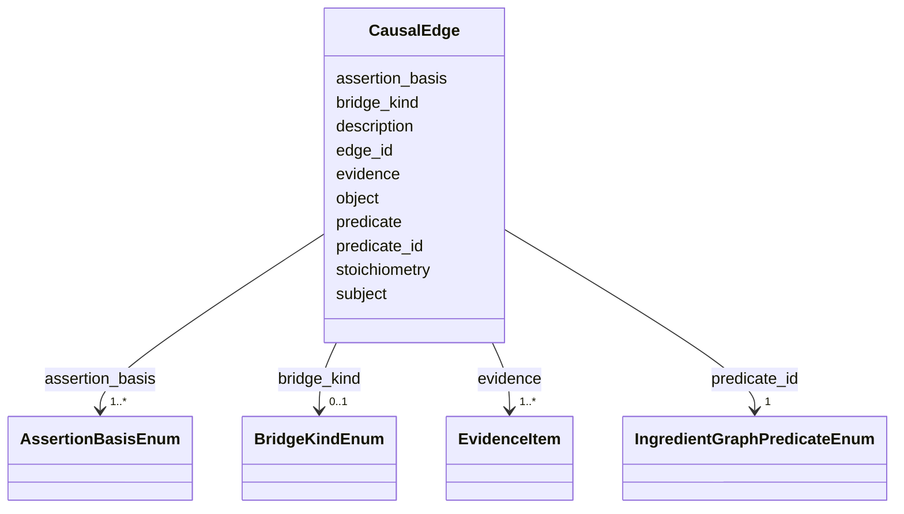

# Class: CausalEdge 


_An evidence-backed directed relationship between two local node_ids. MIM: edge_id (TaxonMech precedent), a closed predicate_id, bridge_kind on chemistry edges, and the assertion_basis each edge claims._


URI: [mediaingredientmech:CausalEdge](https://w3id.org/mediaingredientmech/CausalEdge)





<!-- no inheritance hierarchy -->


## Slots

| Name | Cardinality and Range | Description | Inheritance |
| ---  | --- | --- | --- |
| [edge_id](edge_id.md) | 1 <br/> [String](String.md) | Stable within the graph; review dispositions and Discussions anchor on causal... | direct |
| [subject](subject.md) | 1 <br/> [String](String.md) |  | direct |
| [predicate](predicate.md) | 1 <br/> [String](String.md) | Canonical label of predicate_id (title in IngredientGraphPredicateEnum) | direct |
| [predicate_id](predicate_id.md) | 1 <br/> [IngredientGraphPredicateEnum](IngredientGraphPredicateEnum.md) |  | direct |
| [object](object.md) | 1 <br/> [String](String.md) |  | direct |
| [description](description.md) | 0..1 <br/> [String](String.md) |  | direct |
| [bridge_kind](bridge_kind.md) | 0..1 <br/> [BridgeKindEnum](BridgeKindEnum.md) | Set on chemistry edges only: what the supplied form becomes, or a protonation... | direct |
| [stoichiometry](stoichiometry.md) | 0..1 <br/> [Integer](Integer.md) | ION_PART only | direct |
| [assertion_basis](assertion_basis.md) | 1..* <br/> [AssertionBasisEnum](AssertionBasisEnum.md) | The offline checks this edge claims; qc-causal-graphs confirms each one | direct |
| [evidence](evidence.md) | 1..* <br/> [EvidenceItem](EvidenceItem.md) |  | direct |


## Usages

| used by | used in | type | used |
| ---  | --- | --- | --- |
| [CausalGraph](CausalGraph.md) | [edges](edges.md) | range | [CausalEdge](CausalEdge.md) |


## Rules


### 

| Rule Applied | Preconditions | Postconditions | Elseconditions |
|--------------|---------------|----------------|----------------|
| slot_conditions |```{'stoichiometry': {'value_presence': 'PRESENT'}}``` |```{'bridge_kind': {'equals_string': 'ION_PART'}}``` | |


## Identifier and Mapping Information


### Schema Source


* from schema: https://w3id.org/mediaingredientmech


## Mappings

| Mapping Type | Mapped Value |
| ---  | ---  |
| self | mediaingredientmech:CausalEdge |
| native | mediaingredientmech:CausalEdge |


## LinkML Source

<!-- TODO: investigate https://stackoverflow.com/questions/37606292/how-to-create-tabbed-code-blocks-in-mkdocs-or-sphinx -->

### Direct

<details>
```yaml
name: CausalEdge
description: 'An evidence-backed directed relationship between two local node_ids.
  MIM: edge_id (TaxonMech precedent), a closed predicate_id, bridge_kind on chemistry
  edges, and the assertion_basis each edge claims.'
from_schema: https://w3id.org/mediaingredientmech
attributes:
  edge_id:
    name: edge_id
    description: Stable within the graph; review dispositions and Discussions anchor
      on causal_graphs#<edge_id>.
    from_schema: https://w3id.org/mediaingredientmech
    rank: 1000
    identifier: true
    domain_of:
    - CausalEdge
    range: string
    required: true
    pattern: ^[a-z][a-z0-9_]*$
  subject:
    name: subject
    from_schema: https://w3id.org/mediaingredientmech
    rank: 1000
    domain_of:
    - CausalEdge
    range: string
    required: true
  predicate:
    name: predicate
    description: Canonical label of predicate_id (title in IngredientGraphPredicateEnum).
    from_schema: https://w3id.org/mediaingredientmech
    rank: 1000
    domain_of:
    - CausalEdge
    range: string
    required: true
  predicate_id:
    name: predicate_id
    from_schema: https://w3id.org/mediaingredientmech
    rank: 1000
    domain_of:
    - CausalEdge
    range: IngredientGraphPredicateEnum
    required: true
  object:
    name: object
    from_schema: https://w3id.org/mediaingredientmech
    rank: 1000
    domain_of:
    - CausalEdge
    range: string
    required: true
  description:
    name: description
    from_schema: https://w3id.org/mediaingredientmech
    domain_of:
    - CausalGraph
    - CausalNode
    - CausalEdge
    - ProposedExperiment
    - Dataset
    range: string
  bridge_kind:
    name: bridge_kind
    description: 'Set on chemistry edges only: what the supplied form becomes, or
      a protonation/tautomer step between species. Each kind fixes the allowed predicate_id
      and the bases that must verify (MAPPING_SEMANTICS.md section 7). Chemistry edges
      are taxon-independent.'
    from_schema: https://w3id.org/mediaingredientmech
    rank: 1000
    domain_of:
    - CausalEdge
    range: BridgeKindEnum
  stoichiometry:
    name: stoichiometry
    description: ION_PART only. Ions released per formula unit; must equal the ChEBI
      SMILES component count.
    from_schema: https://w3id.org/mediaingredientmech
    rank: 1000
    domain_of:
    - CausalEdge
    range: integer
    minimum_value: 1
  assertion_basis:
    name: assertion_basis
    description: The offline checks this edge claims; qc-causal-graphs confirms each
      one.
    from_schema: https://w3id.org/mediaingredientmech
    rank: 1000
    domain_of:
    - CausalEdge
    range: AssertionBasisEnum
    required: true
    multivalued: true
  evidence:
    name: evidence
    from_schema: https://w3id.org/mediaingredientmech
    domain_of:
    - OntologyMapping
    - CultureMechReference
    - CommunityOrganismRoleAssignment
    - NutritionalRoleAssignment
    - PhysicochemicalRoleAssignment
    - CellularMetabolicRoleAssignment
    - ComponentAssertion
    - CausalEdge
    - ProteinExample
    - Discussion
    - Dataset
    range: EvidenceItem
    required: true
    multivalued: true
    inlined: true
    inlined_as_list: true
    minimum_cardinality: 1
rules:
- preconditions:
    slot_conditions:
      stoichiometry:
        name: stoichiometry
        value_presence: PRESENT
  postconditions:
    slot_conditions:
      bridge_kind:
        name: bridge_kind
        equals_string: ION_PART

```
</details>

### Induced

<details>
```yaml
name: CausalEdge
description: 'An evidence-backed directed relationship between two local node_ids.
  MIM: edge_id (TaxonMech precedent), a closed predicate_id, bridge_kind on chemistry
  edges, and the assertion_basis each edge claims.'
from_schema: https://w3id.org/mediaingredientmech
attributes:
  edge_id:
    name: edge_id
    description: Stable within the graph; review dispositions and Discussions anchor
      on causal_graphs#<edge_id>.
    from_schema: https://w3id.org/mediaingredientmech
    rank: 1000
    identifier: true
    alias: edge_id
    owner: CausalEdge
    domain_of:
    - CausalEdge
    range: string
    required: true
    pattern: ^[a-z][a-z0-9_]*$
  subject:
    name: subject
    from_schema: https://w3id.org/mediaingredientmech
    rank: 1000
    alias: subject
    owner: CausalEdge
    domain_of:
    - CausalEdge
    range: string
    required: true
  predicate:
    name: predicate
    description: Canonical label of predicate_id (title in IngredientGraphPredicateEnum).
    from_schema: https://w3id.org/mediaingredientmech
    rank: 1000
    alias: predicate
    owner: CausalEdge
    domain_of:
    - CausalEdge
    range: string
    required: true
  predicate_id:
    name: predicate_id
    from_schema: https://w3id.org/mediaingredientmech
    rank: 1000
    alias: predicate_id
    owner: CausalEdge
    domain_of:
    - CausalEdge
    range: IngredientGraphPredicateEnum
    required: true
  object:
    name: object
    from_schema: https://w3id.org/mediaingredientmech
    rank: 1000
    alias: object
    owner: CausalEdge
    domain_of:
    - CausalEdge
    range: string
    required: true
  description:
    name: description
    from_schema: https://w3id.org/mediaingredientmech
    alias: description
    owner: CausalEdge
    domain_of:
    - CausalGraph
    - CausalNode
    - CausalEdge
    - ProposedExperiment
    - Dataset
    range: string
  bridge_kind:
    name: bridge_kind
    description: 'Set on chemistry edges only: what the supplied form becomes, or
      a protonation/tautomer step between species. Each kind fixes the allowed predicate_id
      and the bases that must verify (MAPPING_SEMANTICS.md section 7). Chemistry edges
      are taxon-independent.'
    from_schema: https://w3id.org/mediaingredientmech
    rank: 1000
    alias: bridge_kind
    owner: CausalEdge
    domain_of:
    - CausalEdge
    range: BridgeKindEnum
  stoichiometry:
    name: stoichiometry
    description: ION_PART only. Ions released per formula unit; must equal the ChEBI
      SMILES component count.
    from_schema: https://w3id.org/mediaingredientmech
    rank: 1000
    alias: stoichiometry
    owner: CausalEdge
    domain_of:
    - CausalEdge
    range: integer
    minimum_value: 1
  assertion_basis:
    name: assertion_basis
    description: The offline checks this edge claims; qc-causal-graphs confirms each
      one.
    from_schema: https://w3id.org/mediaingredientmech
    rank: 1000
    alias: assertion_basis
    owner: CausalEdge
    domain_of:
    - CausalEdge
    range: AssertionBasisEnum
    required: true
    multivalued: true
  evidence:
    name: evidence
    from_schema: https://w3id.org/mediaingredientmech
    alias: evidence
    owner: CausalEdge
    domain_of:
    - OntologyMapping
    - CultureMechReference
    - CommunityOrganismRoleAssignment
    - NutritionalRoleAssignment
    - PhysicochemicalRoleAssignment
    - CellularMetabolicRoleAssignment
    - ComponentAssertion
    - CausalEdge
    - ProteinExample
    - Discussion
    - Dataset
    range: EvidenceItem
    required: true
    multivalued: true
    inlined: true
    inlined_as_list: true
    minimum_cardinality: 1
rules:
- preconditions:
    slot_conditions:
      stoichiometry:
        name: stoichiometry
        value_presence: PRESENT
  postconditions:
    slot_conditions:
      bridge_kind:
        name: bridge_kind
        equals_string: ION_PART

```
</details>