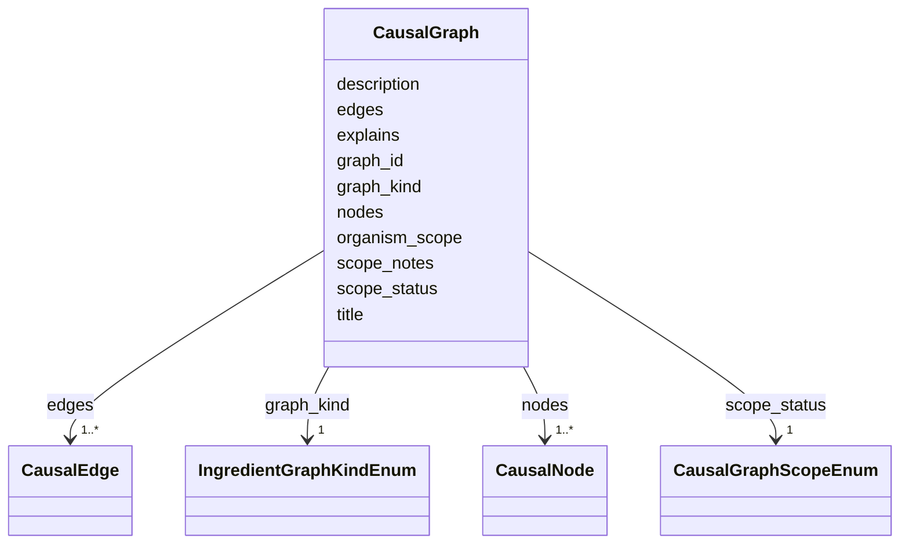

# Class: CausalGraph 


_A directed, evidence-backed mechanism graph for one ingredient. Same shape as the fleet CausalGraph. MIM: graph_id pattern, `explains`, `organism_scope`, and minimum_cardinality on nodes and edges (TaxonMech #66 precedent)._


URI: [mediaingredientmech:CausalGraph](https://w3id.org/mediaingredientmech/CausalGraph)





<!-- no inheritance hierarchy -->


## Slots

| Name | Cardinality and Range | Description | Inheritance |
| ---  | --- | --- | --- |
| [graph_id](graph_id.md) | 1 <br/> [String](String.md) |  | direct |
| [title](title.md) | 0..1 <br/> [String](String.md) |  | direct |
| [description](description.md) | 0..1 <br/> [String](String.md) |  | direct |
| [graph_kind](graph_kind.md) | 1 <br/> [IngredientGraphKindEnum](IngredientGraphKindEnum.md) | What the graph explains (claw graph_facets value) | direct |
| [scope_status](scope_status.md) | 1 <br/> [CausalGraphScopeEnum](CausalGraphScopeEnum.md) | Curator disposition | direct |
| [scope_notes](scope_notes.md) | 0..1 <br/> [String](String.md) |  | direct |
| [explains](explains.md) | * <br/> [String](String.md) | Role assignments on this record that the graph explains, as `<facet>#<ROLE>` ... | direct |
| [organism_scope](organism_scope.md) | 0..1 <br/> [String](String.md) | The one NCBITaxon in which the biological edges hold (a TaxonMech record wher... | direct |
| [nodes](nodes.md) | 1..* <br/> [CausalNode](CausalNode.md) |  | direct |
| [edges](edges.md) | 1..* <br/> [CausalEdge](CausalEdge.md) |  | direct |


## Usages

| used by | used in | type | used |
| ---  | --- | --- | --- |
| [IngredientRecord](IngredientRecord.md) | [causal_graphs](causal_graphs.md) | range | [CausalGraph](CausalGraph.md) |


## Rules


### 

| Rule Applied | Preconditions | Postconditions | Elseconditions |
|--------------|---------------|----------------|----------------|
| slot_conditions |```{'graph_kind': {'equals_string': 'SPECIATION'}}``` |```{'scope_status': {'equals_string': 'NONMECHANISTIC'}}``` | |


## Identifier and Mapping Information


### Schema Source


* from schema: https://w3id.org/mediaingredientmech


## Mappings

| Mapping Type | Mapped Value |
| ---  | ---  |
| self | mediaingredientmech:CausalGraph |
| native | mediaingredientmech:CausalGraph |


## LinkML Source

<!-- TODO: investigate https://stackoverflow.com/questions/37606292/how-to-create-tabbed-code-blocks-in-mkdocs-or-sphinx -->

### Direct

<details>
```yaml
name: CausalGraph
description: 'A directed, evidence-backed mechanism graph for one ingredient. Same
  shape as the fleet CausalGraph. MIM: graph_id pattern, `explains`, `organism_scope`,
  and minimum_cardinality on nodes and edges (TaxonMech #66 precedent).'
from_schema: https://w3id.org/mediaingredientmech
attributes:
  graph_id:
    name: graph_id
    from_schema: https://w3id.org/mediaingredientmech
    rank: 1000
    identifier: true
    domain_of:
    - CausalGraph
    range: string
    required: true
    pattern: ^[a-z][a-z0-9_]*$
  title:
    name: title
    from_schema: https://w3id.org/mediaingredientmech
    rank: 1000
    domain_of:
    - CausalGraph
    - Dataset
    range: string
  description:
    name: description
    from_schema: https://w3id.org/mediaingredientmech
    rank: 1000
    domain_of:
    - CausalGraph
    - CausalNode
    - CausalEdge
    - ProposedExperiment
    - Dataset
    range: string
  graph_kind:
    name: graph_kind
    description: What the graph explains (claw graph_facets value).
    from_schema: https://w3id.org/mediaingredientmech
    rank: 1000
    domain_of:
    - CausalGraph
    range: IngredientGraphKindEnum
    required: true
  scope_status:
    name: scope_status
    description: Curator disposition. NONMECHANISTIC is a reviewed graph with no cellular
      mechanism in it (a SPECIATION graph, an indicator dye), explained in scope_notes;
      never a deferral. Proposed or incomplete graphs are REVIEW_NEEDED. MECHANISTIC
      requires the planned qc-causal-graphs scope gate and independent scientific
      approval; schema validation is insufficient.
    from_schema: https://w3id.org/mediaingredientmech
    rank: 1000
    domain_of:
    - CausalGraph
    range: CausalGraphScopeEnum
    required: true
  scope_notes:
    name: scope_notes
    from_schema: https://w3id.org/mediaingredientmech
    rank: 1000
    domain_of:
    - CausalGraph
    range: string
  explains:
    name: explains
    description: 'Role assignments on this record that the graph explains, as `<facet>#<ROLE>`
      hash anchors (mech_shared attaches_to convention), e.g. `nutritional_roles#SULFUR_SOURCE`.
      Each must name a role present on the record. A pointer only: a role never creates
      an edge and an edge never creates a role.'
    from_schema: https://w3id.org/mediaingredientmech
    rank: 1000
    domain_of:
    - CausalGraph
    range: string
    multivalued: true
    pattern: ^(nutritional_roles|physicochemical_roles|cellular_metabolic_roles)#[A-Z][A-Z0-9_]*$
  organism_scope:
    name: organism_scope
    description: The one NCBITaxon in which the biological edges hold (a TaxonMech
      record where one exists). Every organism-specific source the graph cites (protein_examples
      taxa, PathwayMech taxa) must lie on its lineage. Omit only for a taxon-agnostic
      graph; such a graph cannot be MECHANISTIC if it cites organism-specific evidence.
      Strains and genome assemblies are reached through TaxonMech, never copied here.
    from_schema: https://w3id.org/mediaingredientmech
    rank: 1000
    domain_of:
    - CausalGraph
    range: string
    pattern: ^NCBITaxon:[1-9][0-9]*$
  nodes:
    name: nodes
    from_schema: https://w3id.org/mediaingredientmech
    rank: 1000
    domain_of:
    - CausalGraph
    range: CausalNode
    required: true
    multivalued: true
    inlined: true
    inlined_as_list: true
    minimum_cardinality: 1
  edges:
    name: edges
    from_schema: https://w3id.org/mediaingredientmech
    rank: 1000
    domain_of:
    - CausalGraph
    range: CausalEdge
    required: true
    multivalued: true
    inlined: true
    inlined_as_list: true
    minimum_cardinality: 1
rules:
- preconditions:
    slot_conditions:
      graph_kind:
        name: graph_kind
        equals_string: SPECIATION
  postconditions:
    slot_conditions:
      scope_status:
        name: scope_status
        equals_string: NONMECHANISTIC
  description: A SPECIATION graph is chemistry only and never MECHANISTIC.

```
</details>

### Induced

<details>
```yaml
name: CausalGraph
description: 'A directed, evidence-backed mechanism graph for one ingredient. Same
  shape as the fleet CausalGraph. MIM: graph_id pattern, `explains`, `organism_scope`,
  and minimum_cardinality on nodes and edges (TaxonMech #66 precedent).'
from_schema: https://w3id.org/mediaingredientmech
attributes:
  graph_id:
    name: graph_id
    from_schema: https://w3id.org/mediaingredientmech
    rank: 1000
    identifier: true
    alias: graph_id
    owner: CausalGraph
    domain_of:
    - CausalGraph
    range: string
    required: true
    pattern: ^[a-z][a-z0-9_]*$
  title:
    name: title
    from_schema: https://w3id.org/mediaingredientmech
    rank: 1000
    alias: title
    owner: CausalGraph
    domain_of:
    - CausalGraph
    - Dataset
    range: string
  description:
    name: description
    from_schema: https://w3id.org/mediaingredientmech
    rank: 1000
    alias: description
    owner: CausalGraph
    domain_of:
    - CausalGraph
    - CausalNode
    - CausalEdge
    - ProposedExperiment
    - Dataset
    range: string
  graph_kind:
    name: graph_kind
    description: What the graph explains (claw graph_facets value).
    from_schema: https://w3id.org/mediaingredientmech
    rank: 1000
    alias: graph_kind
    owner: CausalGraph
    domain_of:
    - CausalGraph
    range: IngredientGraphKindEnum
    required: true
  scope_status:
    name: scope_status
    description: Curator disposition. NONMECHANISTIC is a reviewed graph with no cellular
      mechanism in it (a SPECIATION graph, an indicator dye), explained in scope_notes;
      never a deferral. Proposed or incomplete graphs are REVIEW_NEEDED. MECHANISTIC
      requires the planned qc-causal-graphs scope gate and independent scientific
      approval; schema validation is insufficient.
    from_schema: https://w3id.org/mediaingredientmech
    rank: 1000
    alias: scope_status
    owner: CausalGraph
    domain_of:
    - CausalGraph
    range: CausalGraphScopeEnum
    required: true
  scope_notes:
    name: scope_notes
    from_schema: https://w3id.org/mediaingredientmech
    rank: 1000
    alias: scope_notes
    owner: CausalGraph
    domain_of:
    - CausalGraph
    range: string
  explains:
    name: explains
    description: 'Role assignments on this record that the graph explains, as `<facet>#<ROLE>`
      hash anchors (mech_shared attaches_to convention), e.g. `nutritional_roles#SULFUR_SOURCE`.
      Each must name a role present on the record. A pointer only: a role never creates
      an edge and an edge never creates a role.'
    from_schema: https://w3id.org/mediaingredientmech
    rank: 1000
    alias: explains
    owner: CausalGraph
    domain_of:
    - CausalGraph
    range: string
    multivalued: true
    pattern: ^(nutritional_roles|physicochemical_roles|cellular_metabolic_roles)#[A-Z][A-Z0-9_]*$
  organism_scope:
    name: organism_scope
    description: The one NCBITaxon in which the biological edges hold (a TaxonMech
      record where one exists). Every organism-specific source the graph cites (protein_examples
      taxa, PathwayMech taxa) must lie on its lineage. Omit only for a taxon-agnostic
      graph; such a graph cannot be MECHANISTIC if it cites organism-specific evidence.
      Strains and genome assemblies are reached through TaxonMech, never copied here.
    from_schema: https://w3id.org/mediaingredientmech
    rank: 1000
    alias: organism_scope
    owner: CausalGraph
    domain_of:
    - CausalGraph
    range: string
    pattern: ^NCBITaxon:[1-9][0-9]*$
  nodes:
    name: nodes
    from_schema: https://w3id.org/mediaingredientmech
    rank: 1000
    alias: nodes
    owner: CausalGraph
    domain_of:
    - CausalGraph
    range: CausalNode
    required: true
    multivalued: true
    inlined: true
    inlined_as_list: true
    minimum_cardinality: 1
  edges:
    name: edges
    from_schema: https://w3id.org/mediaingredientmech
    rank: 1000
    alias: edges
    owner: CausalGraph
    domain_of:
    - CausalGraph
    range: CausalEdge
    required: true
    multivalued: true
    inlined: true
    inlined_as_list: true
    minimum_cardinality: 1
rules:
- preconditions:
    slot_conditions:
      graph_kind:
        name: graph_kind
        equals_string: SPECIATION
  postconditions:
    slot_conditions:
      scope_status:
        name: scope_status
        equals_string: NONMECHANISTIC
  description: A SPECIATION graph is chemistry only and never MECHANISTIC.

```
</details>