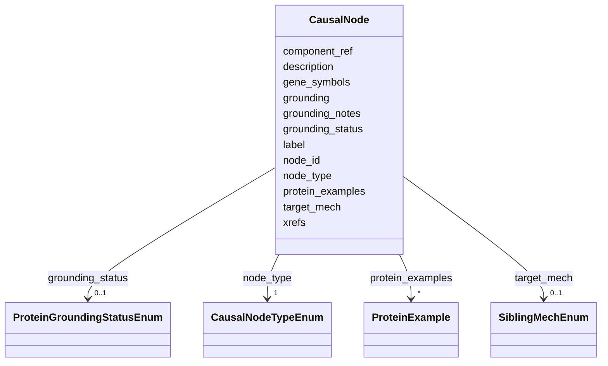

# Class: CausalNode 


_A node in an ingredient mechanism graph. Exactly one INGREDIENT node per graph, grounded to the record identifier. GENE_OR_PROTEIN denotes a taxon-agnostic protein family, function-defined protein or complex; organism-specific UniProtKB proteins are protein_examples, never groundings; genes and operons are metadata._


URI: [mediaingredientmech:CausalNode](https://w3id.org/mediaingredientmech/CausalNode)





<!-- no inheritance hierarchy -->


## Slots

| Name | Cardinality and Range | Description | Inheritance |
| ---  | --- | --- | --- |
| [node_id](node_id.md) | 1 <br/> [String](String.md) |  | direct |
| [label](label.md) | 1 <br/> [String](String.md) | Canonical label of the grounding (ChEBI/GO label, or the sibling record's lab... | direct |
| [node_type](node_type.md) | 1 <br/> [CausalNodeTypeEnum](CausalNodeTypeEnum.md) |  | direct |
| [grounding](grounding.md) | 0..1 <br/> [String](String.md) | CURIE for the node; for a sibling-Mech record, that record's identifier, whic... | direct |
| [target_mech](target_mech.md) | 0..1 <br/> [SiblingMechEnum](SiblingMechEnum.md) | Owning Mech when a grounding is a record in more than one Mech and the node_t... | direct |
| [grounding_status](grounding_status.md) | 0..1 <br/> [ProteinGroundingStatusEnum](ProteinGroundingStatusEnum.md) |  | direct |
| [grounding_notes](grounding_notes.md) | 0..1 <br/> [String](String.md) |  | direct |
| [component_ref](component_ref.md) | 0..1 <br/> [String](String.md) | components[] | direct |
| [xrefs](xrefs.md) | * <br/> [String](String.md) | CURIEs denoting exactly this node's entity (e | direct |
| [description](description.md) | 0..1 <br/> [String](String.md) |  | direct |
| [gene_symbols](gene_symbols.md) | * <br/> [String](String.md) |  | direct |
| [protein_examples](protein_examples.md) | * <br/> [ProteinExample](ProteinExample.md) | Organism-specific UniProtKB instances of a GENE_OR_PROTEIN node, or proteins ... | direct |


## Usages

| used by | used in | type | used |
| ---  | --- | --- | --- |
| [CausalGraph](CausalGraph.md) | [nodes](nodes.md) | range | [CausalNode](CausalNode.md) |


## Identifier and Mapping Information


### Schema Source


* from schema: https://w3id.org/mediaingredientmech


## Mappings

| Mapping Type | Mapped Value |
| ---  | ---  |
| self | mediaingredientmech:CausalNode |
| native | mediaingredientmech:CausalNode |


## LinkML Source

<!-- TODO: investigate https://stackoverflow.com/questions/37606292/how-to-create-tabbed-code-blocks-in-mkdocs-or-sphinx -->

### Direct

<details>
```yaml
name: CausalNode
description: A node in an ingredient mechanism graph. Exactly one INGREDIENT node
  per graph, grounded to the record identifier. GENE_OR_PROTEIN denotes a taxon-agnostic
  protein family, function-defined protein or complex; organism-specific UniProtKB
  proteins are protein_examples, never groundings; genes and operons are metadata.
from_schema: https://w3id.org/mediaingredientmech
attributes:
  node_id:
    name: node_id
    from_schema: https://w3id.org/mediaingredientmech
    rank: 1000
    identifier: true
    domain_of:
    - CausalNode
    range: string
    required: true
    pattern: ^[a-z][a-z0-9_]*$
  label:
    name: label
    description: Canonical label of the grounding (ChEBI/GO label, or the sibling
      record's label).
    from_schema: https://w3id.org/mediaingredientmech
    rank: 1000
    domain_of:
    - CausalNode
    range: string
    required: true
  node_type:
    name: node_type
    from_schema: https://w3id.org/mediaingredientmech
    rank: 1000
    domain_of:
    - CausalNode
    range: CausalNodeTypeEnum
    required: true
  grounding:
    name: grounding
    description: 'CURIE for the node; for a sibling-Mech record, that record''s identifier,
      which is the only way a graph links out of the record. MIM: the local part admits
      `~` (five MIM identifiers use it); organism, strain, genome and protein-instance
      prefixes are refused (genome firewall).'
    from_schema: https://w3id.org/mediaingredientmech
    rank: 1000
    domain_of:
    - CausalNode
    range: string
    pattern: ^(?!(?:UniProtKB|NCBITaxon|ncbi\.assembly|kgmicrobe\.strain|insdc|RefSeq|GenBank|ENA|biosample|bioproject|img\.taxon|patric|gtdb):)[A-Za-z][A-Za-z0-9._-]*:[A-Za-z0-9._~-]+$
  target_mech:
    name: target_mech
    description: Owning Mech when a grounding is a record in more than one Mech and
      the node_type precedence in qc-causal-graphs does not decide it.
    from_schema: https://w3id.org/mediaingredientmech
    rank: 1000
    domain_of:
    - CausalNode
    range: SiblingMechEnum
  grounding_status:
    name: grounding_status
    from_schema: https://w3id.org/mediaingredientmech
    rank: 1000
    domain_of:
    - CausalNode
    range: ProteinGroundingStatusEnum
  grounding_notes:
    name: grounding_notes
    from_schema: https://w3id.org/mediaingredientmech
    rank: 1000
    domain_of:
    - CausalNode
    range: string
  component_ref:
    name: component_ref
    description: components[].component_id of this record when the node is one of
      its own components (COMPONENT edges), so graph and composition stay in step.
    from_schema: https://w3id.org/mediaingredientmech
    rank: 1000
    domain_of:
    - CausalNode
    range: string
  xrefs:
    name: xrefs
    description: 'CURIEs denoting exactly this node''s entity (e.g. the GO term an
      EC record maps to). Never the record identifier, a parent, or a related form:
      those are separate nodes joined by an edge.'
    from_schema: https://w3id.org/mediaingredientmech
    rank: 1000
    domain_of:
    - CausalNode
    range: string
    multivalued: true
    pattern: ^[A-Za-z][A-Za-z0-9._-]*:[A-Za-z0-9._~-]+$
  description:
    name: description
    from_schema: https://w3id.org/mediaingredientmech
    domain_of:
    - CausalGraph
    - CausalNode
    - CausalEdge
    - ProposedExperiment
    - Dataset
    range: string
  gene_symbols:
    name: gene_symbols
    from_schema: https://w3id.org/mediaingredientmech
    rank: 1000
    domain_of:
    - CausalNode
    range: string
    multivalued: true
  protein_examples:
    name: protein_examples
    description: 'Organism-specific UniProtKB instances of a GENE_OR_PROTEIN node,
      or proteins that enable a MOLECULAR_FUNCTION node (MIM: TraitMech allows GENE_OR_PROTEIN
      only; ProteinTraitsMech attaches its examples to EC/RHEA records). Each names
      the taxon in which its role was established; that taxon resolves to a TaxonMech
      record.'
    from_schema: https://w3id.org/mediaingredientmech
    rank: 1000
    domain_of:
    - CausalNode
    range: ProteinExample
    multivalued: true
    inlined: true
    inlined_as_list: true

```
</details>

### Induced

<details>
```yaml
name: CausalNode
description: A node in an ingredient mechanism graph. Exactly one INGREDIENT node
  per graph, grounded to the record identifier. GENE_OR_PROTEIN denotes a taxon-agnostic
  protein family, function-defined protein or complex; organism-specific UniProtKB
  proteins are protein_examples, never groundings; genes and operons are metadata.
from_schema: https://w3id.org/mediaingredientmech
attributes:
  node_id:
    name: node_id
    from_schema: https://w3id.org/mediaingredientmech
    rank: 1000
    identifier: true
    alias: node_id
    owner: CausalNode
    domain_of:
    - CausalNode
    range: string
    required: true
    pattern: ^[a-z][a-z0-9_]*$
  label:
    name: label
    description: Canonical label of the grounding (ChEBI/GO label, or the sibling
      record's label).
    from_schema: https://w3id.org/mediaingredientmech
    rank: 1000
    alias: label
    owner: CausalNode
    domain_of:
    - CausalNode
    range: string
    required: true
  node_type:
    name: node_type
    from_schema: https://w3id.org/mediaingredientmech
    rank: 1000
    alias: node_type
    owner: CausalNode
    domain_of:
    - CausalNode
    range: CausalNodeTypeEnum
    required: true
  grounding:
    name: grounding
    description: 'CURIE for the node; for a sibling-Mech record, that record''s identifier,
      which is the only way a graph links out of the record. MIM: the local part admits
      `~` (five MIM identifiers use it); organism, strain, genome and protein-instance
      prefixes are refused (genome firewall).'
    from_schema: https://w3id.org/mediaingredientmech
    rank: 1000
    alias: grounding
    owner: CausalNode
    domain_of:
    - CausalNode
    range: string
    pattern: ^(?!(?:UniProtKB|NCBITaxon|ncbi\.assembly|kgmicrobe\.strain|insdc|RefSeq|GenBank|ENA|biosample|bioproject|img\.taxon|patric|gtdb):)[A-Za-z][A-Za-z0-9._-]*:[A-Za-z0-9._~-]+$
  target_mech:
    name: target_mech
    description: Owning Mech when a grounding is a record in more than one Mech and
      the node_type precedence in qc-causal-graphs does not decide it.
    from_schema: https://w3id.org/mediaingredientmech
    rank: 1000
    alias: target_mech
    owner: CausalNode
    domain_of:
    - CausalNode
    range: SiblingMechEnum
  grounding_status:
    name: grounding_status
    from_schema: https://w3id.org/mediaingredientmech
    rank: 1000
    alias: grounding_status
    owner: CausalNode
    domain_of:
    - CausalNode
    range: ProteinGroundingStatusEnum
  grounding_notes:
    name: grounding_notes
    from_schema: https://w3id.org/mediaingredientmech
    rank: 1000
    alias: grounding_notes
    owner: CausalNode
    domain_of:
    - CausalNode
    range: string
  component_ref:
    name: component_ref
    description: components[].component_id of this record when the node is one of
      its own components (COMPONENT edges), so graph and composition stay in step.
    from_schema: https://w3id.org/mediaingredientmech
    rank: 1000
    alias: component_ref
    owner: CausalNode
    domain_of:
    - CausalNode
    range: string
  xrefs:
    name: xrefs
    description: 'CURIEs denoting exactly this node''s entity (e.g. the GO term an
      EC record maps to). Never the record identifier, a parent, or a related form:
      those are separate nodes joined by an edge.'
    from_schema: https://w3id.org/mediaingredientmech
    rank: 1000
    alias: xrefs
    owner: CausalNode
    domain_of:
    - CausalNode
    range: string
    multivalued: true
    pattern: ^[A-Za-z][A-Za-z0-9._-]*:[A-Za-z0-9._~-]+$
  description:
    name: description
    from_schema: https://w3id.org/mediaingredientmech
    alias: description
    owner: CausalNode
    domain_of:
    - CausalGraph
    - CausalNode
    - CausalEdge
    - ProposedExperiment
    - Dataset
    range: string
  gene_symbols:
    name: gene_symbols
    from_schema: https://w3id.org/mediaingredientmech
    rank: 1000
    alias: gene_symbols
    owner: CausalNode
    domain_of:
    - CausalNode
    range: string
    multivalued: true
  protein_examples:
    name: protein_examples
    description: 'Organism-specific UniProtKB instances of a GENE_OR_PROTEIN node,
      or proteins that enable a MOLECULAR_FUNCTION node (MIM: TraitMech allows GENE_OR_PROTEIN
      only; ProteinTraitsMech attaches its examples to EC/RHEA records). Each names
      the taxon in which its role was established; that taxon resolves to a TaxonMech
      record.'
    from_schema: https://w3id.org/mediaingredientmech
    rank: 1000
    alias: protein_examples
    owner: CausalNode
    domain_of:
    - CausalNode
    range: ProteinExample
    multivalued: true
    inlined: true
    inlined_as_list: true

```
</details>