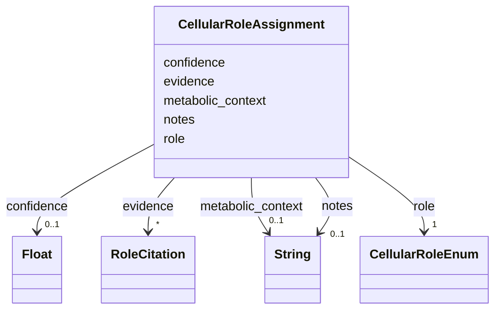

# Class: CellularRoleAssignment 


_Assignment of a cellular/metabolic role in organism metabolism with supporting evidence_


URI: [mediaingredientmech:CellularRoleAssignment](https://w3id.org/mediaingredientmech/CellularRoleAssignment)





<!-- no inheritance hierarchy -->


## Slots

| Name | Cardinality and Range | Description | Inheritance |
| ---  | --- | --- | --- |
| [role](role.md) | 1 <br/> [CellularRoleEnum](CellularRoleEnum.md) | The cellular/metabolic role (e | direct |
| [metabolic_context](metabolic_context.md) | 0..1 <br/> [xsd:string](http://www.w3.org/2001/XMLSchema#string) | Pathway or metabolic context (e | direct |
| [confidence](confidence.md) | 0..1 <br/> [xsd:float](http://www.w3.org/2001/XMLSchema#float) | Confidence score for this role assignment (0 | direct |
| [evidence](evidence.md) | * <br/> [RoleCitation](RoleCitation.md) | Citations and references supporting this role | direct |
| [notes](notes.md) | 0..1 <br/> [xsd:string](http://www.w3.org/2001/XMLSchema#string) | Additional context about this role assignment | direct |


## Usages

| used by | used in | type | used |
| ---  | --- | --- | --- |
| [IngredientRecord](IngredientRecord.md) | [cellular_roles](cellular_roles.md) | range | [CellularRoleAssignment](CellularRoleAssignment.md) |


## Identifier and Mapping Information


### Schema Source


* from schema: https://w3id.org/mediaingredientmech


## Mappings

| Mapping Type | Mapped Value |
| ---  | ---  |
| self | mediaingredientmech:CellularRoleAssignment |
| native | mediaingredientmech:CellularRoleAssignment |


## LinkML Source

<!-- TODO: investigate https://stackoverflow.com/questions/37606292/how-to-create-tabbed-code-blocks-in-mkdocs-or-sphinx -->

### Direct

<details>
```yaml
name: CellularRoleAssignment
description: Assignment of a cellular/metabolic role in organism metabolism with supporting
  evidence
from_schema: https://w3id.org/mediaingredientmech
attributes:
  role:
    name: role
    description: The cellular/metabolic role (e.g., PRIMARY_DEGRADER, ELECTRON_DONOR)
    from_schema: https://w3id.org/mediaingredientmech
    domain_of:
    - RoleAssignment
    - CellularRoleAssignment
    range: CellularRoleEnum
    required: true
  metabolic_context:
    name: metabolic_context
    description: Pathway or metabolic context (e.g., "denitrification", "aromatic
      degradation")
    from_schema: https://w3id.org/mediaingredientmech
    rank: 1000
    domain_of:
    - CellularRoleAssignment
  confidence:
    name: confidence
    description: Confidence score for this role assignment (0.0-1.0)
    from_schema: https://w3id.org/mediaingredientmech
    domain_of:
    - RoleAssignment
    - CellularRoleAssignment
    range: float
  evidence:
    name: evidence
    description: Citations and references supporting this role
    from_schema: https://w3id.org/mediaingredientmech
    domain_of:
    - OntologyMapping
    - RoleAssignment
    - CellularRoleAssignment
    range: RoleCitation
    multivalued: true
    inlined: true
    inlined_as_list: true
  notes:
    name: notes
    description: Additional context about this role assignment
    from_schema: https://w3id.org/mediaingredientmech
    domain_of:
    - IngredientRecord
    - MappingEvidence
    - CurationEvent
    - RoleAssignment
    - CellularRoleAssignment

```
</details>

### Induced

<details>
```yaml
name: CellularRoleAssignment
description: Assignment of a cellular/metabolic role in organism metabolism with supporting
  evidence
from_schema: https://w3id.org/mediaingredientmech
attributes:
  role:
    name: role
    description: The cellular/metabolic role (e.g., PRIMARY_DEGRADER, ELECTRON_DONOR)
    from_schema: https://w3id.org/mediaingredientmech
    alias: role
    owner: CellularRoleAssignment
    domain_of:
    - RoleAssignment
    - CellularRoleAssignment
    range: CellularRoleEnum
    required: true
  metabolic_context:
    name: metabolic_context
    description: Pathway or metabolic context (e.g., "denitrification", "aromatic
      degradation")
    from_schema: https://w3id.org/mediaingredientmech
    rank: 1000
    alias: metabolic_context
    owner: CellularRoleAssignment
    domain_of:
    - CellularRoleAssignment
    range: string
  confidence:
    name: confidence
    description: Confidence score for this role assignment (0.0-1.0)
    from_schema: https://w3id.org/mediaingredientmech
    alias: confidence
    owner: CellularRoleAssignment
    domain_of:
    - RoleAssignment
    - CellularRoleAssignment
    range: float
  evidence:
    name: evidence
    description: Citations and references supporting this role
    from_schema: https://w3id.org/mediaingredientmech
    alias: evidence
    owner: CellularRoleAssignment
    domain_of:
    - OntologyMapping
    - RoleAssignment
    - CellularRoleAssignment
    range: RoleCitation
    multivalued: true
    inlined: true
    inlined_as_list: true
  notes:
    name: notes
    description: Additional context about this role assignment
    from_schema: https://w3id.org/mediaingredientmech
    alias: notes
    owner: CellularRoleAssignment
    domain_of:
    - IngredientRecord
    - MappingEvidence
    - CurationEvent
    - RoleAssignment
    - CellularRoleAssignment
    range: string

```
</details>