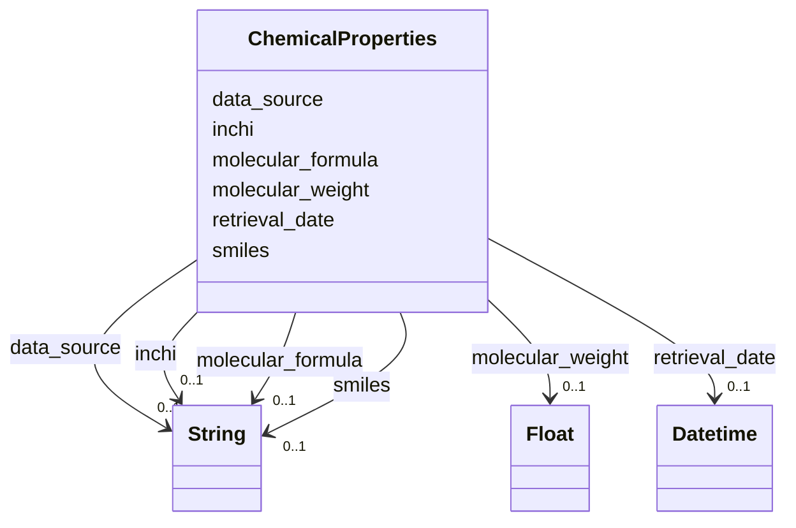

# Class: ChemicalProperties 


_Chemical structure and properties for CHEBI-mapped ingredients_


URI: [mediaingredientmech:ChemicalProperties](https://w3id.org/mediaingredientmech/ChemicalProperties)





<!-- no inheritance hierarchy -->


## Slots

| Name | Cardinality and Range | Description | Inheritance |
| ---  | --- | --- | --- |
| [molecular_formula](molecular_formula.md) | 0..1 <br/> [xsd:string](http://www.w3.org/2001/XMLSchema#string) | Molecular formula (e | direct |
| [smiles](smiles.md) | 0..1 <br/> [xsd:string](http://www.w3.org/2001/XMLSchema#string) | Simplified Molecular Input Line Entry System notation | direct |
| [inchi](inchi.md) | 0..1 <br/> [xsd:string](http://www.w3.org/2001/XMLSchema#string) | IUPAC International Chemical Identifier | direct |
| [molecular_weight](molecular_weight.md) | 0..1 <br/> [xsd:float](http://www.w3.org/2001/XMLSchema#float) | Molecular weight in g/mol | direct |
| [data_source](data_source.md) | 0..1 <br/> [xsd:string](http://www.w3.org/2001/XMLSchema#string) | Source of chemical properties (e | direct |
| [retrieval_date](retrieval_date.md) | 0..1 <br/> [xsd:dateTime](http://www.w3.org/2001/XMLSchema#dateTime) | When these properties were retrieved | direct |


## Usages

| used by | used in | type | used |
| ---  | --- | --- | --- |
| [IngredientRecord](IngredientRecord.md) | [chemical_properties](chemical_properties.md) | range | [ChemicalProperties](ChemicalProperties.md) |


## Identifier and Mapping Information


### Schema Source


* from schema: https://w3id.org/mediaingredientmech


## Mappings

| Mapping Type | Mapped Value |
| ---  | ---  |
| self | mediaingredientmech:ChemicalProperties |
| native | mediaingredientmech:ChemicalProperties |


## LinkML Source

<!-- TODO: investigate https://stackoverflow.com/questions/37606292/how-to-create-tabbed-code-blocks-in-mkdocs-or-sphinx -->

### Direct

<details>
```yaml
name: ChemicalProperties
description: Chemical structure and properties for CHEBI-mapped ingredients
from_schema: https://w3id.org/mediaingredientmech
attributes:
  molecular_formula:
    name: molecular_formula
    description: Molecular formula (e.g., H2O, C6H12O6)
    from_schema: https://w3id.org/mediaingredientmech
    rank: 1000
    domain_of:
    - ChemicalProperties
  smiles:
    name: smiles
    description: Simplified Molecular Input Line Entry System notation
    from_schema: https://w3id.org/mediaingredientmech
    rank: 1000
    domain_of:
    - ChemicalProperties
  inchi:
    name: inchi
    description: IUPAC International Chemical Identifier
    from_schema: https://w3id.org/mediaingredientmech
    rank: 1000
    domain_of:
    - ChemicalProperties
  molecular_weight:
    name: molecular_weight
    description: Molecular weight in g/mol
    from_schema: https://w3id.org/mediaingredientmech
    rank: 1000
    domain_of:
    - ChemicalProperties
    range: float
  data_source:
    name: data_source
    description: Source of chemical properties (e.g., ChEBI, PubChem)
    from_schema: https://w3id.org/mediaingredientmech
    rank: 1000
    domain_of:
    - ChemicalProperties
  retrieval_date:
    name: retrieval_date
    description: When these properties were retrieved
    from_schema: https://w3id.org/mediaingredientmech
    rank: 1000
    domain_of:
    - ChemicalProperties
    range: datetime

```
</details>

### Induced

<details>
```yaml
name: ChemicalProperties
description: Chemical structure and properties for CHEBI-mapped ingredients
from_schema: https://w3id.org/mediaingredientmech
attributes:
  molecular_formula:
    name: molecular_formula
    description: Molecular formula (e.g., H2O, C6H12O6)
    from_schema: https://w3id.org/mediaingredientmech
    rank: 1000
    alias: molecular_formula
    owner: ChemicalProperties
    domain_of:
    - ChemicalProperties
    range: string
  smiles:
    name: smiles
    description: Simplified Molecular Input Line Entry System notation
    from_schema: https://w3id.org/mediaingredientmech
    rank: 1000
    alias: smiles
    owner: ChemicalProperties
    domain_of:
    - ChemicalProperties
    range: string
  inchi:
    name: inchi
    description: IUPAC International Chemical Identifier
    from_schema: https://w3id.org/mediaingredientmech
    rank: 1000
    alias: inchi
    owner: ChemicalProperties
    domain_of:
    - ChemicalProperties
    range: string
  molecular_weight:
    name: molecular_weight
    description: Molecular weight in g/mol
    from_schema: https://w3id.org/mediaingredientmech
    rank: 1000
    alias: molecular_weight
    owner: ChemicalProperties
    domain_of:
    - ChemicalProperties
    range: float
  data_source:
    name: data_source
    description: Source of chemical properties (e.g., ChEBI, PubChem)
    from_schema: https://w3id.org/mediaingredientmech
    rank: 1000
    alias: data_source
    owner: ChemicalProperties
    domain_of:
    - ChemicalProperties
    range: string
  retrieval_date:
    name: retrieval_date
    description: When these properties were retrieved
    from_schema: https://w3id.org/mediaingredientmech
    rank: 1000
    alias: retrieval_date
    owner: ChemicalProperties
    domain_of:
    - ChemicalProperties
    range: datetime

```
</details>