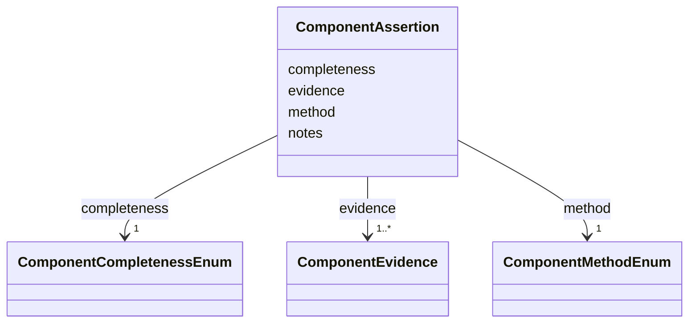

# Class: ComponentAssertion


_Provenance for one IngredientRecord.components decomposition. The method states how the constituent list was derived; evidence identifies the source that can be checked. It describes has-part only: a mapping or interpretation of the whole record as another ingredient is an ontology-grounding claim, not a component._


URI: [mediaingredientmech:ComponentAssertion](https://w3id.org/mediaingredientmech/ComponentAssertion)





<!-- no inheritance hierarchy -->


## Slots

| Name | Cardinality and Range | Description | Inheritance |
| ---  | --- | --- | --- |
| [method](method.md) | 1 <br/> [ComponentMethodEnum](ComponentMethodEnum.md) | Method used to derive the constituent list | direct |
| [completeness](completeness.md) | 1 <br/> [ComponentCompletenessEnum](ComponentCompletenessEnum.md) | Whether the cited source establishes a complete constituent list | direct |
| [evidence](evidence.md) | 1..* <br/> [ComponentEvidence](ComponentEvidence.md) | One or more structured evidence records supporting the decomposition | direct |
| [notes](notes.md) | 0..1 <br/> [String](String.md) | Additional context about the decomposition as a whole | direct |


## Usages

| used by | used in | type | used |
| ---  | --- | --- | --- |
| [IngredientRecord](IngredientRecord.md) | [component_assertion](component_assertion.md) | range | [ComponentAssertion](ComponentAssertion.md) |


## Identifier and Mapping Information


### Schema Source


* from schema: https://w3id.org/mediaingredientmech


## Mappings

| Mapping Type | Mapped Value |
| ---  | ---  |
| self | mediaingredientmech:ComponentAssertion |
| native | mediaingredientmech:ComponentAssertion |


## LinkML Source

<!-- TODO: investigate https://stackoverflow.com/questions/37606292/how-to-create-tabbed-code-blocks-in-mkdocs-or-sphinx -->

### Direct

<details>
```yaml
name: ComponentAssertion
description: 'Provenance for one IngredientRecord.components decomposition. The method
  states how the constituent list was derived; evidence identifies the source that
  can be checked. It describes has-part only: a mapping or interpretation of the whole
  record as another ingredient is an ontology-grounding claim, not a component.'
from_schema: https://w3id.org/mediaingredientmech
attributes:
  method:
    name: method
    description: Method used to derive the constituent list.
    from_schema: https://w3id.org/mediaingredientmech
    rank: 1000
    domain_of:
    - ComponentAssertion
    range: ComponentMethodEnum
    required: true
  completeness:
    name: completeness
    description: Whether the cited source establishes a complete constituent list.
    from_schema: https://w3id.org/mediaingredientmech
    rank: 1000
    domain_of:
    - ComponentAssertion
    range: ComponentCompletenessEnum
    required: true
  evidence:
    name: evidence
    description: One or more structured evidence records supporting the decomposition.
    from_schema: https://w3id.org/mediaingredientmech
    domain_of:
    - OntologyMapping
    - CommunityOrganismRoleAssignment
    - NutritionalRoleAssignment
    - PhysicochemicalRoleAssignment
    - CellularMetabolicRoleAssignment
    - ComponentAssertion
    - Discussion
    - Dataset
    range: ComponentEvidence
    required: true
    multivalued: true
    inlined: true
    inlined_as_list: true
  notes:
    name: notes
    description: Additional context about the decomposition as a whole.
    from_schema: https://w3id.org/mediaingredientmech
    domain_of:
    - IngredientRecord
    - EnvironmentContext
    - MappingEvidence
    - SuppliedForm
    - CurationEvent
    - CommunityOrganismRoleAssignment
    - NutritionalRoleAssignment
    - PhysicochemicalRoleAssignment
    - CellularMetabolicRoleAssignment
    - ComponentAssertion
    - ComponentEvidence
    - SupportingReference
    - Discussion
    - Dataset

```
</details>

### Induced

<details>
```yaml
name: ComponentAssertion
description: 'Provenance for one IngredientRecord.components decomposition. The method
  states how the constituent list was derived; evidence identifies the source that
  can be checked. It describes has-part only: a mapping or interpretation of the whole
  record as another ingredient is an ontology-grounding claim, not a component.'
from_schema: https://w3id.org/mediaingredientmech
attributes:
  method:
    name: method
    description: Method used to derive the constituent list.
    from_schema: https://w3id.org/mediaingredientmech
    rank: 1000
    alias: method
    owner: ComponentAssertion
    domain_of:
    - ComponentAssertion
    range: ComponentMethodEnum
    required: true
  completeness:
    name: completeness
    description: Whether the cited source establishes a complete constituent list.
    from_schema: https://w3id.org/mediaingredientmech
    rank: 1000
    alias: completeness
    owner: ComponentAssertion
    domain_of:
    - ComponentAssertion
    range: ComponentCompletenessEnum
    required: true
  evidence:
    name: evidence
    description: One or more structured evidence records supporting the decomposition.
    from_schema: https://w3id.org/mediaingredientmech
    alias: evidence
    owner: ComponentAssertion
    domain_of:
    - OntologyMapping
    - CommunityOrganismRoleAssignment
    - NutritionalRoleAssignment
    - PhysicochemicalRoleAssignment
    - CellularMetabolicRoleAssignment
    - ComponentAssertion
    - Discussion
    - Dataset
    range: ComponentEvidence
    required: true
    multivalued: true
    inlined: true
    inlined_as_list: true
  notes:
    name: notes
    description: Additional context about the decomposition as a whole.
    from_schema: https://w3id.org/mediaingredientmech
    alias: notes
    owner: ComponentAssertion
    domain_of:
    - IngredientRecord
    - EnvironmentContext
    - MappingEvidence
    - SuppliedForm
    - CurationEvent
    - CommunityOrganismRoleAssignment
    - NutritionalRoleAssignment
    - PhysicochemicalRoleAssignment
    - CellularMetabolicRoleAssignment
    - ComponentAssertion
    - ComponentEvidence
    - SupportingReference
    - Discussion
    - Dataset
    range: string

```
</details>