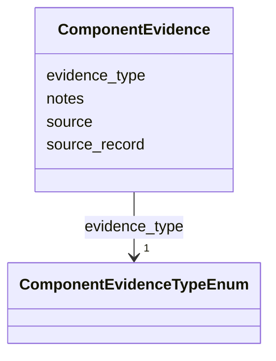

# Class: ComponentEvidence


_Evidence supporting an IngredientRecord.components decomposition._


URI: [mediaingredientmech:ComponentEvidence](https://w3id.org/mediaingredientmech/ComponentEvidence)





<!-- no inheritance hierarchy -->


## Slots

| Name | Cardinality and Range | Description | Inheritance |
| ---  | --- | --- | --- |
| [evidence_type](evidence_type.md) | 1 <br/> [ComponentEvidenceTypeEnum](ComponentEvidenceTypeEnum.md) | Kind of source that supports the constituent list | direct |
| [source](source.md) | 1 <br/> [String](String.md) | Stable source name, repository-relative path, database identifier, DOI, or UR... | direct |
| [source_record](source_record.md) | 0..1 <br/> [String](String.md) | Row key, recipe identifier, source label, or other locator within source | direct |
| [notes](notes.md) | 0..1 <br/> [String](String.md) | Curator explanation of what the source establishes | direct |


## Usages

| used by | used in | type | used |
| ---  | --- | --- | --- |
| [ComponentAssertion](ComponentAssertion.md) | [evidence](evidence.md) | range | [ComponentEvidence](ComponentEvidence.md) |


## Identifier and Mapping Information


### Schema Source


* from schema: https://w3id.org/mediaingredientmech


## Mappings

| Mapping Type | Mapped Value |
| ---  | ---  |
| self | mediaingredientmech:ComponentEvidence |
| native | mediaingredientmech:ComponentEvidence |


## LinkML Source

<!-- TODO: investigate https://stackoverflow.com/questions/37606292/how-to-create-tabbed-code-blocks-in-mkdocs-or-sphinx -->

### Direct

<details>
```yaml
name: ComponentEvidence
description: Evidence supporting an IngredientRecord.components decomposition.
from_schema: https://w3id.org/mediaingredientmech
attributes:
  evidence_type:
    name: evidence_type
    description: Kind of source that supports the constituent list.
    from_schema: https://w3id.org/mediaingredientmech
    domain_of:
    - MappingEvidence
    - ComponentEvidence
    range: ComponentEvidenceTypeEnum
    required: true
  source:
    name: source
    description: Stable source name, repository-relative path, database identifier,
      DOI, or URL.
    from_schema: https://w3id.org/mediaingredientmech
    domain_of:
    - MappingEvidence
    - IngredientSynonym
    - SourceOccurrence
    - ComponentEvidence
    - StockComponent
    required: true
  source_record:
    name: source_record
    description: Row key, recipe identifier, source label, or other locator within
      source.
    from_schema: https://w3id.org/mediaingredientmech
    rank: 1000
    domain_of:
    - ComponentEvidence
  notes:
    name: notes
    description: Curator explanation of what the source establishes.
    from_schema: https://w3id.org/mediaingredientmech
    domain_of:
    - IngredientRecord
    - EnvironmentContext
    - MappingEvidence
    - SuppliedForm
    - CurationEvent
    - CommunityOrganismRoleAssignment
    - NutritionalRoleAssignment
    - PhysicochemicalRoleAssignment
    - CellularMetabolicRoleAssignment
    - ComponentAssertion
    - ComponentEvidence
    - SupportingReference
    - Discussion
    - Dataset

```
</details>

### Induced

<details>
```yaml
name: ComponentEvidence
description: Evidence supporting an IngredientRecord.components decomposition.
from_schema: https://w3id.org/mediaingredientmech
attributes:
  evidence_type:
    name: evidence_type
    description: Kind of source that supports the constituent list.
    from_schema: https://w3id.org/mediaingredientmech
    alias: evidence_type
    owner: ComponentEvidence
    domain_of:
    - MappingEvidence
    - ComponentEvidence
    range: ComponentEvidenceTypeEnum
    required: true
  source:
    name: source
    description: Stable source name, repository-relative path, database identifier,
      DOI, or URL.
    from_schema: https://w3id.org/mediaingredientmech
    alias: source
    owner: ComponentEvidence
    domain_of:
    - MappingEvidence
    - IngredientSynonym
    - SourceOccurrence
    - ComponentEvidence
    - StockComponent
    range: string
    required: true
  source_record:
    name: source_record
    description: Row key, recipe identifier, source label, or other locator within
      source.
    from_schema: https://w3id.org/mediaingredientmech
    rank: 1000
    alias: source_record
    owner: ComponentEvidence
    domain_of:
    - ComponentEvidence
    range: string
  notes:
    name: notes
    description: Curator explanation of what the source establishes.
    from_schema: https://w3id.org/mediaingredientmech
    alias: notes
    owner: ComponentEvidence
    domain_of:
    - IngredientRecord
    - EnvironmentContext
    - MappingEvidence
    - SuppliedForm
    - CurationEvent
    - CommunityOrganismRoleAssignment
    - NutritionalRoleAssignment
    - PhysicochemicalRoleAssignment
    - CellularMetabolicRoleAssignment
    - ComponentAssertion
    - ComponentEvidence
    - SupportingReference
    - Discussion
    - Dataset
    range: string

```
</details>