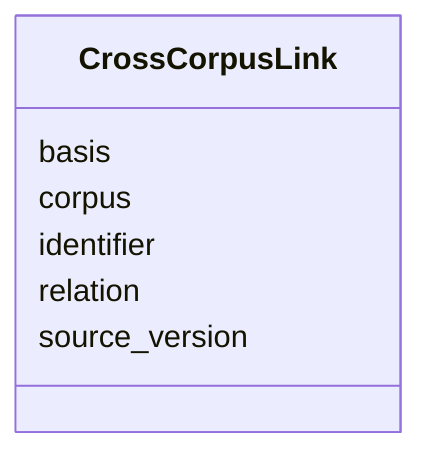

# Class: CrossCorpusLink 


_A directed link from the containing record or sub-object to a record in another Mech corpus. The five field names preserve NaturalProductMech's existing link shape. Consumers define allowed relations and evidence requirements; this class alone does not verify a target, its version, organism scope, or the scientific basis of the relation._


URI: [mediaingredientmech:CrossCorpusLink](https://w3id.org/mediaingredientmech/CrossCorpusLink)





<!-- no inheritance hierarchy -->


## Slots

| Name | Cardinality and Range | Description | Inheritance |
| ---  | --- | --- | --- |
| [corpus](corpus.md) | 1 <br/> [String](String.md) | Canonical target corpus name, for example PathwayMech or AntibioticMech | direct |
| [identifier](identifier.md) | 1 <br/> [String](String.md) | Target record identifier, verbatim, in the named corpus | direct |
| [relation](relation.md) | 1 <br/> [String](String.md) | Directed relation from the containing record or sub-object to the target | direct |
| [basis](basis.md) | 1 <br/> [String](String.md) | How the relation was established, for example SAME_INCHIKEY for an exact chem... | direct |
| [source_version](source_version.md) | 0..1 <br/> [String](String.md) | Pinned commit or release of the target corpus that was checked | direct |


## Identifier and Mapping Information


### Schema Source


* from schema: https://w3id.org/mediaingredientmech


## Mappings

| Mapping Type | Mapped Value |
| ---  | ---  |
| self | mediaingredientmech:CrossCorpusLink |
| native | mediaingredientmech:CrossCorpusLink |


## LinkML Source

<!-- TODO: investigate https://stackoverflow.com/questions/37606292/how-to-create-tabbed-code-blocks-in-mkdocs-or-sphinx -->

### Direct

<details>
```yaml
name: CrossCorpusLink
description: A directed link from the containing record or sub-object to a record
  in another Mech corpus. The five field names preserve NaturalProductMech's existing
  link shape. Consumers define allowed relations and evidence requirements; this class
  alone does not verify a target, its version, organism scope, or the scientific basis
  of the relation.
from_schema: https://w3id.org/mediaingredientmech
attributes:
  corpus:
    name: corpus
    description: Canonical target corpus name, for example PathwayMech or AntibioticMech.
    from_schema: https://w3id.org/kg-microbe/mech-shared
    rank: 1000
    domain_of:
    - CrossCorpusLink
    range: string
    required: true
  identifier:
    name: identifier
    description: Target record identifier, verbatim, in the named corpus.
    from_schema: https://w3id.org/kg-microbe/mech-shared
    domain_of:
    - IngredientRecord
    - CrossCorpusLink
    range: string
    required: true
  relation:
    name: relation
    description: Directed relation from the containing record or sub-object to the
      target. Consumers may constrain this string with a local enum through slot_usage
      on a subclass, without changing the shared module.
    from_schema: https://w3id.org/kg-microbe/mech-shared
    rank: 1000
    domain_of:
    - CrossCorpusLink
    range: string
    required: true
  basis:
    name: basis
    description: How the relation was established, for example SAME_INCHIKEY for an
      exact chemical-structure join. A match on a protein or reaction must not be
      presented as sufficient evidence for a stronger relation.
    from_schema: https://w3id.org/kg-microbe/mech-shared
    rank: 1000
    domain_of:
    - CrossCorpusLink
    range: string
    required: true
  source_version:
    name: source_version
    description: Pinned commit or release of the target corpus that was checked. Optional
      for compatibility with existing NaturalProductMech links; consumers should require
      a full immutable version for newly added links.
    from_schema: https://w3id.org/kg-microbe/mech-shared
    rank: 1000
    domain_of:
    - CrossCorpusLink
    range: string

```
</details>

### Induced

<details>
```yaml
name: CrossCorpusLink
description: A directed link from the containing record or sub-object to a record
  in another Mech corpus. The five field names preserve NaturalProductMech's existing
  link shape. Consumers define allowed relations and evidence requirements; this class
  alone does not verify a target, its version, organism scope, or the scientific basis
  of the relation.
from_schema: https://w3id.org/mediaingredientmech
attributes:
  corpus:
    name: corpus
    description: Canonical target corpus name, for example PathwayMech or AntibioticMech.
    from_schema: https://w3id.org/kg-microbe/mech-shared
    rank: 1000
    alias: corpus
    owner: CrossCorpusLink
    domain_of:
    - CrossCorpusLink
    range: string
    required: true
  identifier:
    name: identifier
    description: Target record identifier, verbatim, in the named corpus.
    from_schema: https://w3id.org/kg-microbe/mech-shared
    alias: identifier
    owner: CrossCorpusLink
    domain_of:
    - IngredientRecord
    - CrossCorpusLink
    range: string
    required: true
  relation:
    name: relation
    description: Directed relation from the containing record or sub-object to the
      target. Consumers may constrain this string with a local enum through slot_usage
      on a subclass, without changing the shared module.
    from_schema: https://w3id.org/kg-microbe/mech-shared
    rank: 1000
    alias: relation
    owner: CrossCorpusLink
    domain_of:
    - CrossCorpusLink
    range: string
    required: true
  basis:
    name: basis
    description: How the relation was established, for example SAME_INCHIKEY for an
      exact chemical-structure join. A match on a protein or reaction must not be
      presented as sufficient evidence for a stronger relation.
    from_schema: https://w3id.org/kg-microbe/mech-shared
    rank: 1000
    alias: basis
    owner: CrossCorpusLink
    domain_of:
    - CrossCorpusLink
    range: string
    required: true
  source_version:
    name: source_version
    description: Pinned commit or release of the target corpus that was checked. Optional
      for compatibility with existing NaturalProductMech links; consumers should require
      a full immutable version for newly added links.
    from_schema: https://w3id.org/kg-microbe/mech-shared
    rank: 1000
    alias: source_version
    owner: CrossCorpusLink
    domain_of:
    - CrossCorpusLink
    range: string

```
</details>