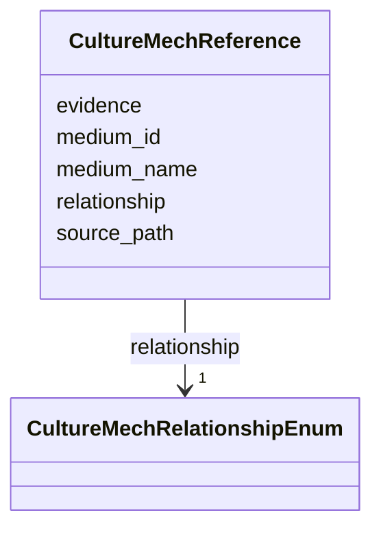

# Class: CultureMechReference 


_A verified link from a MIM record to a CultureMech recipe, carried by stable id rather than by display name. CultureMech names are not unique -- 2291 are shared by more than one recipe and 4784 recipes carry none -- so a name cannot identify a recipe and must never be the stored identity (#447)._


URI: [mediaingredientmech:CultureMechReference](https://w3id.org/mediaingredientmech/CultureMechReference)





<!-- no inheritance hierarchy -->


## Slots

| Name | Cardinality and Range | Description | Inheritance |
| ---  | --- | --- | --- |
| [medium_id](medium_id.md) | 1 <br/> [String](String.md) | The stable CultureMech recipe id | direct |
| [medium_name](medium_name.md) | 0..1 <br/> [String](String.md) | Display name at the time of linking | direct |
| [relationship](relationship.md) | 1 <br/> [CultureMechRelationshipEnum](CultureMechRelationshipEnum.md) | How this record relates to that recipe | direct |
| [source_path](source_path.md) | 0..1 <br/> [String](String.md) | Path to the recipe within CultureMech at the time of linking, as provenance | direct |
| [evidence](evidence.md) | 1 <br/> [String](String.md) | Why this link is believed, in prose | direct |


## Usages

| used by | used in | type | used |
| ---  | --- | --- | --- |
| [IngredientRecord](IngredientRecord.md) | [culturemech_reference](culturemech_reference.md) | range | [CultureMechReference](CultureMechReference.md) |


## Identifier and Mapping Information


### Schema Source


* from schema: https://w3id.org/mediaingredientmech


## Mappings

| Mapping Type | Mapped Value |
| ---  | ---  |
| self | mediaingredientmech:CultureMechReference |
| native | mediaingredientmech:CultureMechReference |


## LinkML Source

<!-- TODO: investigate https://stackoverflow.com/questions/37606292/how-to-create-tabbed-code-blocks-in-mkdocs-or-sphinx -->

### Direct

<details>
```yaml
name: CultureMechReference
description: A verified link from a MIM record to a CultureMech recipe, carried by
  stable id rather than by display name. CultureMech names are not unique -- 2291
  are shared by more than one recipe and 4784 recipes carry none -- so a name cannot
  identify a recipe and must never be the stored identity (#447).
from_schema: https://w3id.org/mediaingredientmech
attributes:
  medium_id:
    name: medium_id
    description: The stable CultureMech recipe id. Every recipe in `data/normalized_yaml/`
      carries one as its first field, and they are unique across all 15877 of them.
    from_schema: https://w3id.org/mediaingredientmech
    rank: 1000
    domain_of:
    - CultureMechReference
    required: true
    pattern: ^CultureMech:[0-9]{6}$
  medium_name:
    name: medium_name
    description: Display name at the time of linking. Convenience for a human reader
      only -- never used for matching, and not authoritative if CultureMech renames
      the recipe.
    from_schema: https://w3id.org/mediaingredientmech
    rank: 1000
    domain_of:
    - CultureMechReference
  relationship:
    name: relationship
    description: How this record relates to that recipe. Required because an untyped
      link cannot distinguish the claims it might be making, which is the defect that
      motivated this class.
    from_schema: https://w3id.org/mediaingredientmech
    rank: 1000
    domain_of:
    - CultureMechReference
    range: CultureMechRelationshipEnum
    required: true
  source_path:
    name: source_path
    description: Path to the recipe within CultureMech at the time of linking, as
      provenance. Not resolved at read time; the id is the identity.
    from_schema: https://w3id.org/mediaingredientmech
    rank: 1000
    domain_of:
    - CultureMechReference
  evidence:
    name: evidence
    description: Why this link is believed, in prose. Required so a link can never
      rest on a name match alone -- both existing links were verified by composition,
      and the record of that is the reason to trust them.
    from_schema: https://w3id.org/mediaingredientmech
    domain_of:
    - OntologyMapping
    - CultureMechReference
    - CommunityOrganismRoleAssignment
    - NutritionalRoleAssignment
    - PhysicochemicalRoleAssignment
    - CellularMetabolicRoleAssignment
    - ComponentAssertion
    - Discussion
    - Dataset
    required: true

```
</details>

### Induced

<details>
```yaml
name: CultureMechReference
description: A verified link from a MIM record to a CultureMech recipe, carried by
  stable id rather than by display name. CultureMech names are not unique -- 2291
  are shared by more than one recipe and 4784 recipes carry none -- so a name cannot
  identify a recipe and must never be the stored identity (#447).
from_schema: https://w3id.org/mediaingredientmech
attributes:
  medium_id:
    name: medium_id
    description: The stable CultureMech recipe id. Every recipe in `data/normalized_yaml/`
      carries one as its first field, and they are unique across all 15877 of them.
    from_schema: https://w3id.org/mediaingredientmech
    rank: 1000
    alias: medium_id
    owner: CultureMechReference
    domain_of:
    - CultureMechReference
    range: string
    required: true
    pattern: ^CultureMech:[0-9]{6}$
  medium_name:
    name: medium_name
    description: Display name at the time of linking. Convenience for a human reader
      only -- never used for matching, and not authoritative if CultureMech renames
      the recipe.
    from_schema: https://w3id.org/mediaingredientmech
    rank: 1000
    alias: medium_name
    owner: CultureMechReference
    domain_of:
    - CultureMechReference
    range: string
  relationship:
    name: relationship
    description: How this record relates to that recipe. Required because an untyped
      link cannot distinguish the claims it might be making, which is the defect that
      motivated this class.
    from_schema: https://w3id.org/mediaingredientmech
    rank: 1000
    alias: relationship
    owner: CultureMechReference
    domain_of:
    - CultureMechReference
    range: CultureMechRelationshipEnum
    required: true
  source_path:
    name: source_path
    description: Path to the recipe within CultureMech at the time of linking, as
      provenance. Not resolved at read time; the id is the identity.
    from_schema: https://w3id.org/mediaingredientmech
    rank: 1000
    alias: source_path
    owner: CultureMechReference
    domain_of:
    - CultureMechReference
    range: string
  evidence:
    name: evidence
    description: Why this link is believed, in prose. Required so a link can never
      rest on a name match alone -- both existing links were verified by composition,
      and the record of that is the reason to trust them.
    from_schema: https://w3id.org/mediaingredientmech
    alias: evidence
    owner: CultureMechReference
    domain_of:
    - OntologyMapping
    - CultureMechReference
    - CommunityOrganismRoleAssignment
    - NutritionalRoleAssignment
    - PhysicochemicalRoleAssignment
    - CellularMetabolicRoleAssignment
    - ComponentAssertion
    - Discussion
    - Dataset
    range: string
    required: true

```
</details>