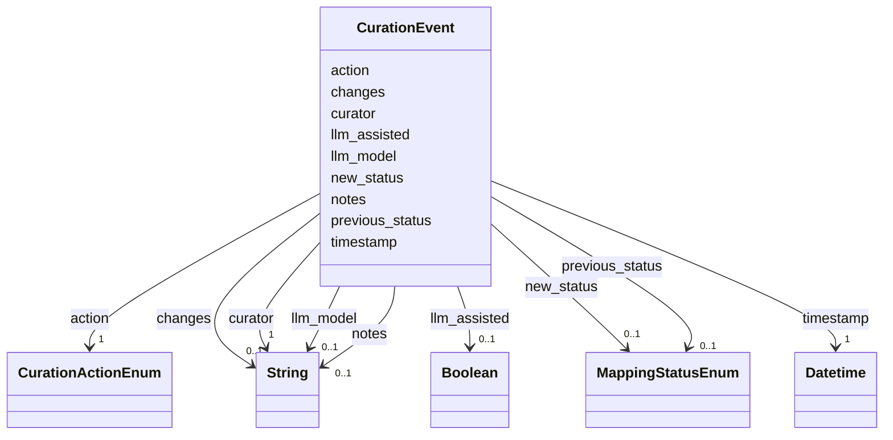

# Class: CurationEvent 


_Audit trail entry for a curation action_


URI: [mediaingredientmech:CurationEvent](https://w3id.org/mediaingredientmech/CurationEvent)





<!-- no inheritance hierarchy -->


## Slots

| Name | Cardinality and Range | Description | Inheritance |
| ---  | --- | --- | --- |
| [timestamp](timestamp.md) | 1 <br/> [xsd:dateTime](http://www.w3.org/2001/XMLSchema#dateTime) | When this action occurred | direct |
| [curator](curator.md) | 1 <br/> [xsd:string](http://www.w3.org/2001/XMLSchema#string) | Who performed this action (username or system) | direct |
| [action](action.md) | 1 <br/> [CurationActionEnum](CurationActionEnum.md) | Type of curation action | direct |
| [changes](changes.md) | 0..1 <br/> [xsd:string](http://www.w3.org/2001/XMLSchema#string) | Description of what changed | direct |
| [previous_status](previous_status.md) | 0..1 <br/> [MappingStatusEnum](MappingStatusEnum.md) | Status before this action | direct |
| [new_status](new_status.md) | 0..1 <br/> [MappingStatusEnum](MappingStatusEnum.md) | Status after this action | direct |
| [llm_assisted](llm_assisted.md) | 0..1 <br/> [xsd:boolean](http://www.w3.org/2001/XMLSchema#boolean) | Whether LLM assistance was used | direct |
| [llm_model](llm_model.md) | 0..1 <br/> [xsd:string](http://www.w3.org/2001/XMLSchema#string) | LLM model identifier (if llm_assisted=true) | direct |
| [notes](notes.md) | 0..1 <br/> [xsd:string](http://www.w3.org/2001/XMLSchema#string) | Additional context for this action | direct |


## Usages

| used by | used in | type | used |
| ---  | --- | --- | --- |
| [IngredientRecord](IngredientRecord.md) | [curation_history](curation_history.md) | range | [CurationEvent](CurationEvent.md) |


## Identifier and Mapping Information


### Schema Source


* from schema: https://w3id.org/mediaingredientmech


## Mappings

| Mapping Type | Mapped Value |
| ---  | ---  |
| self | mediaingredientmech:CurationEvent |
| native | mediaingredientmech:CurationEvent |


## LinkML Source

<!-- TODO: investigate https://stackoverflow.com/questions/37606292/how-to-create-tabbed-code-blocks-in-mkdocs-or-sphinx -->

### Direct

<details>
```yaml
name: CurationEvent
description: Audit trail entry for a curation action
from_schema: https://w3id.org/mediaingredientmech
attributes:
  timestamp:
    name: timestamp
    description: When this action occurred
    from_schema: https://w3id.org/mediaingredientmech
    rank: 1000
    domain_of:
    - CurationEvent
    range: datetime
    required: true
  curator:
    name: curator
    description: Who performed this action (username or system)
    from_schema: https://w3id.org/mediaingredientmech
    rank: 1000
    domain_of:
    - CurationEvent
    required: true
  action:
    name: action
    description: Type of curation action
    from_schema: https://w3id.org/mediaingredientmech
    rank: 1000
    domain_of:
    - CurationEvent
    range: CurationActionEnum
    required: true
  changes:
    name: changes
    description: Description of what changed
    from_schema: https://w3id.org/mediaingredientmech
    rank: 1000
    domain_of:
    - CurationEvent
  previous_status:
    name: previous_status
    description: Status before this action
    from_schema: https://w3id.org/mediaingredientmech
    rank: 1000
    domain_of:
    - CurationEvent
    range: MappingStatusEnum
  new_status:
    name: new_status
    description: Status after this action
    from_schema: https://w3id.org/mediaingredientmech
    rank: 1000
    domain_of:
    - CurationEvent
    range: MappingStatusEnum
  llm_assisted:
    name: llm_assisted
    description: Whether LLM assistance was used
    from_schema: https://w3id.org/mediaingredientmech
    rank: 1000
    domain_of:
    - CurationEvent
    range: boolean
  llm_model:
    name: llm_model
    description: LLM model identifier (if llm_assisted=true)
    from_schema: https://w3id.org/mediaingredientmech
    rank: 1000
    domain_of:
    - CurationEvent
  notes:
    name: notes
    description: Additional context for this action
    from_schema: https://w3id.org/mediaingredientmech
    domain_of:
    - IngredientRecord
    - MappingEvidence
    - CurationEvent
    - RoleAssignment
    - CellularRoleAssignment

```
</details>

### Induced

<details>
```yaml
name: CurationEvent
description: Audit trail entry for a curation action
from_schema: https://w3id.org/mediaingredientmech
attributes:
  timestamp:
    name: timestamp
    description: When this action occurred
    from_schema: https://w3id.org/mediaingredientmech
    rank: 1000
    alias: timestamp
    owner: CurationEvent
    domain_of:
    - CurationEvent
    range: datetime
    required: true
  curator:
    name: curator
    description: Who performed this action (username or system)
    from_schema: https://w3id.org/mediaingredientmech
    rank: 1000
    alias: curator
    owner: CurationEvent
    domain_of:
    - CurationEvent
    range: string
    required: true
  action:
    name: action
    description: Type of curation action
    from_schema: https://w3id.org/mediaingredientmech
    rank: 1000
    alias: action
    owner: CurationEvent
    domain_of:
    - CurationEvent
    range: CurationActionEnum
    required: true
  changes:
    name: changes
    description: Description of what changed
    from_schema: https://w3id.org/mediaingredientmech
    rank: 1000
    alias: changes
    owner: CurationEvent
    domain_of:
    - CurationEvent
    range: string
  previous_status:
    name: previous_status
    description: Status before this action
    from_schema: https://w3id.org/mediaingredientmech
    rank: 1000
    alias: previous_status
    owner: CurationEvent
    domain_of:
    - CurationEvent
    range: MappingStatusEnum
  new_status:
    name: new_status
    description: Status after this action
    from_schema: https://w3id.org/mediaingredientmech
    rank: 1000
    alias: new_status
    owner: CurationEvent
    domain_of:
    - CurationEvent
    range: MappingStatusEnum
  llm_assisted:
    name: llm_assisted
    description: Whether LLM assistance was used
    from_schema: https://w3id.org/mediaingredientmech
    rank: 1000
    alias: llm_assisted
    owner: CurationEvent
    domain_of:
    - CurationEvent
    range: boolean
  llm_model:
    name: llm_model
    description: LLM model identifier (if llm_assisted=true)
    from_schema: https://w3id.org/mediaingredientmech
    rank: 1000
    alias: llm_model
    owner: CurationEvent
    domain_of:
    - CurationEvent
    range: string
  notes:
    name: notes
    description: Additional context for this action
    from_schema: https://w3id.org/mediaingredientmech
    alias: notes
    owner: CurationEvent
    domain_of:
    - IngredientRecord
    - MappingEvidence
    - CurationEvent
    - RoleAssignment
    - CellularRoleAssignment
    range: string

```
</details>