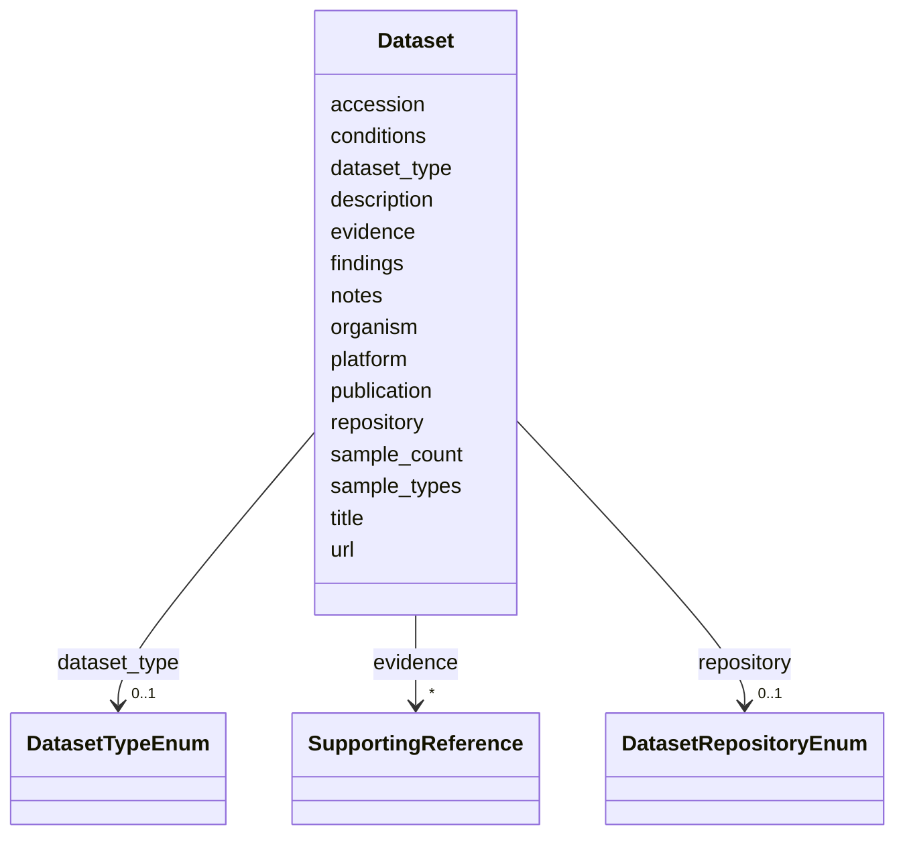

# Class: Dataset 


_A reference to a publicly available dataset (omics, sequence, phenotype) relevant to this record. A lightweight repository-accession reference, not a full Datasheets-for-Datasets / DCAT description._


URI: [mediaingredientmech:Dataset](https://w3id.org/mediaingredientmech/Dataset)





<!-- no inheritance hierarchy -->


## Slots

| Name | Cardinality and Range | Description | Inheritance |
| ---  | --- | --- | --- |
| [accession](accession.md) | 0..1 _recommended_ <br/> [String](String.md) | Repository accession or CURIE, e | direct |
| [title](title.md) | 0..1 <br/> [String](String.md) | Short dataset title | direct |
| [description](description.md) | 0..1 _recommended_ <br/> [String](String.md) | Human-readable description; may add nuance beyond the title | direct |
| [organism](organism.md) | 0..1 <br/> [String](String.md) | Source organism / community label (free text or CURIE) | direct |
| [dataset_type](dataset_type.md) | 0..1 <br/> [DatasetTypeEnum](DatasetTypeEnum.md) |  | direct |
| [repository](repository.md) | 0..1 <br/> [DatasetRepositoryEnum](DatasetRepositoryEnum.md) |  | direct |
| [sample_types](sample_types.md) | * <br/> [String](String.md) | Sample/material types represented (free text or term labels) | direct |
| [sample_count](sample_count.md) | 0..1 <br/> [Integer](Integer.md) |  | direct |
| [conditions](conditions.md) | * <br/> [String](String.md) | Experimental conditions / groups represented | direct |
| [platform](platform.md) | 0..1 <br/> [String](String.md) | Sequencing/assay platform | direct |
| [url](url.md) | 0..1 <br/> [Uri](Uri.md) | Direct URL to the dataset landing page, if no CURIE applies | direct |
| [publication](publication.md) | 0..1 <br/> [String](String.md) | Associated publication reference (e | direct |
| [findings](findings.md) | 0..1 <br/> [String](String.md) | Brief note on what the dataset shows relevant to this record | direct |
| [evidence](evidence.md) | * <br/> [SupportingReference](SupportingReference.md) | Supporting citations | direct |
| [notes](notes.md) | 0..1 <br/> [String](String.md) |  | direct |


## Usages

| used by | used in | type | used |
| ---  | --- | --- | --- |
| [IngredientRecord](IngredientRecord.md) | [datasets](datasets.md) | range | [Dataset](Dataset.md) |


## Identifier and Mapping Information


### Schema Source


* from schema: https://w3id.org/mediaingredientmech


## Mappings

| Mapping Type | Mapped Value |
| ---  | ---  |
| self | mediaingredientmech:Dataset |
| native | mediaingredientmech:Dataset |


## LinkML Source

<!-- TODO: investigate https://stackoverflow.com/questions/37606292/how-to-create-tabbed-code-blocks-in-mkdocs-or-sphinx -->

### Direct

<details>
```yaml
name: Dataset
description: A reference to a publicly available dataset (omics, sequence, phenotype)
  relevant to this record. A lightweight repository-accession reference, not a full
  Datasheets-for-Datasets / DCAT description.
from_schema: https://w3id.org/mediaingredientmech
attributes:
  accession:
    name: accession
    description: Repository accession or CURIE, e.g. `geo:GSE36701`, `NCBI_SRA:SRP...`.
      (CultureMech `dataset_id` migrates here.)
    from_schema: https://w3id.org/kg-microbe/mech-shared
    rank: 1000
    domain_of:
    - Dataset
    recommended: true
  title:
    name: title
    description: Short dataset title. (CommunityMech `name` migrates here.)
    from_schema: https://w3id.org/kg-microbe/mech-shared
    rank: 1000
    domain_of:
    - Dataset
  description:
    name: description
    description: Human-readable description; may add nuance beyond the title.
    from_schema: https://w3id.org/kg-microbe/mech-shared
    domain_of:
    - ProposedExperiment
    - Dataset
    recommended: true
  organism:
    name: organism
    description: Source organism / community label (free text or CURIE).
    from_schema: https://w3id.org/kg-microbe/mech-shared
    rank: 1000
    domain_of:
    - Dataset
  dataset_type:
    name: dataset_type
    from_schema: https://w3id.org/kg-microbe/mech-shared
    rank: 1000
    domain_of:
    - Dataset
    range: DatasetTypeEnum
  repository:
    name: repository
    from_schema: https://w3id.org/kg-microbe/mech-shared
    rank: 1000
    domain_of:
    - Dataset
    range: DatasetRepositoryEnum
  sample_types:
    name: sample_types
    description: Sample/material types represented (free text or term labels).
    from_schema: https://w3id.org/kg-microbe/mech-shared
    rank: 1000
    domain_of:
    - Dataset
    multivalued: true
  sample_count:
    name: sample_count
    from_schema: https://w3id.org/kg-microbe/mech-shared
    rank: 1000
    domain_of:
    - Dataset
    range: integer
  conditions:
    name: conditions
    description: Experimental conditions / groups represented.
    from_schema: https://w3id.org/kg-microbe/mech-shared
    rank: 1000
    domain_of:
    - Dataset
    multivalued: true
  platform:
    name: platform
    description: Sequencing/assay platform.
    from_schema: https://w3id.org/kg-microbe/mech-shared
    rank: 1000
    domain_of:
    - Dataset
  url:
    name: url
    description: Direct URL to the dataset landing page, if no CURIE applies.
    from_schema: https://w3id.org/kg-microbe/mech-shared
    domain_of:
    - RoleCitation
    - Dataset
    range: uri
  publication:
    name: publication
    description: Associated publication reference (e.g. PMID:...).
    from_schema: https://w3id.org/kg-microbe/mech-shared
    rank: 1000
    domain_of:
    - Dataset
  findings:
    name: findings
    description: Brief note on what the dataset shows relevant to this record.
    from_schema: https://w3id.org/kg-microbe/mech-shared
    rank: 1000
    domain_of:
    - Dataset
  evidence:
    name: evidence
    description: Supporting citations.
    from_schema: https://w3id.org/kg-microbe/mech-shared
    domain_of:
    - OntologyMapping
    - RoleAssignment
    - CommunityOrganismRoleAssignment
    - NutritionalRoleAssignment
    - PhysicochemicalRoleAssignment
    - CellularMetabolicRoleAssignment
    - Discussion
    - Dataset
    range: SupportingReference
    multivalued: true
    inlined: true
    inlined_as_list: true
  notes:
    name: notes
    from_schema: https://w3id.org/kg-microbe/mech-shared
    domain_of:
    - IngredientRecord
    - EnvironmentContext
    - MappingEvidence
    - CurationEvent
    - RoleAssignment
    - CommunityOrganismRoleAssignment
    - NutritionalRoleAssignment
    - PhysicochemicalRoleAssignment
    - CellularMetabolicRoleAssignment
    - SupportingReference
    - Discussion
    - Dataset

```
</details>

### Induced

<details>
```yaml
name: Dataset
description: A reference to a publicly available dataset (omics, sequence, phenotype)
  relevant to this record. A lightweight repository-accession reference, not a full
  Datasheets-for-Datasets / DCAT description.
from_schema: https://w3id.org/mediaingredientmech
attributes:
  accession:
    name: accession
    description: Repository accession or CURIE, e.g. `geo:GSE36701`, `NCBI_SRA:SRP...`.
      (CultureMech `dataset_id` migrates here.)
    from_schema: https://w3id.org/kg-microbe/mech-shared
    rank: 1000
    alias: accession
    owner: Dataset
    domain_of:
    - Dataset
    range: string
    recommended: true
  title:
    name: title
    description: Short dataset title. (CommunityMech `name` migrates here.)
    from_schema: https://w3id.org/kg-microbe/mech-shared
    rank: 1000
    alias: title
    owner: Dataset
    domain_of:
    - Dataset
    range: string
  description:
    name: description
    description: Human-readable description; may add nuance beyond the title.
    from_schema: https://w3id.org/kg-microbe/mech-shared
    alias: description
    owner: Dataset
    domain_of:
    - ProposedExperiment
    - Dataset
    range: string
    recommended: true
  organism:
    name: organism
    description: Source organism / community label (free text or CURIE).
    from_schema: https://w3id.org/kg-microbe/mech-shared
    rank: 1000
    alias: organism
    owner: Dataset
    domain_of:
    - Dataset
    range: string
  dataset_type:
    name: dataset_type
    from_schema: https://w3id.org/kg-microbe/mech-shared
    rank: 1000
    alias: dataset_type
    owner: Dataset
    domain_of:
    - Dataset
    range: DatasetTypeEnum
  repository:
    name: repository
    from_schema: https://w3id.org/kg-microbe/mech-shared
    rank: 1000
    alias: repository
    owner: Dataset
    domain_of:
    - Dataset
    range: DatasetRepositoryEnum
  sample_types:
    name: sample_types
    description: Sample/material types represented (free text or term labels).
    from_schema: https://w3id.org/kg-microbe/mech-shared
    rank: 1000
    alias: sample_types
    owner: Dataset
    domain_of:
    - Dataset
    range: string
    multivalued: true
  sample_count:
    name: sample_count
    from_schema: https://w3id.org/kg-microbe/mech-shared
    rank: 1000
    alias: sample_count
    owner: Dataset
    domain_of:
    - Dataset
    range: integer
  conditions:
    name: conditions
    description: Experimental conditions / groups represented.
    from_schema: https://w3id.org/kg-microbe/mech-shared
    rank: 1000
    alias: conditions
    owner: Dataset
    domain_of:
    - Dataset
    range: string
    multivalued: true
  platform:
    name: platform
    description: Sequencing/assay platform.
    from_schema: https://w3id.org/kg-microbe/mech-shared
    rank: 1000
    alias: platform
    owner: Dataset
    domain_of:
    - Dataset
    range: string
  url:
    name: url
    description: Direct URL to the dataset landing page, if no CURIE applies.
    from_schema: https://w3id.org/kg-microbe/mech-shared
    alias: url
    owner: Dataset
    domain_of:
    - RoleCitation
    - Dataset
    range: uri
  publication:
    name: publication
    description: Associated publication reference (e.g. PMID:...).
    from_schema: https://w3id.org/kg-microbe/mech-shared
    rank: 1000
    alias: publication
    owner: Dataset
    domain_of:
    - Dataset
    range: string
  findings:
    name: findings
    description: Brief note on what the dataset shows relevant to this record.
    from_schema: https://w3id.org/kg-microbe/mech-shared
    rank: 1000
    alias: findings
    owner: Dataset
    domain_of:
    - Dataset
    range: string
  evidence:
    name: evidence
    description: Supporting citations.
    from_schema: https://w3id.org/kg-microbe/mech-shared
    alias: evidence
    owner: Dataset
    domain_of:
    - OntologyMapping
    - RoleAssignment
    - CommunityOrganismRoleAssignment
    - NutritionalRoleAssignment
    - PhysicochemicalRoleAssignment
    - CellularMetabolicRoleAssignment
    - Discussion
    - Dataset
    range: SupportingReference
    multivalued: true
    inlined: true
    inlined_as_list: true
  notes:
    name: notes
    from_schema: https://w3id.org/kg-microbe/mech-shared
    alias: notes
    owner: Dataset
    domain_of:
    - IngredientRecord
    - EnvironmentContext
    - MappingEvidence
    - CurationEvent
    - RoleAssignment
    - CommunityOrganismRoleAssignment
    - NutritionalRoleAssignment
    - PhysicochemicalRoleAssignment
    - CellularMetabolicRoleAssignment
    - SupportingReference
    - Discussion
    - Dataset
    range: string

```
</details>