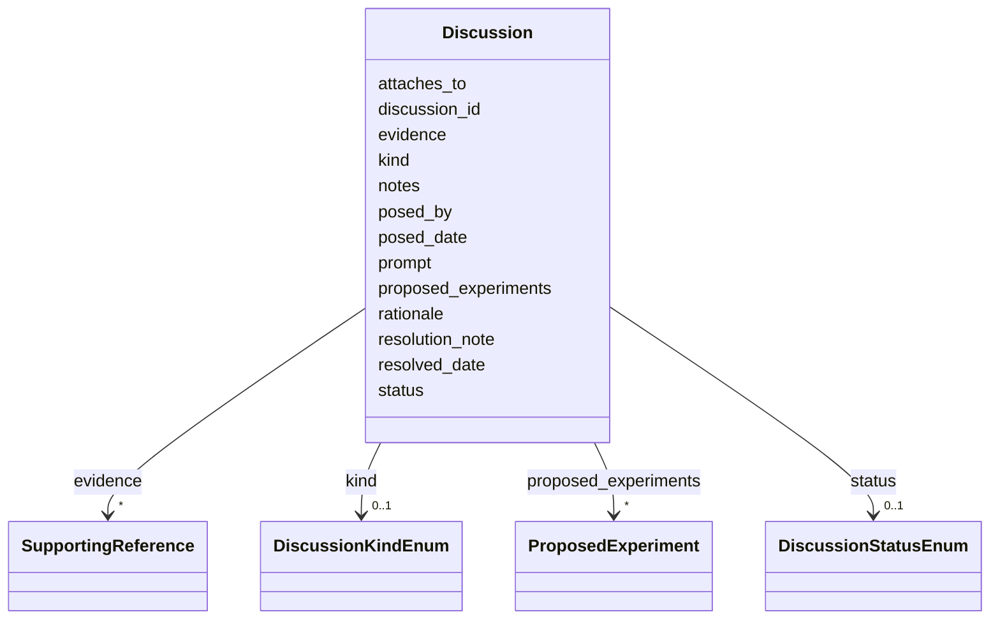

# Class: Discussion 


_A thread-like record of an open question, controversy, curation todo, emerging hypothesis, knowledge gap, or interpretation debate attached to a record or one of its sub-objects. Captures the discourse / knowledge-gap layer of curation. External thread links (GitHub issues, forum posts) are cited via the `evidence` block, not a separate slot._


URI: [mediaingredientmech:Discussion](https://w3id.org/mediaingredientmech/Discussion)





<!-- no inheritance hierarchy -->


## Slots

| Name | Cardinality and Range | Description | Inheritance |
| ---  | --- | --- | --- |
| [discussion_id](discussion_id.md) | 1 <br/> [String](String.md) | Stable local identifier for this discussion thread | direct |
| [prompt](prompt.md) | 1 <br/> [String](String.md) | The open question, gap statement, or todo, in one or two sentences | direct |
| [kind](kind.md) | 0..1 <br/> [DiscussionKindEnum](DiscussionKindEnum.md) |  | direct |
| [status](status.md) | 0..1 <br/> [DiscussionStatusEnum](DiscussionStatusEnum.md) |  | direct |
| [attaches_to](attaches_to.md) | * <br/> [String](String.md) | Hash-anchor pointers into the sections/nodes this discussion concerns: `<sect... | direct |
| [rationale](rationale.md) | 0..1 <br/> [String](String.md) | Why this matters / what resolving it would change | direct |
| [proposed_experiments](proposed_experiments.md) | * <br/> [ProposedExperiment](ProposedExperiment.md) | Optional sketches of how the gap could be resolved | direct |
| [evidence](evidence.md) | * <br/> [SupportingReference](SupportingReference.md) | Supporting / contextual citations | direct |
| [posed_by](posed_by.md) | 0..1 <br/> [String](String.md) | Curator or agent that raised the discussion | direct |
| [posed_date](posed_date.md) | 0..1 <br/> [Date](Date.md) |  | direct |
| [resolved_date](resolved_date.md) | 0..1 <br/> [Date](Date.md) |  | direct |
| [resolution_note](resolution_note.md) | 0..1 <br/> [String](String.md) | How it was resolved (when status is RESOLVED) | direct |
| [notes](notes.md) | 0..1 <br/> [String](String.md) |  | direct |


## Usages

| used by | used in | type | used |
| ---  | --- | --- | --- |
| [IngredientRecord](IngredientRecord.md) | [discussions](discussions.md) | range | [Discussion](Discussion.md) |


## Identifier and Mapping Information


### Schema Source


* from schema: https://w3id.org/mediaingredientmech


## Mappings

| Mapping Type | Mapped Value |
| ---  | ---  |
| self | mediaingredientmech:Discussion |
| native | mediaingredientmech:Discussion |


## LinkML Source

<!-- TODO: investigate https://stackoverflow.com/questions/37606292/how-to-create-tabbed-code-blocks-in-mkdocs-or-sphinx -->

### Direct

<details>
```yaml
name: Discussion
description: A thread-like record of an open question, controversy, curation todo,
  emerging hypothesis, knowledge gap, or interpretation debate attached to a record
  or one of its sub-objects. Captures the discourse / knowledge-gap layer of curation.
  External thread links (GitHub issues, forum posts) are cited via the `evidence`
  block, not a separate slot.
from_schema: https://w3id.org/mediaingredientmech
attributes:
  discussion_id:
    name: discussion_id
    description: Stable local identifier for this discussion thread.
    from_schema: https://w3id.org/kg-microbe/mech-shared
    rank: 1000
    domain_of:
    - Discussion
    required: true
  prompt:
    name: prompt
    description: The open question, gap statement, or todo, in one or two sentences.
    from_schema: https://w3id.org/kg-microbe/mech-shared
    rank: 1000
    domain_of:
    - Discussion
    required: true
  kind:
    name: kind
    from_schema: https://w3id.org/kg-microbe/mech-shared
    rank: 1000
    domain_of:
    - Discussion
    range: DiscussionKindEnum
  status:
    name: status
    from_schema: https://w3id.org/kg-microbe/mech-shared
    rank: 1000
    domain_of:
    - Discussion
    range: DiscussionStatusEnum
  attaches_to:
    name: attaches_to
    description: 'Hash-anchor pointers into the sections/nodes this discussion concerns:
      `<section>#<anchor>`, e.g. `causal_graphs#edge_x`, `composition#ingredient_y`,
      `ecological_interactions#z`, `ontology_mapping#m`. Free-form so each Mech can
      anchor into its own record structure.'
    from_schema: https://w3id.org/kg-microbe/mech-shared
    rank: 1000
    domain_of:
    - Discussion
    multivalued: true
  rationale:
    name: rationale
    description: Why this matters / what resolving it would change.
    from_schema: https://w3id.org/kg-microbe/mech-shared
    rank: 1000
    domain_of:
    - Discussion
  proposed_experiments:
    name: proposed_experiments
    description: Optional sketches of how the gap could be resolved.
    from_schema: https://w3id.org/kg-microbe/mech-shared
    rank: 1000
    domain_of:
    - Discussion
    range: ProposedExperiment
    multivalued: true
    inlined: true
    inlined_as_list: true
  evidence:
    name: evidence
    description: Supporting / contextual citations.
    from_schema: https://w3id.org/kg-microbe/mech-shared
    domain_of:
    - OntologyMapping
    - CommunityOrganismRoleAssignment
    - NutritionalRoleAssignment
    - PhysicochemicalRoleAssignment
    - CellularMetabolicRoleAssignment
    - Discussion
    - Dataset
    range: SupportingReference
    multivalued: true
    inlined: true
    inlined_as_list: true
  posed_by:
    name: posed_by
    description: Curator or agent that raised the discussion.
    from_schema: https://w3id.org/kg-microbe/mech-shared
    rank: 1000
    domain_of:
    - Discussion
  posed_date:
    name: posed_date
    from_schema: https://w3id.org/kg-microbe/mech-shared
    rank: 1000
    domain_of:
    - Discussion
    range: date
  resolved_date:
    name: resolved_date
    from_schema: https://w3id.org/kg-microbe/mech-shared
    rank: 1000
    domain_of:
    - Discussion
    range: date
  resolution_note:
    name: resolution_note
    description: How it was resolved (when status is RESOLVED).
    from_schema: https://w3id.org/kg-microbe/mech-shared
    rank: 1000
    domain_of:
    - Discussion
  notes:
    name: notes
    from_schema: https://w3id.org/kg-microbe/mech-shared
    domain_of:
    - IngredientRecord
    - EnvironmentContext
    - MappingEvidence
    - CurationEvent
    - CommunityOrganismRoleAssignment
    - NutritionalRoleAssignment
    - PhysicochemicalRoleAssignment
    - CellularMetabolicRoleAssignment
    - SupportingReference
    - Discussion
    - Dataset

```
</details>

### Induced

<details>
```yaml
name: Discussion
description: A thread-like record of an open question, controversy, curation todo,
  emerging hypothesis, knowledge gap, or interpretation debate attached to a record
  or one of its sub-objects. Captures the discourse / knowledge-gap layer of curation.
  External thread links (GitHub issues, forum posts) are cited via the `evidence`
  block, not a separate slot.
from_schema: https://w3id.org/mediaingredientmech
attributes:
  discussion_id:
    name: discussion_id
    description: Stable local identifier for this discussion thread.
    from_schema: https://w3id.org/kg-microbe/mech-shared
    rank: 1000
    alias: discussion_id
    owner: Discussion
    domain_of:
    - Discussion
    range: string
    required: true
  prompt:
    name: prompt
    description: The open question, gap statement, or todo, in one or two sentences.
    from_schema: https://w3id.org/kg-microbe/mech-shared
    rank: 1000
    alias: prompt
    owner: Discussion
    domain_of:
    - Discussion
    range: string
    required: true
  kind:
    name: kind
    from_schema: https://w3id.org/kg-microbe/mech-shared
    rank: 1000
    alias: kind
    owner: Discussion
    domain_of:
    - Discussion
    range: DiscussionKindEnum
  status:
    name: status
    from_schema: https://w3id.org/kg-microbe/mech-shared
    rank: 1000
    alias: status
    owner: Discussion
    domain_of:
    - Discussion
    range: DiscussionStatusEnum
  attaches_to:
    name: attaches_to
    description: 'Hash-anchor pointers into the sections/nodes this discussion concerns:
      `<section>#<anchor>`, e.g. `causal_graphs#edge_x`, `composition#ingredient_y`,
      `ecological_interactions#z`, `ontology_mapping#m`. Free-form so each Mech can
      anchor into its own record structure.'
    from_schema: https://w3id.org/kg-microbe/mech-shared
    rank: 1000
    alias: attaches_to
    owner: Discussion
    domain_of:
    - Discussion
    range: string
    multivalued: true
  rationale:
    name: rationale
    description: Why this matters / what resolving it would change.
    from_schema: https://w3id.org/kg-microbe/mech-shared
    rank: 1000
    alias: rationale
    owner: Discussion
    domain_of:
    - Discussion
    range: string
  proposed_experiments:
    name: proposed_experiments
    description: Optional sketches of how the gap could be resolved.
    from_schema: https://w3id.org/kg-microbe/mech-shared
    rank: 1000
    alias: proposed_experiments
    owner: Discussion
    domain_of:
    - Discussion
    range: ProposedExperiment
    multivalued: true
    inlined: true
    inlined_as_list: true
  evidence:
    name: evidence
    description: Supporting / contextual citations.
    from_schema: https://w3id.org/kg-microbe/mech-shared
    alias: evidence
    owner: Discussion
    domain_of:
    - OntologyMapping
    - CommunityOrganismRoleAssignment
    - NutritionalRoleAssignment
    - PhysicochemicalRoleAssignment
    - CellularMetabolicRoleAssignment
    - Discussion
    - Dataset
    range: SupportingReference
    multivalued: true
    inlined: true
    inlined_as_list: true
  posed_by:
    name: posed_by
    description: Curator or agent that raised the discussion.
    from_schema: https://w3id.org/kg-microbe/mech-shared
    rank: 1000
    alias: posed_by
    owner: Discussion
    domain_of:
    - Discussion
    range: string
  posed_date:
    name: posed_date
    from_schema: https://w3id.org/kg-microbe/mech-shared
    rank: 1000
    alias: posed_date
    owner: Discussion
    domain_of:
    - Discussion
    range: date
  resolved_date:
    name: resolved_date
    from_schema: https://w3id.org/kg-microbe/mech-shared
    rank: 1000
    alias: resolved_date
    owner: Discussion
    domain_of:
    - Discussion
    range: date
  resolution_note:
    name: resolution_note
    description: How it was resolved (when status is RESOLVED).
    from_schema: https://w3id.org/kg-microbe/mech-shared
    rank: 1000
    alias: resolution_note
    owner: Discussion
    domain_of:
    - Discussion
    range: string
  notes:
    name: notes
    from_schema: https://w3id.org/kg-microbe/mech-shared
    alias: notes
    owner: Discussion
    domain_of:
    - IngredientRecord
    - EnvironmentContext
    - MappingEvidence
    - CurationEvent
    - CommunityOrganismRoleAssignment
    - NutritionalRoleAssignment
    - PhysicochemicalRoleAssignment
    - CellularMetabolicRoleAssignment
    - SupportingReference
    - Discussion
    - Dataset
    range: string

```
</details>