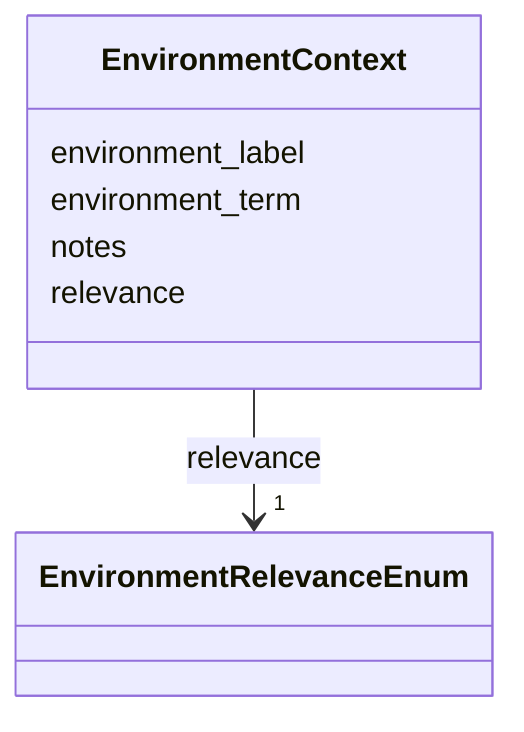

# Class: EnvironmentContext 


_Environmental context annotation for an ingredient. Links an ingredient to an ENVO environment with a relevance qualifier explaining why the ingredient is associated with that environment. Schema mirrors the legacy `MappedIngredient.environmental_context` class in mapped_ingredients_schema.yaml so cross-repo tooling can treat the two interchangeably._


URI: [mediaingredientmech:EnvironmentContext](https://w3id.org/mediaingredientmech/EnvironmentContext)





<!-- no inheritance hierarchy -->


## Slots

| Name | Cardinality and Range | Description | Inheritance |
| ---  | --- | --- | --- |
| [environment_term](environment_term.md) | 1 <br/> [String](String.md) | ENVO term CURIE (e | direct |
| [environment_label](environment_label.md) | 0..1 <br/> [String](String.md) | Canonical ENVO label for environment_term | direct |
| [relevance](relevance.md) | 1 <br/> [EnvironmentRelevanceEnum](EnvironmentRelevanceEnum.md) | Why this ingredient is relevant to the specified environment | direct |
| [notes](notes.md) | 0..1 <br/> [String](String.md) | Additional context about the ingredient-environment relationship | direct |


## Usages

| used by | used in | type | used |
| ---  | --- | --- | --- |
| [IngredientRecord](IngredientRecord.md) | [environmental_context](environmental_context.md) | range | [EnvironmentContext](EnvironmentContext.md) |


## Identifier and Mapping Information


### Schema Source


* from schema: https://w3id.org/mediaingredientmech


## Mappings

| Mapping Type | Mapped Value |
| ---  | ---  |
| self | mediaingredientmech:EnvironmentContext |
| native | mediaingredientmech:EnvironmentContext |


## LinkML Source

<!-- TODO: investigate https://stackoverflow.com/questions/37606292/how-to-create-tabbed-code-blocks-in-mkdocs-or-sphinx -->

### Direct

<details>
```yaml
name: EnvironmentContext
description: Environmental context annotation for an ingredient. Links an ingredient
  to an ENVO environment with a relevance qualifier explaining why the ingredient
  is associated with that environment. Schema mirrors the legacy `MappedIngredient.environmental_context`
  class in mapped_ingredients_schema.yaml so cross-repo tooling can treat the two
  interchangeably.
from_schema: https://w3id.org/mediaingredientmech
attributes:
  environment_term:
    name: environment_term
    description: ENVO term CURIE (e.g. `ENVO:00000044` for peatland)
    from_schema: https://w3id.org/mediaingredientmech
    rank: 1000
    domain_of:
    - EnvironmentContext
    range: string
    required: true
    pattern: ^ENVO:\d{7,8}$
  environment_label:
    name: environment_label
    description: Canonical ENVO label for environment_term. Verified against the ontology
      by the id↔label gate; the free/relevance name lives in notes.
    from_schema: https://w3id.org/mediaingredientmech
    rank: 1000
    slot_uri: rdfs:label
    domain_of:
    - EnvironmentContext
    range: string
    required: false
  relevance:
    name: relevance
    description: Why this ingredient is relevant to the specified environment
    from_schema: https://w3id.org/mediaingredientmech
    rank: 1000
    domain_of:
    - EnvironmentContext
    range: EnvironmentRelevanceEnum
    required: true
  notes:
    name: notes
    description: Additional context about the ingredient-environment relationship
    from_schema: https://w3id.org/mediaingredientmech
    domain_of:
    - IngredientRecord
    - EnvironmentContext
    - MappingEvidence
    - CurationEvent
    - RoleAssignment
    - CommunityOrganismRoleAssignment
    - NutritionalRoleAssignment
    - PhysicochemicalRoleAssignment
    - CellularMetabolicRoleAssignment
    - SupportingReference
    - Discussion
    - Dataset
    range: string
    required: false

```
</details>

### Induced

<details>
```yaml
name: EnvironmentContext
description: Environmental context annotation for an ingredient. Links an ingredient
  to an ENVO environment with a relevance qualifier explaining why the ingredient
  is associated with that environment. Schema mirrors the legacy `MappedIngredient.environmental_context`
  class in mapped_ingredients_schema.yaml so cross-repo tooling can treat the two
  interchangeably.
from_schema: https://w3id.org/mediaingredientmech
attributes:
  environment_term:
    name: environment_term
    description: ENVO term CURIE (e.g. `ENVO:00000044` for peatland)
    from_schema: https://w3id.org/mediaingredientmech
    rank: 1000
    alias: environment_term
    owner: EnvironmentContext
    domain_of:
    - EnvironmentContext
    range: string
    required: true
    pattern: ^ENVO:\d{7,8}$
  environment_label:
    name: environment_label
    description: Canonical ENVO label for environment_term. Verified against the ontology
      by the id↔label gate; the free/relevance name lives in notes.
    from_schema: https://w3id.org/mediaingredientmech
    rank: 1000
    slot_uri: rdfs:label
    alias: environment_label
    owner: EnvironmentContext
    domain_of:
    - EnvironmentContext
    range: string
    required: false
  relevance:
    name: relevance
    description: Why this ingredient is relevant to the specified environment
    from_schema: https://w3id.org/mediaingredientmech
    rank: 1000
    alias: relevance
    owner: EnvironmentContext
    domain_of:
    - EnvironmentContext
    range: EnvironmentRelevanceEnum
    required: true
  notes:
    name: notes
    description: Additional context about the ingredient-environment relationship
    from_schema: https://w3id.org/mediaingredientmech
    alias: notes
    owner: EnvironmentContext
    domain_of:
    - IngredientRecord
    - EnvironmentContext
    - MappingEvidence
    - CurationEvent
    - RoleAssignment
    - CommunityOrganismRoleAssignment
    - NutritionalRoleAssignment
    - PhysicochemicalRoleAssignment
    - CellularMetabolicRoleAssignment
    - SupportingReference
    - Discussion
    - Dataset
    range: string
    required: false

```
</details>