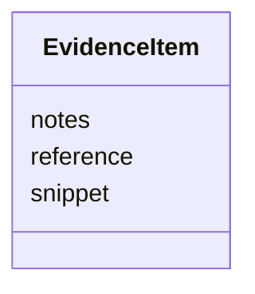

# Class: EvidenceItem 


_One citation for one graph claim (fleet EvidenceItem shape). The source kind is read from `reference`: PMID:/doi: is literature; a https://github.com/CultureBotAI/<Mech>/blob/<commit>/<path> permalink at the pinned commit is a sibling record; an ontology CURIE (CHEBI:, GO:) is an axiom recomputed from mappings/ontology_facts.tsv; any other CURIE (RHEA:, EC:, UniProtKB:, PDB:) is a database entry. Never an LLM._


URI: [mediaingredientmech:EvidenceItem](https://w3id.org/mediaingredientmech/EvidenceItem)





<!-- no inheritance hierarchy -->


## Slots

| Name | Cardinality and Range | Description | Inheritance |
| ---  | --- | --- | --- |
| [reference](reference.md) | 1 <br/> [String](String.md) | PMID: | direct |
| [snippet](snippet.md) | 0..1 <br/> [String](String.md) | Verbatim quote, only when actually verbatim: for literature from references_c... | direct |
| [notes](notes.md) | 0..1 <br/> [String](String.md) | What the source establishes for this claim | direct |


## Usages

| used by | used in | type | used |
| ---  | --- | --- | --- |
| [CausalEdge](CausalEdge.md) | [evidence](evidence.md) | range | [EvidenceItem](EvidenceItem.md) |
| [ProteinExample](ProteinExample.md) | [evidence](evidence.md) | range | [EvidenceItem](EvidenceItem.md) |


## Identifier and Mapping Information


### Schema Source


* from schema: https://w3id.org/mediaingredientmech


## Mappings

| Mapping Type | Mapped Value |
| ---  | ---  |
| self | mediaingredientmech:EvidenceItem |
| native | mediaingredientmech:EvidenceItem |


## LinkML Source

<!-- TODO: investigate https://stackoverflow.com/questions/37606292/how-to-create-tabbed-code-blocks-in-mkdocs-or-sphinx -->

### Direct

<details>
```yaml
name: EvidenceItem
description: 'One citation for one graph claim (fleet EvidenceItem shape). The source
  kind is read from `reference`: PMID:/doi: is literature; a https://github.com/CultureBotAI/<Mech>/blob/<commit>/<path>
  permalink at the pinned commit is a sibling record; an ontology CURIE (CHEBI:, GO:)
  is an axiom recomputed from mappings/ontology_facts.tsv; any other CURIE (RHEA:,
  EC:, UniProtKB:, PDB:) is a database entry. Never an LLM.'
from_schema: https://w3id.org/mediaingredientmech
attributes:
  reference:
    name: reference
    description: PMID:..., doi:..., a database or ontology CURIE, or a pinned sibling-record
      permalink.
    from_schema: https://w3id.org/mediaingredientmech
    rank: 1000
    domain_of:
    - EvidenceItem
    - SupportingReference
    range: string
    required: true
    pattern: ^(?:[A-Za-z][A-Za-z0-9._-]*:\S+|https?://\S+)$
  snippet:
    name: snippet
    description: 'Verbatim quote, only when actually verbatim: for literature from
      references_cache/, for a sibling record from its pinned text in mappings/cross_mech_assertions.jsonl,
      for a database entry only from a cached copy in references_cache/. Never on
      an ontology-axiom citation.'
    from_schema: https://w3id.org/mediaingredientmech
    domain_of:
    - MappingEvidence
    - EvidenceItem
    - SupportingReference
    range: string
  notes:
    name: notes
    description: What the source establishes for this claim. Required with literature.
    from_schema: https://w3id.org/mediaingredientmech
    domain_of:
    - IngredientRecord
    - EnvironmentContext
    - MappingEvidence
    - SuppliedForm
    - CurationEvent
    - CommunityOrganismRoleAssignment
    - NutritionalRoleAssignment
    - PhysicochemicalRoleAssignment
    - CellularMetabolicRoleAssignment
    - ComponentAssertion
    - ComponentEvidence
    - EvidenceItem
    - SupportingReference
    - Discussion
    - Dataset
    range: string

```
</details>

### Induced

<details>
```yaml
name: EvidenceItem
description: 'One citation for one graph claim (fleet EvidenceItem shape). The source
  kind is read from `reference`: PMID:/doi: is literature; a https://github.com/CultureBotAI/<Mech>/blob/<commit>/<path>
  permalink at the pinned commit is a sibling record; an ontology CURIE (CHEBI:, GO:)
  is an axiom recomputed from mappings/ontology_facts.tsv; any other CURIE (RHEA:,
  EC:, UniProtKB:, PDB:) is a database entry. Never an LLM.'
from_schema: https://w3id.org/mediaingredientmech
attributes:
  reference:
    name: reference
    description: PMID:..., doi:..., a database or ontology CURIE, or a pinned sibling-record
      permalink.
    from_schema: https://w3id.org/mediaingredientmech
    rank: 1000
    alias: reference
    owner: EvidenceItem
    domain_of:
    - EvidenceItem
    - SupportingReference
    range: string
    required: true
    pattern: ^(?:[A-Za-z][A-Za-z0-9._-]*:\S+|https?://\S+)$
  snippet:
    name: snippet
    description: 'Verbatim quote, only when actually verbatim: for literature from
      references_cache/, for a sibling record from its pinned text in mappings/cross_mech_assertions.jsonl,
      for a database entry only from a cached copy in references_cache/. Never on
      an ontology-axiom citation.'
    from_schema: https://w3id.org/mediaingredientmech
    alias: snippet
    owner: EvidenceItem
    domain_of:
    - MappingEvidence
    - EvidenceItem
    - SupportingReference
    range: string
  notes:
    name: notes
    description: What the source establishes for this claim. Required with literature.
    from_schema: https://w3id.org/mediaingredientmech
    alias: notes
    owner: EvidenceItem
    domain_of:
    - IngredientRecord
    - EnvironmentContext
    - MappingEvidence
    - SuppliedForm
    - CurationEvent
    - CommunityOrganismRoleAssignment
    - NutritionalRoleAssignment
    - PhysicochemicalRoleAssignment
    - CellularMetabolicRoleAssignment
    - ComponentAssertion
    - ComponentEvidence
    - EvidenceItem
    - SupportingReference
    - Discussion
    - Dataset
    range: string

```
</details>