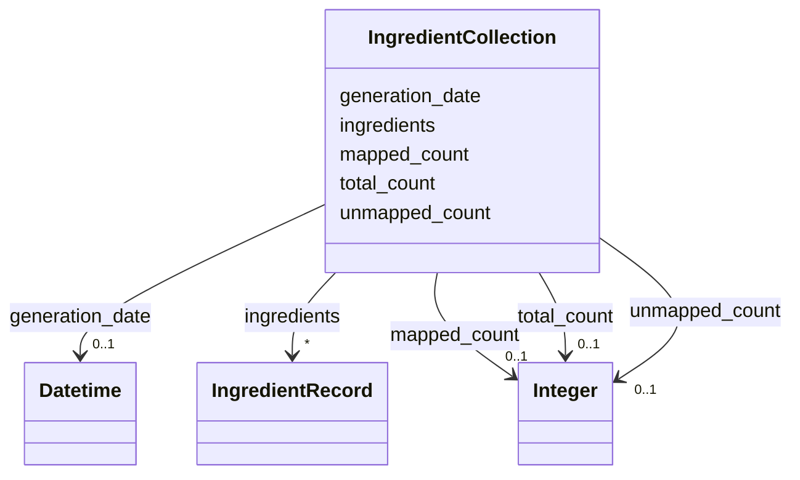

# Class: IngredientCollection 


_Root container for all ingredient records_


URI: [mediaingredientmech:IngredientCollection](https://w3id.org/mediaingredientmech/IngredientCollection)





<!-- no inheritance hierarchy -->


## Slots

| Name | Cardinality and Range | Description | Inheritance |
| ---  | --- | --- | --- |
| [generation_date](generation_date.md) | 0..1 <br/> [xsd:dateTime](http://www.w3.org/2001/XMLSchema#dateTime) | Timestamp when this collection was generated | direct |
| [total_count](total_count.md) | 0..1 <br/> [xsd:integer](http://www.w3.org/2001/XMLSchema#integer) | Total number of ingredient records | direct |
| [mapped_count](mapped_count.md) | 0..1 <br/> [xsd:integer](http://www.w3.org/2001/XMLSchema#integer) | Number of mapped ingredients | direct |
| [unmapped_count](unmapped_count.md) | 0..1 <br/> [xsd:integer](http://www.w3.org/2001/XMLSchema#integer) | Number of unmapped ingredients | direct |
| [ingredients](ingredients.md) | * <br/> [IngredientRecord](IngredientRecord.md) | List of all ingredient records | direct |


## Identifier and Mapping Information


### Schema Source


* from schema: https://w3id.org/mediaingredientmech


## Mappings

| Mapping Type | Mapped Value |
| ---  | ---  |
| self | mediaingredientmech:IngredientCollection |
| native | mediaingredientmech:IngredientCollection |


## LinkML Source

<!-- TODO: investigate https://stackoverflow.com/questions/37606292/how-to-create-tabbed-code-blocks-in-mkdocs-or-sphinx -->

### Direct

<details>
```yaml
name: IngredientCollection
description: Root container for all ingredient records
from_schema: https://w3id.org/mediaingredientmech
attributes:
  generation_date:
    name: generation_date
    description: Timestamp when this collection was generated
    from_schema: https://w3id.org/mediaingredientmech
    rank: 1000
    domain_of:
    - IngredientCollection
    range: datetime
  total_count:
    name: total_count
    description: Total number of ingredient records
    from_schema: https://w3id.org/mediaingredientmech
    rank: 1000
    domain_of:
    - IngredientCollection
    range: integer
  mapped_count:
    name: mapped_count
    description: Number of mapped ingredients
    from_schema: https://w3id.org/mediaingredientmech
    rank: 1000
    domain_of:
    - IngredientCollection
    range: integer
  unmapped_count:
    name: unmapped_count
    description: Number of unmapped ingredients
    from_schema: https://w3id.org/mediaingredientmech
    rank: 1000
    domain_of:
    - IngredientCollection
    range: integer
  ingredients:
    name: ingredients
    description: List of all ingredient records
    from_schema: https://w3id.org/mediaingredientmech
    rank: 1000
    domain_of:
    - IngredientCollection
    range: IngredientRecord
    multivalued: true
    inlined: true
    inlined_as_list: true
tree_root: true

```
</details>

### Induced

<details>
```yaml
name: IngredientCollection
description: Root container for all ingredient records
from_schema: https://w3id.org/mediaingredientmech
attributes:
  generation_date:
    name: generation_date
    description: Timestamp when this collection was generated
    from_schema: https://w3id.org/mediaingredientmech
    rank: 1000
    alias: generation_date
    owner: IngredientCollection
    domain_of:
    - IngredientCollection
    range: datetime
  total_count:
    name: total_count
    description: Total number of ingredient records
    from_schema: https://w3id.org/mediaingredientmech
    rank: 1000
    alias: total_count
    owner: IngredientCollection
    domain_of:
    - IngredientCollection
    range: integer
  mapped_count:
    name: mapped_count
    description: Number of mapped ingredients
    from_schema: https://w3id.org/mediaingredientmech
    rank: 1000
    alias: mapped_count
    owner: IngredientCollection
    domain_of:
    - IngredientCollection
    range: integer
  unmapped_count:
    name: unmapped_count
    description: Number of unmapped ingredients
    from_schema: https://w3id.org/mediaingredientmech
    rank: 1000
    alias: unmapped_count
    owner: IngredientCollection
    domain_of:
    - IngredientCollection
    range: integer
  ingredients:
    name: ingredients
    description: List of all ingredient records
    from_schema: https://w3id.org/mediaingredientmech
    rank: 1000
    alias: ingredients
    owner: IngredientCollection
    domain_of:
    - IngredientCollection
    range: IngredientRecord
    multivalued: true
    inlined_as_list: true
tree_root: true

```
</details>