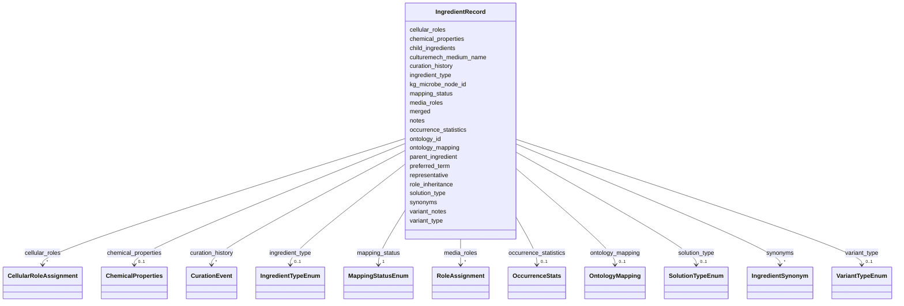

# Class: IngredientRecord 


_Core record for a media ingredient with ontology mapping, synonyms, and curation history. Represents either a mapped ingredient (with ontology_id) or unmapped ingredient (needs curation). Can serve as root element for individual YAML files or as elements in IngredientCollection._


URI: [mediaingredientmech:IngredientRecord](https://w3id.org/mediaingredientmech/IngredientRecord)





<!-- no inheritance hierarchy -->


## Slots

| Name | Cardinality and Range | Description | Inheritance |
| ---  | --- | --- | --- |
| [ontology_id](ontology_id.md) | 1 <br/> [String](String.md) | Unique ontology identifier - either ontology ID (e | direct |
| [preferred_term](preferred_term.md) | 1 <br/> [String](String.md) | Canonical name for this ingredient | direct |
| [ontology_mapping](ontology_mapping.md) | 0..1 <br/> [OntologyMapping](OntologyMapping.md) | Ontology term mapping (CHEBI/FOODON) | direct |
| [synonyms](synonyms.md) | * <br/> [IngredientSynonym](IngredientSynonym.md) | Alternative names and raw text variants | direct |
| [mapping_status](mapping_status.md) | 1 <br/> [MappingStatusEnum](MappingStatusEnum.md) | Current mapping status | direct |
| [occurrence_statistics](occurrence_statistics.md) | 0..1 <br/> [OccurrenceStats](OccurrenceStats.md) | Usage statistics across media recipes | direct |
| [curation_history](curation_history.md) | * <br/> [CurationEvent](CurationEvent.md) | Audit trail of all curation actions | direct |
| [notes](notes.md) | 0..1 <br/> [String](String.md) | Free-text curation notes | direct |
| [media_roles](media_roles.md) | * <br/> [RoleAssignment](RoleAssignment.md) | Functional roles in growth medium formulation (e | direct |
| [cellular_roles](cellular_roles.md) | * <br/> [CellularRoleAssignment](CellularRoleAssignment.md) | Cellular/metabolic roles in organism metabolism (e | direct |
| [solution_type](solution_type.md) | 0..1 <br/> [SolutionTypeEnum](SolutionTypeEnum.md) | Type of solution if this is a stock/pre-mix rather than individual chemical | direct |
| [chemical_properties](chemical_properties.md) | 0..1 <br/> [ChemicalProperties](ChemicalProperties.md) | Chemical structure and properties (for CHEBI-mapped ingredients only) | direct |
| [representative](representative.md) | 0..1 <br/> [String](String.md) | ID of the representative record if this record has been merged | direct |
| [merged](merged.md) | * <br/> [String](String.md) | List of MediaIngredientMech IDs merged into this representative | direct |
| [ingredient_type](ingredient_type.md) | 0..1 <br/> [IngredientTypeEnum](IngredientTypeEnum.md) | Classification of entry type: single chemical ingredient vs complex defined m... | direct |
| [culturemech_medium_name](culturemech_medium_name.md) | 0..1 <br/> [String](String.md) | Cross-reference to CultureMech medium name if this is a defined medium | direct |
| [parent_ingredient](parent_ingredient.md) | 0..1 <br/> [String](String.md) | Reference to parent ingredient in hierarchy (MediaIngredientMech:XXXXXX) | direct |
| [child_ingredients](child_ingredients.md) | * <br/> [String](String.md) | List of child ingredient IDs in hierarchy | direct |
| [variant_type](variant_type.md) | 0..1 <br/> [VariantTypeEnum](VariantTypeEnum.md) | Classification of variant relationship to parent | direct |
| [variant_notes](variant_notes.md) | 0..1 <br/> [String](String.md) | Human-readable explanation of variant distinction from parent/siblings | direct |
| [role_inheritance](role_inheritance.md) | 0..1 <br/> [Boolean](Boolean.md) | If true, inherits media_roles from parent ingredient | direct |
| [kg_microbe_node_id](kg_microbe_node_id.md) | 0..1 <br/> [String](String.md) | KG-Microbe node ID for this ingredient when found in the KG exactly | direct |


## Usages

| used by | used in | type | used |
| ---  | --- | --- | --- |
| [IngredientCollection](IngredientCollection.md) | [ingredients](ingredients.md) | range | [IngredientRecord](IngredientRecord.md) |


## Identifier and Mapping Information


### Schema Source


* from schema: https://w3id.org/mediaingredientmech


## Mappings

| Mapping Type | Mapped Value |
| ---  | ---  |
| self | mediaingredientmech:IngredientRecord |
| native | mediaingredientmech:IngredientRecord |


## LinkML Source

<!-- TODO: investigate https://stackoverflow.com/questions/37606292/how-to-create-tabbed-code-blocks-in-mkdocs-or-sphinx -->

### Direct

<details>
```yaml
name: IngredientRecord
description: Core record for a media ingredient with ontology mapping, synonyms, and
  curation history. Represents either a mapped ingredient (with ontology_id) or unmapped
  ingredient (needs curation). Can serve as root element for individual YAML files
  or as elements in IngredientCollection.
from_schema: https://w3id.org/mediaingredientmech
attributes:
  ontology_id:
    name: ontology_id
    description: Unique ontology identifier - either ontology ID (e.g., CHEBI:26710)
      for mapped ingredients or generated placeholder (e.g., UNMAPPED_001) for unmapped
      ingredients
    from_schema: https://w3id.org/mediaingredientmech
    rank: 1000
    identifier: true
    domain_of:
    - IngredientRecord
    - OntologyMapping
    required: true
  preferred_term:
    name: preferred_term
    description: Canonical name for this ingredient
    from_schema: https://w3id.org/mediaingredientmech
    rank: 1000
    domain_of:
    - IngredientRecord
    required: true
  ontology_mapping:
    name: ontology_mapping
    description: Ontology term mapping (CHEBI/FOODON)
    from_schema: https://w3id.org/mediaingredientmech
    rank: 1000
    domain_of:
    - IngredientRecord
    range: OntologyMapping
  synonyms:
    name: synonyms
    description: Alternative names and raw text variants
    from_schema: https://w3id.org/mediaingredientmech
    rank: 1000
    domain_of:
    - IngredientRecord
    range: IngredientSynonym
    multivalued: true
    inlined: true
    inlined_as_list: true
  mapping_status:
    name: mapping_status
    description: Current mapping status
    from_schema: https://w3id.org/mediaingredientmech
    rank: 1000
    domain_of:
    - IngredientRecord
    range: MappingStatusEnum
    required: true
  occurrence_statistics:
    name: occurrence_statistics
    description: Usage statistics across media recipes
    from_schema: https://w3id.org/mediaingredientmech
    rank: 1000
    domain_of:
    - IngredientRecord
    range: OccurrenceStats
  curation_history:
    name: curation_history
    description: Audit trail of all curation actions
    from_schema: https://w3id.org/mediaingredientmech
    rank: 1000
    domain_of:
    - IngredientRecord
    range: CurationEvent
    multivalued: true
    inlined: true
    inlined_as_list: true
  notes:
    name: notes
    description: Free-text curation notes
    from_schema: https://w3id.org/mediaingredientmech
    rank: 1000
    domain_of:
    - IngredientRecord
    - MappingEvidence
    - CurationEvent
    - RoleAssignment
    - CellularRoleAssignment
  media_roles:
    name: media_roles
    description: Functional roles in growth medium formulation (e.g., NITROGEN_SOURCE,
      BUFFER)
    from_schema: https://w3id.org/mediaingredientmech
    rank: 1000
    domain_of:
    - IngredientRecord
    range: RoleAssignment
    multivalued: true
    inlined: true
    inlined_as_list: true
  cellular_roles:
    name: cellular_roles
    description: Cellular/metabolic roles in organism metabolism (e.g., PRIMARY_DEGRADER,
      ELECTRON_DONOR)
    from_schema: https://w3id.org/mediaingredientmech
    rank: 1000
    domain_of:
    - IngredientRecord
    range: CellularRoleAssignment
    multivalued: true
    inlined: true
    inlined_as_list: true
  solution_type:
    name: solution_type
    description: Type of solution if this is a stock/pre-mix rather than individual
      chemical
    from_schema: https://w3id.org/mediaingredientmech
    rank: 1000
    domain_of:
    - IngredientRecord
    range: SolutionTypeEnum
  chemical_properties:
    name: chemical_properties
    description: Chemical structure and properties (for CHEBI-mapped ingredients only)
    from_schema: https://w3id.org/mediaingredientmech
    rank: 1000
    domain_of:
    - IngredientRecord
    range: ChemicalProperties
  representative:
    name: representative
    description: ID of the representative record if this record has been merged. Only
      set when mapping_status is REJECTED due to merge. Points to the canonical record
      representing this ingredient.
    from_schema: https://w3id.org/mediaingredientmech
    rank: 1000
    domain_of:
    - IngredientRecord
    pattern: ^MediaIngredientMech:[0-9]{6}$
  merged:
    name: merged
    description: List of MediaIngredientMech IDs merged into this representative.
      Only set on records serving as merge targets. Tracks all records consolidated
      into this canonical representation.
    from_schema: https://w3id.org/mediaingredientmech
    rank: 1000
    domain_of:
    - IngredientRecord
    multivalued: true
    pattern: ^MediaIngredientMech:[0-9]{6}$
  ingredient_type:
    name: ingredient_type
    description: 'Classification of entry type: single chemical ingredient vs complex
      defined medium. SINGLE_INGREDIENT: Pure chemical (NaCl, agar, glucose). DEFINED_MEDIUM:
      Complete medium formulation/recipe (R2A agar, LB broth). UNDEFINED_MIXTURE:
      Complex mixture of unknown composition (yeast extract, peptone). STOCK_SOLUTION:
      Pre-mixed solution of defined ingredients.'
    from_schema: https://w3id.org/mediaingredientmech
    rank: 1000
    domain_of:
    - IngredientRecord
    range: IngredientTypeEnum
  culturemech_medium_name:
    name: culturemech_medium_name
    description: Cross-reference to CultureMech medium name if this is a defined medium.
      Used to link complex media entries to their full recipe formulations.
    from_schema: https://w3id.org/mediaingredientmech
    rank: 1000
    domain_of:
    - IngredientRecord
  parent_ingredient:
    name: parent_ingredient
    description: 'Reference to parent ingredient in hierarchy (MediaIngredientMech:XXXXXX).
      Used for variants: purity levels (tap/distilled/double-distilled water), hydrates
      (CaCl2·2H2O vs CaCl2), stereoisomers (D-glucose vs L-glucose). Enables queries
      like "find all media using any form of water".'
    from_schema: https://w3id.org/mediaingredientmech
    rank: 1000
    domain_of:
    - IngredientRecord
    pattern: ^MediaIngredientMech:[0-9]{6}$
  child_ingredients:
    name: child_ingredients
    description: List of child ingredient IDs in hierarchy. Parent record contains
      all children (e.g., Water → Tap water, Distilled water). Used to navigate hierarchy
      and query all variants.
    from_schema: https://w3id.org/mediaingredientmech
    rank: 1000
    domain_of:
    - IngredientRecord
    multivalued: true
    pattern: ^MediaIngredientMech:[0-9]{6}$
  variant_type:
    name: variant_type
    description: 'Classification of variant relationship to parent. Indicates why
      this ingredient is distinct from parent/siblings. Examples: PURIFIED (distilled),
      ULTRA_PURIFIED (double distilled), TAP (impure).'
    from_schema: https://w3id.org/mediaingredientmech
    rank: 1000
    domain_of:
    - IngredientRecord
    range: VariantTypeEnum
  variant_notes:
    name: variant_notes
    description: 'Human-readable explanation of variant distinction from parent/siblings.
      Example: "Higher purity (10x, <0.1 µS/cm vs <1 µS/cm) than standard distilled
      water. Used for trace-metal sensitive work."'
    from_schema: https://w3id.org/mediaingredientmech
    rank: 1000
    domain_of:
    - IngredientRecord
  role_inheritance:
    name: role_inheritance
    description: If true, inherits media_roles from parent ingredient. Allows child
      variants to automatically get parent's roles while enabling variant-specific
      role overrides or restrictions.
    from_schema: https://w3id.org/mediaingredientmech
    rank: 1000
    domain_of:
    - IngredientRecord
    range: boolean
  kg_microbe_node_id:
    name: kg_microbe_node_id
    description: 'KG-Microbe node ID for this ingredient when found in the KG exactly.
      Populated when the ingredient''s CHEBI identifier is present as a named node
      in the KG-Microbe mediadive graph (i.e., used as an ingredient in at least one
      KG-Microbe medium solution). Format: CHEBI:XXXXX'
    from_schema: https://w3id.org/mediaingredientmech
    rank: 1000
    domain_of:
    - IngredientRecord
    required: false
    pattern: ^CHEBI:[0-9]+$
tree_root: true

```
</details>

### Induced

<details>
```yaml
name: IngredientRecord
description: Core record for a media ingredient with ontology mapping, synonyms, and
  curation history. Represents either a mapped ingredient (with ontology_id) or unmapped
  ingredient (needs curation). Can serve as root element for individual YAML files
  or as elements in IngredientCollection.
from_schema: https://w3id.org/mediaingredientmech
attributes:
  ontology_id:
    name: ontology_id
    description: Unique ontology identifier - either ontology ID (e.g., CHEBI:26710)
      for mapped ingredients or generated placeholder (e.g., UNMAPPED_001) for unmapped
      ingredients
    from_schema: https://w3id.org/mediaingredientmech
    rank: 1000
    identifier: true
    alias: ontology_id
    owner: IngredientRecord
    domain_of:
    - IngredientRecord
    - OntologyMapping
    range: string
    required: true
  preferred_term:
    name: preferred_term
    description: Canonical name for this ingredient
    from_schema: https://w3id.org/mediaingredientmech
    rank: 1000
    alias: preferred_term
    owner: IngredientRecord
    domain_of:
    - IngredientRecord
    range: string
    required: true
  ontology_mapping:
    name: ontology_mapping
    description: Ontology term mapping (CHEBI/FOODON)
    from_schema: https://w3id.org/mediaingredientmech
    rank: 1000
    alias: ontology_mapping
    owner: IngredientRecord
    domain_of:
    - IngredientRecord
    range: OntologyMapping
  synonyms:
    name: synonyms
    description: Alternative names and raw text variants
    from_schema: https://w3id.org/mediaingredientmech
    rank: 1000
    alias: synonyms
    owner: IngredientRecord
    domain_of:
    - IngredientRecord
    range: IngredientSynonym
    multivalued: true
    inlined: true
    inlined_as_list: true
  mapping_status:
    name: mapping_status
    description: Current mapping status
    from_schema: https://w3id.org/mediaingredientmech
    rank: 1000
    alias: mapping_status
    owner: IngredientRecord
    domain_of:
    - IngredientRecord
    range: MappingStatusEnum
    required: true
  occurrence_statistics:
    name: occurrence_statistics
    description: Usage statistics across media recipes
    from_schema: https://w3id.org/mediaingredientmech
    rank: 1000
    alias: occurrence_statistics
    owner: IngredientRecord
    domain_of:
    - IngredientRecord
    range: OccurrenceStats
  curation_history:
    name: curation_history
    description: Audit trail of all curation actions
    from_schema: https://w3id.org/mediaingredientmech
    rank: 1000
    alias: curation_history
    owner: IngredientRecord
    domain_of:
    - IngredientRecord
    range: CurationEvent
    multivalued: true
    inlined: true
    inlined_as_list: true
  notes:
    name: notes
    description: Free-text curation notes
    from_schema: https://w3id.org/mediaingredientmech
    rank: 1000
    alias: notes
    owner: IngredientRecord
    domain_of:
    - IngredientRecord
    - MappingEvidence
    - CurationEvent
    - RoleAssignment
    - CellularRoleAssignment
    range: string
  media_roles:
    name: media_roles
    description: Functional roles in growth medium formulation (e.g., NITROGEN_SOURCE,
      BUFFER)
    from_schema: https://w3id.org/mediaingredientmech
    rank: 1000
    alias: media_roles
    owner: IngredientRecord
    domain_of:
    - IngredientRecord
    range: RoleAssignment
    multivalued: true
    inlined: true
    inlined_as_list: true
  cellular_roles:
    name: cellular_roles
    description: Cellular/metabolic roles in organism metabolism (e.g., PRIMARY_DEGRADER,
      ELECTRON_DONOR)
    from_schema: https://w3id.org/mediaingredientmech
    rank: 1000
    alias: cellular_roles
    owner: IngredientRecord
    domain_of:
    - IngredientRecord
    range: CellularRoleAssignment
    multivalued: true
    inlined: true
    inlined_as_list: true
  solution_type:
    name: solution_type
    description: Type of solution if this is a stock/pre-mix rather than individual
      chemical
    from_schema: https://w3id.org/mediaingredientmech
    rank: 1000
    alias: solution_type
    owner: IngredientRecord
    domain_of:
    - IngredientRecord
    range: SolutionTypeEnum
  chemical_properties:
    name: chemical_properties
    description: Chemical structure and properties (for CHEBI-mapped ingredients only)
    from_schema: https://w3id.org/mediaingredientmech
    rank: 1000
    alias: chemical_properties
    owner: IngredientRecord
    domain_of:
    - IngredientRecord
    range: ChemicalProperties
  representative:
    name: representative
    description: ID of the representative record if this record has been merged. Only
      set when mapping_status is REJECTED due to merge. Points to the canonical record
      representing this ingredient.
    from_schema: https://w3id.org/mediaingredientmech
    rank: 1000
    alias: representative
    owner: IngredientRecord
    domain_of:
    - IngredientRecord
    range: string
    pattern: ^MediaIngredientMech:[0-9]{6}$
  merged:
    name: merged
    description: List of MediaIngredientMech IDs merged into this representative.
      Only set on records serving as merge targets. Tracks all records consolidated
      into this canonical representation.
    from_schema: https://w3id.org/mediaingredientmech
    rank: 1000
    alias: merged
    owner: IngredientRecord
    domain_of:
    - IngredientRecord
    range: string
    multivalued: true
    pattern: ^MediaIngredientMech:[0-9]{6}$
  ingredient_type:
    name: ingredient_type
    description: 'Classification of entry type: single chemical ingredient vs complex
      defined medium. SINGLE_INGREDIENT: Pure chemical (NaCl, agar, glucose). DEFINED_MEDIUM:
      Complete medium formulation/recipe (R2A agar, LB broth). UNDEFINED_MIXTURE:
      Complex mixture of unknown composition (yeast extract, peptone). STOCK_SOLUTION:
      Pre-mixed solution of defined ingredients.'
    from_schema: https://w3id.org/mediaingredientmech
    rank: 1000
    alias: ingredient_type
    owner: IngredientRecord
    domain_of:
    - IngredientRecord
    range: IngredientTypeEnum
  culturemech_medium_name:
    name: culturemech_medium_name
    description: Cross-reference to CultureMech medium name if this is a defined medium.
      Used to link complex media entries to their full recipe formulations.
    from_schema: https://w3id.org/mediaingredientmech
    rank: 1000
    alias: culturemech_medium_name
    owner: IngredientRecord
    domain_of:
    - IngredientRecord
    range: string
  parent_ingredient:
    name: parent_ingredient
    description: 'Reference to parent ingredient in hierarchy (MediaIngredientMech:XXXXXX).
      Used for variants: purity levels (tap/distilled/double-distilled water), hydrates
      (CaCl2·2H2O vs CaCl2), stereoisomers (D-glucose vs L-glucose). Enables queries
      like "find all media using any form of water".'
    from_schema: https://w3id.org/mediaingredientmech
    rank: 1000
    alias: parent_ingredient
    owner: IngredientRecord
    domain_of:
    - IngredientRecord
    range: string
    pattern: ^MediaIngredientMech:[0-9]{6}$
  child_ingredients:
    name: child_ingredients
    description: List of child ingredient IDs in hierarchy. Parent record contains
      all children (e.g., Water → Tap water, Distilled water). Used to navigate hierarchy
      and query all variants.
    from_schema: https://w3id.org/mediaingredientmech
    rank: 1000
    alias: child_ingredients
    owner: IngredientRecord
    domain_of:
    - IngredientRecord
    range: string
    multivalued: true
    pattern: ^MediaIngredientMech:[0-9]{6}$
  variant_type:
    name: variant_type
    description: 'Classification of variant relationship to parent. Indicates why
      this ingredient is distinct from parent/siblings. Examples: PURIFIED (distilled),
      ULTRA_PURIFIED (double distilled), TAP (impure).'
    from_schema: https://w3id.org/mediaingredientmech
    rank: 1000
    alias: variant_type
    owner: IngredientRecord
    domain_of:
    - IngredientRecord
    range: VariantTypeEnum
  variant_notes:
    name: variant_notes
    description: 'Human-readable explanation of variant distinction from parent/siblings.
      Example: "Higher purity (10x, <0.1 µS/cm vs <1 µS/cm) than standard distilled
      water. Used for trace-metal sensitive work."'
    from_schema: https://w3id.org/mediaingredientmech
    rank: 1000
    alias: variant_notes
    owner: IngredientRecord
    domain_of:
    - IngredientRecord
    range: string
  role_inheritance:
    name: role_inheritance
    description: If true, inherits media_roles from parent ingredient. Allows child
      variants to automatically get parent's roles while enabling variant-specific
      role overrides or restrictions.
    from_schema: https://w3id.org/mediaingredientmech
    rank: 1000
    alias: role_inheritance
    owner: IngredientRecord
    domain_of:
    - IngredientRecord
    range: boolean
  kg_microbe_node_id:
    name: kg_microbe_node_id
    description: 'KG-Microbe node ID for this ingredient when found in the KG exactly.
      Populated when the ingredient''s CHEBI identifier is present as a named node
      in the KG-Microbe mediadive graph (i.e., used as an ingredient in at least one
      KG-Microbe medium solution). Format: CHEBI:XXXXX'
    from_schema: https://w3id.org/mediaingredientmech
    rank: 1000
    alias: kg_microbe_node_id
    owner: IngredientRecord
    domain_of:
    - IngredientRecord
    range: string
    required: false
    pattern: ^CHEBI:[0-9]+$
tree_root: true

```
</details>