# Class: IngredientRecord 


_Core record for a media ingredient with ontology mapping, synonyms, and curation history. Represents either a mapped ingredient (with an ontology CURIE identifier) or an unmapped ingredient (placeholder identifier, awaits curation). Can serve as root element for individual YAML files or as elements in IngredientCollection._


URI: [mediaingredientmech:IngredientRecord](https://w3id.org/mediaingredientmech/IngredientRecord)

```mermaid
 classDiagram
    class IngredientRecord
    click IngredientRecord href "../IngredientRecord/"
      IngredientRecord : cellular_metabolic_roles
        
          
    
        
        
        IngredientRecord --> "*" CellularMetabolicRoleAssignment : cellular_metabolic_roles
        click CellularMetabolicRoleAssignment href "../CellularMetabolicRoleAssignment/"
    

        
      IngredientRecord : chemical_properties
        
          
    
        
        
        IngredientRecord --> "0..1" ChemicalProperties : chemical_properties
        click ChemicalProperties href "../ChemicalProperties/"
    

        
      IngredientRecord : child_ingredients
        
      IngredientRecord : community_organism_roles
        
          
    
        
        
        IngredientRecord --> "*" CommunityOrganismRoleAssignment : community_organism_roles
        click CommunityOrganismRoleAssignment href "../CommunityOrganismRoleAssignment/"
    

        
      IngredientRecord : components
        
          
    
        
        
        IngredientRecord --> "*" StockComponent : components
        click StockComponent href "../StockComponent/"
    

        
      IngredientRecord : culturemech_medium_name
        
      IngredientRecord : curation_history
        
          
    
        
        
        IngredientRecord --> "*" CurationEvent : curation_history
        click CurationEvent href "../CurationEvent/"
    

        
      IngredientRecord : datasets
        
          
    
        
        
        IngredientRecord --> "*" Dataset : datasets
        click Dataset href "../Dataset/"
    

        
      IngredientRecord : discussions
        
          
    
        
        
        IngredientRecord --> "*" Discussion : discussions
        click Discussion href "../Discussion/"
    

        
      IngredientRecord : environmental_context
        
          
    
        
        
        IngredientRecord --> "*" EnvironmentContext : environmental_context
        click EnvironmentContext href "../EnvironmentContext/"
    

        
      IngredientRecord : identifier
        
      IngredientRecord : ingredient_type
        
          
    
        
        
        IngredientRecord --> "0..1" IngredientTypeEnum : ingredient_type
        click IngredientTypeEnum href "../IngredientTypeEnum/"
    

        
      IngredientRecord : kg_microbe_node_id
        
      IngredientRecord : mapping_status
        
          
    
        
        
        IngredientRecord --> "1" MappingStatusEnum : mapping_status
        click MappingStatusEnum href "../MappingStatusEnum/"
    

        
      IngredientRecord : merged
        
      IngredientRecord : notes
        
      IngredientRecord : nutritional_roles
        
          
    
        
        
        IngredientRecord --> "*" NutritionalRoleAssignment : nutritional_roles
        click NutritionalRoleAssignment href "../NutritionalRoleAssignment/"
    

        
      IngredientRecord : occurrence_statistics
        
          
    
        
        
        IngredientRecord --> "0..1" OccurrenceStats : occurrence_statistics
        click OccurrenceStats href "../OccurrenceStats/"
    

        
      IngredientRecord : ontology_mapping
        
          
    
        
        
        IngredientRecord --> "0..1" OntologyMapping : ontology_mapping
        click OntologyMapping href "../OntologyMapping/"
    

        
      IngredientRecord : parent_ingredient
        
      IngredientRecord : physicochemical_roles
        
          
    
        
        
        IngredientRecord --> "*" PhysicochemicalRoleAssignment : physicochemical_roles
        click PhysicochemicalRoleAssignment href "../PhysicochemicalRoleAssignment/"
    

        
      IngredientRecord : preferred_term
        
      IngredientRecord : representative
        
      IngredientRecord : role_inheritance
        
      IngredientRecord : solution_type
        
          
    
        
        
        IngredientRecord --> "0..1" SolutionTypeEnum : solution_type
        click SolutionTypeEnum href "../SolutionTypeEnum/"
    

        
      IngredientRecord : synonyms
        
          
    
        
        
        IngredientRecord --> "*" IngredientSynonym : synonyms
        click IngredientSynonym href "../IngredientSynonym/"
    

        
      IngredientRecord : variant_notes
        
      IngredientRecord : variant_type
        
          
    
        
        
        IngredientRecord --> "0..1" VariantTypeEnum : variant_type
        click VariantTypeEnum href "../VariantTypeEnum/"
    

        
      
```





<!-- no inheritance hierarchy -->


## Slots

| Name | Cardinality and Range | Description | Inheritance |
| ---  | --- | --- | --- |
| [identifier](identifier.md) | 1 <br/> [String](String.md) | Primary key for the record | direct |
| [preferred_term](preferred_term.md) | 1 <br/> [String](String.md) | Canonical name for this ingredient | direct |
| [ontology_mapping](ontology_mapping.md) | 0..1 <br/> [OntologyMapping](OntologyMapping.md) | Ontology term mapping (CHEBI/FOODON) | direct |
| [synonyms](synonyms.md) | * <br/> [IngredientSynonym](IngredientSynonym.md) | Alternative names and raw text variants | direct |
| [mapping_status](mapping_status.md) | 1 <br/> [MappingStatusEnum](MappingStatusEnum.md) | Current mapping status | direct |
| [occurrence_statistics](occurrence_statistics.md) | 0..1 <br/> [OccurrenceStats](OccurrenceStats.md) | Usage statistics across media recipes | direct |
| [curation_history](curation_history.md) | * <br/> [CurationEvent](CurationEvent.md) | Audit trail of all curation actions | direct |
| [notes](notes.md) | 0..1 <br/> [String](String.md) | Free-text curation notes | direct |
| [community_organism_roles](community_organism_roles.md) | * <br/> [CommunityOrganismRoleAssignment](CommunityOrganismRoleAssignment.md) | Role(s) this organism plays in a microbial community (e | direct |
| [nutritional_roles](nutritional_roles.md) | * <br/> [NutritionalRoleAssignment](NutritionalRoleAssignment.md) | What element or macronutrient this ingredient supplies to the medium (e | direct |
| [physicochemical_roles](physicochemical_roles.md) | * <br/> [PhysicochemicalRoleAssignment](PhysicochemicalRoleAssignment.md) | Chemical or physical function this ingredient performs in the medium (e | direct |
| [cellular_metabolic_roles](cellular_metabolic_roles.md) | * <br/> [CellularMetabolicRoleAssignment](CellularMetabolicRoleAssignment.md) | Role of this ingredient inside/on the cultured microbe (e | direct |
| [solution_type](solution_type.md) | 0..1 <br/> [SolutionTypeEnum](SolutionTypeEnum.md) | Type of solution if this is a stock/pre-mix rather than individual chemical | direct |
| [chemical_properties](chemical_properties.md) | 0..1 <br/> [ChemicalProperties](ChemicalProperties.md) | Chemical structure and properties (for CHEBI-mapped ingredients only) | direct |
| [representative](representative.md) | 0..1 <br/> [String](String.md) | `identifier` of the representative record if this record has been merged | direct |
| [merged](merged.md) | * <br/> [String](String.md) | List of record `identifier`s merged into this representative | direct |
| [ingredient_type](ingredient_type.md) | 0..1 <br/> [IngredientTypeEnum](IngredientTypeEnum.md) | Classification of entry type: single chemical ingredient vs complex defined m... | direct |
| [components](components.md) | * <br/> [StockComponent](StockComponent.md) | Recipe-level decomposition for a STOCK_SOLUTION or DEFINED_MEDIUM: the list o... | direct |
| [culturemech_medium_name](culturemech_medium_name.md) | 0..1 <br/> [String](String.md) | Cross-reference to CultureMech medium name if this is a defined medium | direct |
| [parent_ingredient](parent_ingredient.md) | 0..1 <br/> [String](String.md) | Reference to parent ingredient's `identifier` in the variant hierarchy | direct |
| [child_ingredients](child_ingredients.md) | * <br/> [String](String.md) | List of child ingredient `identifier`s in the variant hierarchy | direct |
| [variant_type](variant_type.md) | 0..1 <br/> [VariantTypeEnum](VariantTypeEnum.md) | Classification of variant relationship to parent | direct |
| [variant_notes](variant_notes.md) | 0..1 <br/> [String](String.md) | Human-readable explanation of variant distinction from parent/siblings | direct |
| [role_inheritance](role_inheritance.md) | 0..1 <br/> [Boolean](Boolean.md) | If true, inherits the three role facets (nutritional_roles, physicochemical_r... | direct |
| [kg_microbe_node_id](kg_microbe_node_id.md) | 0..1 <br/> [String](String.md) | KG-Microbe node ID for this ingredient when found in the KG exactly | direct |
| [environmental_context](environmental_context.md) | * <br/> [EnvironmentContext](EnvironmentContext.md) | Environmental contexts where this ingredient is relevant | direct |
| [discussions](discussions.md) | * <br/> [Discussion](Discussion.md) | Open questions, knowledge gaps, controversies, and curation todos attached to... | direct |
| [datasets](datasets.md) | * <br/> [Dataset](Dataset.md) | Public datasets (omics/sequence/phenotype) relevant to this ingredient | direct |


## Usages

| used by | used in | type | used |
| ---  | --- | --- | --- |
| [IngredientCollection](IngredientCollection.md) | [ingredients](ingredients.md) | range | [IngredientRecord](IngredientRecord.md) |


## Identifier and Mapping Information


### Schema Source


* from schema: https://w3id.org/mediaingredientmech


## Mappings

| Mapping Type | Mapped Value |
| ---  | ---  |
| self | mediaingredientmech:IngredientRecord |
| native | mediaingredientmech:IngredientRecord |


## LinkML Source

<!-- TODO: investigate https://stackoverflow.com/questions/37606292/how-to-create-tabbed-code-blocks-in-mkdocs-or-sphinx -->

### Direct

<details>
```yaml
name: IngredientRecord
description: Core record for a media ingredient with ontology mapping, synonyms, and
  curation history. Represents either a mapped ingredient (with an ontology CURIE
  identifier) or an unmapped ingredient (placeholder identifier, awaits curation).
  Can serve as root element for individual YAML files or as elements in IngredientCollection.
from_schema: https://w3id.org/mediaingredientmech
attributes:
  identifier:
    name: identifier
    description: Primary key for the record. For mapped ingredients this is the ontology
      CURIE (e.g. `CHEBI:26710`, `FOODON:3311109`, `cas:247167-54-0`, `kgmicrobe.compound:aburamycin_a`);
      for unmapped ingredients it is a generated `UNMAPPED_NNNN` placeholder. The
      nested `ontology_mapping.ontology_id` carries the same value for mapped records
      (and is absent for unmapped records).
    from_schema: https://w3id.org/mediaingredientmech
    rank: 1000
    identifier: true
    domain_of:
    - IngredientRecord
    required: true
  preferred_term:
    name: preferred_term
    description: Canonical name for this ingredient
    from_schema: https://w3id.org/mediaingredientmech
    rank: 1000
    domain_of:
    - IngredientRecord
    required: true
  ontology_mapping:
    name: ontology_mapping
    description: Ontology term mapping (CHEBI/FOODON)
    from_schema: https://w3id.org/mediaingredientmech
    rank: 1000
    domain_of:
    - IngredientRecord
    range: OntologyMapping
    bindings:
    - obligation_level: REQUIRED
      binds_value_of: ontology_id
  synonyms:
    name: synonyms
    description: Alternative names and raw text variants
    from_schema: https://w3id.org/mediaingredientmech
    rank: 1000
    domain_of:
    - IngredientRecord
    range: IngredientSynonym
    multivalued: true
    inlined: true
    inlined_as_list: true
  mapping_status:
    name: mapping_status
    description: Current mapping status
    from_schema: https://w3id.org/mediaingredientmech
    rank: 1000
    domain_of:
    - IngredientRecord
    range: MappingStatusEnum
    required: true
  occurrence_statistics:
    name: occurrence_statistics
    description: Usage statistics across media recipes
    from_schema: https://w3id.org/mediaingredientmech
    rank: 1000
    domain_of:
    - IngredientRecord
    range: OccurrenceStats
  curation_history:
    name: curation_history
    description: Audit trail of all curation actions
    from_schema: https://w3id.org/mediaingredientmech
    rank: 1000
    domain_of:
    - IngredientRecord
    range: CurationEvent
    multivalued: true
    inlined: true
    inlined_as_list: true
  notes:
    name: notes
    description: Free-text curation notes
    from_schema: https://w3id.org/mediaingredientmech
    rank: 1000
    domain_of:
    - IngredientRecord
    - EnvironmentContext
    - MappingEvidence
    - CurationEvent
    - CommunityOrganismRoleAssignment
    - NutritionalRoleAssignment
    - PhysicochemicalRoleAssignment
    - CellularMetabolicRoleAssignment
    - SupportingReference
    - Discussion
    - Dataset
  community_organism_roles:
    name: community_organism_roles
    description: Role(s) this organism plays in a microbial community (e.g., PRIMARY_DEGRADER,
      SYNERGIST, COMPETITOR). Formerly `cellular_roles`; renamed to disambiguate from
      ingredient-level cellular metabolic roles.
    from_schema: https://w3id.org/mediaingredientmech
    rank: 1000
    domain_of:
    - IngredientRecord
    range: CommunityOrganismRoleAssignment
    multivalued: true
    inlined: true
    inlined_as_list: true
  nutritional_roles:
    name: nutritional_roles
    description: What element or macronutrient this ingredient supplies to the medium
      (e.g., CARBON_SOURCE, SULFUR_SOURCE, VITAMIN_SOURCE). Facet 1 of 3 orthogonal
      ingredient-role facets — a single ingredient may carry multiple values (e.g.,
      L-cysteine → AMINO_ACID_SOURCE + SULFUR_SOURCE).
    from_schema: https://w3id.org/mediaingredientmech
    rank: 1000
    domain_of:
    - IngredientRecord
    range: NutritionalRoleAssignment
    multivalued: true
    inlined: true
    inlined_as_list: true
  physicochemical_roles:
    name: physicochemical_roles
    description: Chemical or physical function this ingredient performs in the medium
      (e.g., BUFFER, CHELATOR, REDUCING_AGENT). Facet 2 of 3 orthogonal ingredient-role
      facets — independent of what element the ingredient supplies.
    from_schema: https://w3id.org/mediaingredientmech
    rank: 1000
    domain_of:
    - IngredientRecord
    range: PhysicochemicalRoleAssignment
    multivalued: true
    inlined: true
    inlined_as_list: true
  cellular_metabolic_roles:
    name: cellular_metabolic_roles
    description: Role of this ingredient inside/on the cultured microbe (e.g., SUBSTRATE,
      ELECTRON_DONOR, COFACTOR). Facet 3 of 3 orthogonal ingredient-role facets —
      often organism-conditional (e.g., ELECTRON_DONOR applies only for organisms
      that oxidize the compound for energy).
    from_schema: https://w3id.org/mediaingredientmech
    rank: 1000
    domain_of:
    - IngredientRecord
    range: CellularMetabolicRoleAssignment
    multivalued: true
    inlined: true
    inlined_as_list: true
  solution_type:
    name: solution_type
    description: Type of solution if this is a stock/pre-mix rather than individual
      chemical
    from_schema: https://w3id.org/mediaingredientmech
    rank: 1000
    domain_of:
    - IngredientRecord
    range: SolutionTypeEnum
  chemical_properties:
    name: chemical_properties
    description: Chemical structure and properties (for CHEBI-mapped ingredients only)
    from_schema: https://w3id.org/mediaingredientmech
    rank: 1000
    domain_of:
    - IngredientRecord
    range: ChemicalProperties
  representative:
    name: representative
    description: '`identifier` of the representative record if this record has been
      merged. Only set when mapping_status is REJECTED due to merge. Points to the
      canonical record representing this ingredient. (No pattern constraint: the merge-tracking
      feature is currently unused — when revived, point at the schema''s canonical
      identifier format.)'
    from_schema: https://w3id.org/mediaingredientmech
    rank: 1000
    domain_of:
    - IngredientRecord
  merged:
    name: merged
    description: 'List of record `identifier`s merged into this representative. Only
      set on records serving as merge targets. Tracks all records consolidated into
      this canonical representation. (No pattern constraint: see `representative`
      above.)'
    from_schema: https://w3id.org/mediaingredientmech
    rank: 1000
    domain_of:
    - IngredientRecord
    multivalued: true
  ingredient_type:
    name: ingredient_type
    description: 'Classification of entry type: single chemical ingredient vs complex
      defined medium. SINGLE_INGREDIENT: Pure chemical (NaCl, agar, glucose). DEFINED_MEDIUM:
      Complete medium formulation/recipe (R2A agar, LB broth). UNDEFINED_MIXTURE:
      Complex mixture of unknown composition (yeast extract, peptone). STOCK_SOLUTION:
      Pre-mixed solution of defined ingredients.'
    from_schema: https://w3id.org/mediaingredientmech
    rank: 1000
    domain_of:
    - IngredientRecord
    range: IngredientTypeEnum
  components:
    name: components
    description: 'Recipe-level decomposition for a STOCK_SOLUTION or DEFINED_MEDIUM:
      the list of component ingredients (with concentration where known). Lets a named
      mixture (e.g. a trace-element or vitamin solution) be resolved to its constituents.
      Populate only from a verifiable recipe source; leave empty when the composition
      is unknown.'
    from_schema: https://w3id.org/mediaingredientmech
    rank: 1000
    domain_of:
    - IngredientRecord
    range: StockComponent
    multivalued: true
    inlined: true
    inlined_as_list: true
  culturemech_medium_name:
    name: culturemech_medium_name
    description: Cross-reference to CultureMech medium name if this is a defined medium.
      Used to link complex media entries to their full recipe formulations.
    from_schema: https://w3id.org/mediaingredientmech
    rank: 1000
    domain_of:
    - IngredientRecord
  parent_ingredient:
    name: parent_ingredient
    description: 'Reference to parent ingredient''s `identifier` in the variant hierarchy.
      Used for variants: purity levels (tap/distilled/double-distilled water), hydrates
      (CaCl2·2H2O vs CaCl2), stereoisomers (D-glucose vs L-glucose). Enables queries
      like "find all media using any form of water". (No pattern constraint: the hierarchy
      feature is currently unused — when populated, expect the schema''s canonical
      `identifier` format.)'
    from_schema: https://w3id.org/mediaingredientmech
    rank: 1000
    domain_of:
    - IngredientRecord
  child_ingredients:
    name: child_ingredients
    description: 'List of child ingredient `identifier`s in the variant hierarchy.
      Parent record contains all children (e.g. Water → Tap water, Distilled water).
      Used to navigate hierarchy and query all variants. (No pattern constraint: see
      `parent_ingredient` above.)'
    from_schema: https://w3id.org/mediaingredientmech
    rank: 1000
    domain_of:
    - IngredientRecord
    multivalued: true
  variant_type:
    name: variant_type
    description: 'Classification of variant relationship to parent. Indicates why
      this ingredient is distinct from parent/siblings. Examples: PURIFIED (distilled),
      ULTRA_PURIFIED (double distilled), TAP (impure).'
    from_schema: https://w3id.org/mediaingredientmech
    rank: 1000
    domain_of:
    - IngredientRecord
    range: VariantTypeEnum
  variant_notes:
    name: variant_notes
    description: 'Human-readable explanation of variant distinction from parent/siblings.
      Example: "Higher purity (10x, <0.1 µS/cm vs <1 µS/cm) than standard distilled
      water. Used for trace-metal sensitive work."'
    from_schema: https://w3id.org/mediaingredientmech
    rank: 1000
    domain_of:
    - IngredientRecord
  role_inheritance:
    name: role_inheritance
    description: If true, inherits the three role facets (nutritional_roles, physicochemical_roles,
      cellular_metabolic_roles) from the parent ingredient. Allows child variants
      to automatically get parent's roles while enabling variant-specific role overrides
      or restrictions.
    from_schema: https://w3id.org/mediaingredientmech
    rank: 1000
    domain_of:
    - IngredientRecord
    range: boolean
  kg_microbe_node_id:
    name: kg_microbe_node_id
    description: KG-Microbe node ID for this ingredient when found in the KG exactly.
      Populated when the ingredient is present as a named node in the KG-Microbe mediadive
      graph (i.e. used as an ingredient in at least one KG-Microbe medium solution).
      The node ID is a CURIE using whichever scheme the KG-Microbe graph stores the
      entity under — most often `CHEBI:`, but also `mesh:`, `NCIT:`, `FOODON:`, `ENVO:`,
      or one of the kg-microbe registry prefixes (`kgmicrobe.compound:`, `kgmicrobe.ingredient:`).
    from_schema: https://w3id.org/mediaingredientmech
    rank: 1000
    domain_of:
    - IngredientRecord
    required: false
    pattern: ^[A-Za-z][A-Za-z0-9.]*:[A-Za-z0-9][A-Za-z0-9._~-]*$
  environmental_context:
    name: environmental_context
    description: Environmental contexts where this ingredient is relevant. Each entry
      pairs an ENVO term with a relevance qualifier explaining the association (natural
      source, selective agent, environment mimic, etc.). Enables cross-repository
      environment-driven queries with CommunityMech (`environment_term`) and CultureMech
      (`source_environment`). Optional; ubiquitous ingredients (water, glucose) typically
      have no entries.
    from_schema: https://w3id.org/mediaingredientmech
    rank: 1000
    domain_of:
    - IngredientRecord
    range: EnvironmentContext
    bindings:
    - obligation_level: REQUIRED
      binds_value_of: environment_term
    required: false
    multivalued: true
    inlined: true
    inlined_as_list: true
  discussions:
    name: discussions
    description: Open questions, knowledge gaps, controversies, and curation todos
      attached to this ingredient (shared Discussion supertype; anchor `attaches_to`
      into e.g. `ontology_mapping#<term>`).
    from_schema: https://w3id.org/mediaingredientmech
    rank: 1000
    domain_of:
    - IngredientRecord
    range: Discussion
    multivalued: true
    inlined: true
    inlined_as_list: true
  datasets:
    name: datasets
    description: Public datasets (omics/sequence/phenotype) relevant to this ingredient.
    from_schema: https://w3id.org/mediaingredientmech
    rank: 1000
    domain_of:
    - IngredientRecord
    range: Dataset
    multivalued: true
    inlined: true
    inlined_as_list: true
tree_root: true

```
</details>

### Induced

<details>
```yaml
name: IngredientRecord
description: Core record for a media ingredient with ontology mapping, synonyms, and
  curation history. Represents either a mapped ingredient (with an ontology CURIE
  identifier) or an unmapped ingredient (placeholder identifier, awaits curation).
  Can serve as root element for individual YAML files or as elements in IngredientCollection.
from_schema: https://w3id.org/mediaingredientmech
attributes:
  identifier:
    name: identifier
    description: Primary key for the record. For mapped ingredients this is the ontology
      CURIE (e.g. `CHEBI:26710`, `FOODON:3311109`, `cas:247167-54-0`, `kgmicrobe.compound:aburamycin_a`);
      for unmapped ingredients it is a generated `UNMAPPED_NNNN` placeholder. The
      nested `ontology_mapping.ontology_id` carries the same value for mapped records
      (and is absent for unmapped records).
    from_schema: https://w3id.org/mediaingredientmech
    rank: 1000
    identifier: true
    alias: identifier
    owner: IngredientRecord
    domain_of:
    - IngredientRecord
    range: string
    required: true
  preferred_term:
    name: preferred_term
    description: Canonical name for this ingredient
    from_schema: https://w3id.org/mediaingredientmech
    rank: 1000
    alias: preferred_term
    owner: IngredientRecord
    domain_of:
    - IngredientRecord
    range: string
    required: true
  ontology_mapping:
    name: ontology_mapping
    description: Ontology term mapping (CHEBI/FOODON)
    from_schema: https://w3id.org/mediaingredientmech
    rank: 1000
    alias: ontology_mapping
    owner: IngredientRecord
    domain_of:
    - IngredientRecord
    range: OntologyMapping
    bindings:
    - obligation_level: REQUIRED
      binds_value_of: ontology_id
  synonyms:
    name: synonyms
    description: Alternative names and raw text variants
    from_schema: https://w3id.org/mediaingredientmech
    rank: 1000
    alias: synonyms
    owner: IngredientRecord
    domain_of:
    - IngredientRecord
    range: IngredientSynonym
    multivalued: true
    inlined: true
    inlined_as_list: true
  mapping_status:
    name: mapping_status
    description: Current mapping status
    from_schema: https://w3id.org/mediaingredientmech
    rank: 1000
    alias: mapping_status
    owner: IngredientRecord
    domain_of:
    - IngredientRecord
    range: MappingStatusEnum
    required: true
  occurrence_statistics:
    name: occurrence_statistics
    description: Usage statistics across media recipes
    from_schema: https://w3id.org/mediaingredientmech
    rank: 1000
    alias: occurrence_statistics
    owner: IngredientRecord
    domain_of:
    - IngredientRecord
    range: OccurrenceStats
  curation_history:
    name: curation_history
    description: Audit trail of all curation actions
    from_schema: https://w3id.org/mediaingredientmech
    rank: 1000
    alias: curation_history
    owner: IngredientRecord
    domain_of:
    - IngredientRecord
    range: CurationEvent
    multivalued: true
    inlined: true
    inlined_as_list: true
  notes:
    name: notes
    description: Free-text curation notes
    from_schema: https://w3id.org/mediaingredientmech
    rank: 1000
    alias: notes
    owner: IngredientRecord
    domain_of:
    - IngredientRecord
    - EnvironmentContext
    - MappingEvidence
    - CurationEvent
    - CommunityOrganismRoleAssignment
    - NutritionalRoleAssignment
    - PhysicochemicalRoleAssignment
    - CellularMetabolicRoleAssignment
    - SupportingReference
    - Discussion
    - Dataset
    range: string
  community_organism_roles:
    name: community_organism_roles
    description: Role(s) this organism plays in a microbial community (e.g., PRIMARY_DEGRADER,
      SYNERGIST, COMPETITOR). Formerly `cellular_roles`; renamed to disambiguate from
      ingredient-level cellular metabolic roles.
    from_schema: https://w3id.org/mediaingredientmech
    rank: 1000
    alias: community_organism_roles
    owner: IngredientRecord
    domain_of:
    - IngredientRecord
    range: CommunityOrganismRoleAssignment
    multivalued: true
    inlined: true
    inlined_as_list: true
  nutritional_roles:
    name: nutritional_roles
    description: What element or macronutrient this ingredient supplies to the medium
      (e.g., CARBON_SOURCE, SULFUR_SOURCE, VITAMIN_SOURCE). Facet 1 of 3 orthogonal
      ingredient-role facets — a single ingredient may carry multiple values (e.g.,
      L-cysteine → AMINO_ACID_SOURCE + SULFUR_SOURCE).
    from_schema: https://w3id.org/mediaingredientmech
    rank: 1000
    alias: nutritional_roles
    owner: IngredientRecord
    domain_of:
    - IngredientRecord
    range: NutritionalRoleAssignment
    multivalued: true
    inlined: true
    inlined_as_list: true
  physicochemical_roles:
    name: physicochemical_roles
    description: Chemical or physical function this ingredient performs in the medium
      (e.g., BUFFER, CHELATOR, REDUCING_AGENT). Facet 2 of 3 orthogonal ingredient-role
      facets — independent of what element the ingredient supplies.
    from_schema: https://w3id.org/mediaingredientmech
    rank: 1000
    alias: physicochemical_roles
    owner: IngredientRecord
    domain_of:
    - IngredientRecord
    range: PhysicochemicalRoleAssignment
    multivalued: true
    inlined: true
    inlined_as_list: true
  cellular_metabolic_roles:
    name: cellular_metabolic_roles
    description: Role of this ingredient inside/on the cultured microbe (e.g., SUBSTRATE,
      ELECTRON_DONOR, COFACTOR). Facet 3 of 3 orthogonal ingredient-role facets —
      often organism-conditional (e.g., ELECTRON_DONOR applies only for organisms
      that oxidize the compound for energy).
    from_schema: https://w3id.org/mediaingredientmech
    rank: 1000
    alias: cellular_metabolic_roles
    owner: IngredientRecord
    domain_of:
    - IngredientRecord
    range: CellularMetabolicRoleAssignment
    multivalued: true
    inlined: true
    inlined_as_list: true
  solution_type:
    name: solution_type
    description: Type of solution if this is a stock/pre-mix rather than individual
      chemical
    from_schema: https://w3id.org/mediaingredientmech
    rank: 1000
    alias: solution_type
    owner: IngredientRecord
    domain_of:
    - IngredientRecord
    range: SolutionTypeEnum
  chemical_properties:
    name: chemical_properties
    description: Chemical structure and properties (for CHEBI-mapped ingredients only)
    from_schema: https://w3id.org/mediaingredientmech
    rank: 1000
    alias: chemical_properties
    owner: IngredientRecord
    domain_of:
    - IngredientRecord
    range: ChemicalProperties
  representative:
    name: representative
    description: '`identifier` of the representative record if this record has been
      merged. Only set when mapping_status is REJECTED due to merge. Points to the
      canonical record representing this ingredient. (No pattern constraint: the merge-tracking
      feature is currently unused — when revived, point at the schema''s canonical
      identifier format.)'
    from_schema: https://w3id.org/mediaingredientmech
    rank: 1000
    alias: representative
    owner: IngredientRecord
    domain_of:
    - IngredientRecord
    range: string
  merged:
    name: merged
    description: 'List of record `identifier`s merged into this representative. Only
      set on records serving as merge targets. Tracks all records consolidated into
      this canonical representation. (No pattern constraint: see `representative`
      above.)'
    from_schema: https://w3id.org/mediaingredientmech
    rank: 1000
    alias: merged
    owner: IngredientRecord
    domain_of:
    - IngredientRecord
    range: string
    multivalued: true
  ingredient_type:
    name: ingredient_type
    description: 'Classification of entry type: single chemical ingredient vs complex
      defined medium. SINGLE_INGREDIENT: Pure chemical (NaCl, agar, glucose). DEFINED_MEDIUM:
      Complete medium formulation/recipe (R2A agar, LB broth). UNDEFINED_MIXTURE:
      Complex mixture of unknown composition (yeast extract, peptone). STOCK_SOLUTION:
      Pre-mixed solution of defined ingredients.'
    from_schema: https://w3id.org/mediaingredientmech
    rank: 1000
    alias: ingredient_type
    owner: IngredientRecord
    domain_of:
    - IngredientRecord
    range: IngredientTypeEnum
  components:
    name: components
    description: 'Recipe-level decomposition for a STOCK_SOLUTION or DEFINED_MEDIUM:
      the list of component ingredients (with concentration where known). Lets a named
      mixture (e.g. a trace-element or vitamin solution) be resolved to its constituents.
      Populate only from a verifiable recipe source; leave empty when the composition
      is unknown.'
    from_schema: https://w3id.org/mediaingredientmech
    rank: 1000
    alias: components
    owner: IngredientRecord
    domain_of:
    - IngredientRecord
    range: StockComponent
    multivalued: true
    inlined: true
    inlined_as_list: true
  culturemech_medium_name:
    name: culturemech_medium_name
    description: Cross-reference to CultureMech medium name if this is a defined medium.
      Used to link complex media entries to their full recipe formulations.
    from_schema: https://w3id.org/mediaingredientmech
    rank: 1000
    alias: culturemech_medium_name
    owner: IngredientRecord
    domain_of:
    - IngredientRecord
    range: string
  parent_ingredient:
    name: parent_ingredient
    description: 'Reference to parent ingredient''s `identifier` in the variant hierarchy.
      Used for variants: purity levels (tap/distilled/double-distilled water), hydrates
      (CaCl2·2H2O vs CaCl2), stereoisomers (D-glucose vs L-glucose). Enables queries
      like "find all media using any form of water". (No pattern constraint: the hierarchy
      feature is currently unused — when populated, expect the schema''s canonical
      `identifier` format.)'
    from_schema: https://w3id.org/mediaingredientmech
    rank: 1000
    alias: parent_ingredient
    owner: IngredientRecord
    domain_of:
    - IngredientRecord
    range: string
  child_ingredients:
    name: child_ingredients
    description: 'List of child ingredient `identifier`s in the variant hierarchy.
      Parent record contains all children (e.g. Water → Tap water, Distilled water).
      Used to navigate hierarchy and query all variants. (No pattern constraint: see
      `parent_ingredient` above.)'
    from_schema: https://w3id.org/mediaingredientmech
    rank: 1000
    alias: child_ingredients
    owner: IngredientRecord
    domain_of:
    - IngredientRecord
    range: string
    multivalued: true
  variant_type:
    name: variant_type
    description: 'Classification of variant relationship to parent. Indicates why
      this ingredient is distinct from parent/siblings. Examples: PURIFIED (distilled),
      ULTRA_PURIFIED (double distilled), TAP (impure).'
    from_schema: https://w3id.org/mediaingredientmech
    rank: 1000
    alias: variant_type
    owner: IngredientRecord
    domain_of:
    - IngredientRecord
    range: VariantTypeEnum
  variant_notes:
    name: variant_notes
    description: 'Human-readable explanation of variant distinction from parent/siblings.
      Example: "Higher purity (10x, <0.1 µS/cm vs <1 µS/cm) than standard distilled
      water. Used for trace-metal sensitive work."'
    from_schema: https://w3id.org/mediaingredientmech
    rank: 1000
    alias: variant_notes
    owner: IngredientRecord
    domain_of:
    - IngredientRecord
    range: string
  role_inheritance:
    name: role_inheritance
    description: If true, inherits the three role facets (nutritional_roles, physicochemical_roles,
      cellular_metabolic_roles) from the parent ingredient. Allows child variants
      to automatically get parent's roles while enabling variant-specific role overrides
      or restrictions.
    from_schema: https://w3id.org/mediaingredientmech
    rank: 1000
    alias: role_inheritance
    owner: IngredientRecord
    domain_of:
    - IngredientRecord
    range: boolean
  kg_microbe_node_id:
    name: kg_microbe_node_id
    description: KG-Microbe node ID for this ingredient when found in the KG exactly.
      Populated when the ingredient is present as a named node in the KG-Microbe mediadive
      graph (i.e. used as an ingredient in at least one KG-Microbe medium solution).
      The node ID is a CURIE using whichever scheme the KG-Microbe graph stores the
      entity under — most often `CHEBI:`, but also `mesh:`, `NCIT:`, `FOODON:`, `ENVO:`,
      or one of the kg-microbe registry prefixes (`kgmicrobe.compound:`, `kgmicrobe.ingredient:`).
    from_schema: https://w3id.org/mediaingredientmech
    rank: 1000
    alias: kg_microbe_node_id
    owner: IngredientRecord
    domain_of:
    - IngredientRecord
    range: string
    required: false
    pattern: ^[A-Za-z][A-Za-z0-9.]*:[A-Za-z0-9][A-Za-z0-9._~-]*$
  environmental_context:
    name: environmental_context
    description: Environmental contexts where this ingredient is relevant. Each entry
      pairs an ENVO term with a relevance qualifier explaining the association (natural
      source, selective agent, environment mimic, etc.). Enables cross-repository
      environment-driven queries with CommunityMech (`environment_term`) and CultureMech
      (`source_environment`). Optional; ubiquitous ingredients (water, glucose) typically
      have no entries.
    from_schema: https://w3id.org/mediaingredientmech
    rank: 1000
    alias: environmental_context
    owner: IngredientRecord
    domain_of:
    - IngredientRecord
    range: EnvironmentContext
    bindings:
    - obligation_level: REQUIRED
      binds_value_of: environment_term
    required: false
    multivalued: true
    inlined: true
    inlined_as_list: true
  discussions:
    name: discussions
    description: Open questions, knowledge gaps, controversies, and curation todos
      attached to this ingredient (shared Discussion supertype; anchor `attaches_to`
      into e.g. `ontology_mapping#<term>`).
    from_schema: https://w3id.org/mediaingredientmech
    rank: 1000
    alias: discussions
    owner: IngredientRecord
    domain_of:
    - IngredientRecord
    range: Discussion
    multivalued: true
    inlined: true
    inlined_as_list: true
  datasets:
    name: datasets
    description: Public datasets (omics/sequence/phenotype) relevant to this ingredient.
    from_schema: https://w3id.org/mediaingredientmech
    rank: 1000
    alias: datasets
    owner: IngredientRecord
    domain_of:
    - IngredientRecord
    range: Dataset
    multivalued: true
    inlined: true
    inlined_as_list: true
tree_root: true

```
</details>