# Class: IngredientRecord 


_Core record for a media ingredient with ontology mapping, synonyms, and curation history. Represents either a mapped ingredient (with ontology_id) or unmapped ingredient (needs curation). Can serve as root element for individual YAML files or as elements in IngredientCollection._


URI: [mediaingredientmech:IngredientRecord](https://w3id.org/mediaingredientmech/IngredientRecord)

```mermaid
 classDiagram
    class IngredientRecord
    click IngredientRecord href "../IngredientRecord/"
      IngredientRecord : cellular_roles
        
          
    
        
        
        IngredientRecord --> "*" CellularRoleAssignment : cellular_roles
        click CellularRoleAssignment href "../CellularRoleAssignment/"
    

        
      IngredientRecord : chemical_properties
        
          
    
        
        
        IngredientRecord --> "0..1" ChemicalProperties : chemical_properties
        click ChemicalProperties href "../ChemicalProperties/"
    

        
      IngredientRecord : curation_history
        
          
    
        
        
        IngredientRecord --> "*" CurationEvent : curation_history
        click CurationEvent href "../CurationEvent/"
    

        
      IngredientRecord : mapping_status
        
          
    
        
        
        IngredientRecord --> "1" MappingStatusEnum : mapping_status
        click MappingStatusEnum href "../MappingStatusEnum/"
    

        
      IngredientRecord : media_roles
        
          
    
        
        
        IngredientRecord --> "*" RoleAssignment : media_roles
        click RoleAssignment href "../RoleAssignment/"
    

        
      IngredientRecord : notes
        
          
    
        
        
        IngredientRecord --> "0..1" String : notes
        click String href "../http://www.w3.org/2001/XMLSchema#string/"
    

        
      IngredientRecord : occurrence_statistics
        
          
    
        
        
        IngredientRecord --> "0..1" OccurrenceStats : occurrence_statistics
        click OccurrenceStats href "../OccurrenceStats/"
    

        
      IngredientRecord : ontology_id
        
          
    
        
        
        IngredientRecord --> "1" String : ontology_id
        click String href "../http://www.w3.org/2001/XMLSchema#string/"
    

        
      IngredientRecord : ontology_mapping
        
          
    
        
        
        IngredientRecord --> "0..1" OntologyMapping : ontology_mapping
        click OntologyMapping href "../OntologyMapping/"
    

        
      IngredientRecord : preferred_term
        
          
    
        
        
        IngredientRecord --> "1" String : preferred_term
        click String href "../http://www.w3.org/2001/XMLSchema#string/"
    

        
      IngredientRecord : solution_type
        
          
    
        
        
        IngredientRecord --> "0..1" SolutionTypeEnum : solution_type
        click SolutionTypeEnum href "../SolutionTypeEnum/"
    

        
      IngredientRecord : synonyms
        
          
    
        
        
        IngredientRecord --> "*" IngredientSynonym : synonyms
        click IngredientSynonym href "../IngredientSynonym/"
    

        
      
```





<!-- no inheritance hierarchy -->


## Slots

| Name | Cardinality and Range | Description | Inheritance |
| ---  | --- | --- | --- |
| [ontology_id](ontology_id.md) | 1 <br/> [xsd:string](http://www.w3.org/2001/XMLSchema#string) | Unique ontology identifier - either ontology ID (e | direct |
| [preferred_term](preferred_term.md) | 1 <br/> [xsd:string](http://www.w3.org/2001/XMLSchema#string) | Canonical name for this ingredient | direct |
| [ontology_mapping](ontology_mapping.md) | 0..1 <br/> [OntologyMapping](OntologyMapping.md) | Ontology term mapping (CHEBI/FOODON) | direct |
| [synonyms](synonyms.md) | * <br/> [IngredientSynonym](IngredientSynonym.md) | Alternative names and raw text variants | direct |
| [mapping_status](mapping_status.md) | 1 <br/> [MappingStatusEnum](MappingStatusEnum.md) | Current mapping status | direct |
| [occurrence_statistics](occurrence_statistics.md) | 0..1 <br/> [OccurrenceStats](OccurrenceStats.md) | Usage statistics across media recipes | direct |
| [curation_history](curation_history.md) | * <br/> [CurationEvent](CurationEvent.md) | Audit trail of all curation actions | direct |
| [notes](notes.md) | 0..1 <br/> [xsd:string](http://www.w3.org/2001/XMLSchema#string) | Free-text curation notes | direct |
| [media_roles](media_roles.md) | * <br/> [RoleAssignment](RoleAssignment.md) | Functional roles in growth medium formulation (e | direct |
| [cellular_roles](cellular_roles.md) | * <br/> [CellularRoleAssignment](CellularRoleAssignment.md) | Cellular/metabolic roles in organism metabolism (e | direct |
| [solution_type](solution_type.md) | 0..1 <br/> [SolutionTypeEnum](SolutionTypeEnum.md) | Type of solution if this is a stock/pre-mix rather than individual chemical | direct |
| [chemical_properties](chemical_properties.md) | 0..1 <br/> [ChemicalProperties](ChemicalProperties.md) | Chemical structure and properties (for CHEBI-mapped ingredients only) | direct |


## Usages

| used by | used in | type | used |
| ---  | --- | --- | --- |
| [IngredientCollection](IngredientCollection.md) | [ingredients](ingredients.md) | range | [IngredientRecord](IngredientRecord.md) |


## Identifier and Mapping Information


### Schema Source


* from schema: https://w3id.org/mediaingredientmech


## Mappings

| Mapping Type | Mapped Value |
| ---  | ---  |
| self | mediaingredientmech:IngredientRecord |
| native | mediaingredientmech:IngredientRecord |


## LinkML Source

<!-- TODO: investigate https://stackoverflow.com/questions/37606292/how-to-create-tabbed-code-blocks-in-mkdocs-or-sphinx -->

### Direct

<details>
```yaml
name: IngredientRecord
description: Core record for a media ingredient with ontology mapping, synonyms, and
  curation history. Represents either a mapped ingredient (with ontology_id) or unmapped
  ingredient (needs curation). Can serve as root element for individual YAML files
  or as elements in IngredientCollection.
from_schema: https://w3id.org/mediaingredientmech
attributes:
  ontology_id:
    name: ontology_id
    description: Unique ontology identifier - either ontology ID (e.g., CHEBI:26710)
      for mapped ingredients or generated placeholder (e.g., UNMAPPED_001) for unmapped
      ingredients
    from_schema: https://w3id.org/mediaingredientmech
    rank: 1000
    identifier: true
    domain_of:
    - IngredientRecord
    - OntologyMapping
    required: true
  preferred_term:
    name: preferred_term
    description: Canonical name for this ingredient
    from_schema: https://w3id.org/mediaingredientmech
    rank: 1000
    domain_of:
    - IngredientRecord
    required: true
  ontology_mapping:
    name: ontology_mapping
    description: Ontology term mapping (CHEBI/FOODON)
    from_schema: https://w3id.org/mediaingredientmech
    rank: 1000
    domain_of:
    - IngredientRecord
    range: OntologyMapping
  synonyms:
    name: synonyms
    description: Alternative names and raw text variants
    from_schema: https://w3id.org/mediaingredientmech
    rank: 1000
    domain_of:
    - IngredientRecord
    range: IngredientSynonym
    multivalued: true
    inlined: true
    inlined_as_list: true
  mapping_status:
    name: mapping_status
    description: Current mapping status
    from_schema: https://w3id.org/mediaingredientmech
    rank: 1000
    domain_of:
    - IngredientRecord
    range: MappingStatusEnum
    required: true
  occurrence_statistics:
    name: occurrence_statistics
    description: Usage statistics across media recipes
    from_schema: https://w3id.org/mediaingredientmech
    rank: 1000
    domain_of:
    - IngredientRecord
    range: OccurrenceStats
  curation_history:
    name: curation_history
    description: Audit trail of all curation actions
    from_schema: https://w3id.org/mediaingredientmech
    rank: 1000
    domain_of:
    - IngredientRecord
    range: CurationEvent
    multivalued: true
    inlined: true
    inlined_as_list: true
  notes:
    name: notes
    description: Free-text curation notes
    from_schema: https://w3id.org/mediaingredientmech
    rank: 1000
    domain_of:
    - IngredientRecord
    - MappingEvidence
    - CurationEvent
    - RoleAssignment
    - CellularRoleAssignment
  media_roles:
    name: media_roles
    description: Functional roles in growth medium formulation (e.g., NITROGEN_SOURCE,
      BUFFER)
    from_schema: https://w3id.org/mediaingredientmech
    rank: 1000
    domain_of:
    - IngredientRecord
    range: RoleAssignment
    multivalued: true
    inlined: true
    inlined_as_list: true
  cellular_roles:
    name: cellular_roles
    description: Cellular/metabolic roles in organism metabolism (e.g., PRIMARY_DEGRADER,
      ELECTRON_DONOR)
    from_schema: https://w3id.org/mediaingredientmech
    rank: 1000
    domain_of:
    - IngredientRecord
    range: CellularRoleAssignment
    multivalued: true
    inlined: true
    inlined_as_list: true
  solution_type:
    name: solution_type
    description: Type of solution if this is a stock/pre-mix rather than individual
      chemical
    from_schema: https://w3id.org/mediaingredientmech
    rank: 1000
    domain_of:
    - IngredientRecord
    range: SolutionTypeEnum
  chemical_properties:
    name: chemical_properties
    description: Chemical structure and properties (for CHEBI-mapped ingredients only)
    from_schema: https://w3id.org/mediaingredientmech
    rank: 1000
    domain_of:
    - IngredientRecord
    range: ChemicalProperties
tree_root: true

```
</details>

### Induced

<details>
```yaml
name: IngredientRecord
description: Core record for a media ingredient with ontology mapping, synonyms, and
  curation history. Represents either a mapped ingredient (with ontology_id) or unmapped
  ingredient (needs curation). Can serve as root element for individual YAML files
  or as elements in IngredientCollection.
from_schema: https://w3id.org/mediaingredientmech
attributes:
  ontology_id:
    name: ontology_id
    description: Unique ontology identifier - either ontology ID (e.g., CHEBI:26710)
      for mapped ingredients or generated placeholder (e.g., UNMAPPED_001) for unmapped
      ingredients
    from_schema: https://w3id.org/mediaingredientmech
    rank: 1000
    identifier: true
    alias: ontology_id
    owner: IngredientRecord
    domain_of:
    - IngredientRecord
    - OntologyMapping
    range: string
    required: true
  preferred_term:
    name: preferred_term
    description: Canonical name for this ingredient
    from_schema: https://w3id.org/mediaingredientmech
    rank: 1000
    alias: preferred_term
    owner: IngredientRecord
    domain_of:
    - IngredientRecord
    range: string
    required: true
  ontology_mapping:
    name: ontology_mapping
    description: Ontology term mapping (CHEBI/FOODON)
    from_schema: https://w3id.org/mediaingredientmech
    rank: 1000
    alias: ontology_mapping
    owner: IngredientRecord
    domain_of:
    - IngredientRecord
    range: OntologyMapping
  synonyms:
    name: synonyms
    description: Alternative names and raw text variants
    from_schema: https://w3id.org/mediaingredientmech
    rank: 1000
    alias: synonyms
    owner: IngredientRecord
    domain_of:
    - IngredientRecord
    range: IngredientSynonym
    multivalued: true
    inlined: true
    inlined_as_list: true
  mapping_status:
    name: mapping_status
    description: Current mapping status
    from_schema: https://w3id.org/mediaingredientmech
    rank: 1000
    alias: mapping_status
    owner: IngredientRecord
    domain_of:
    - IngredientRecord
    range: MappingStatusEnum
    required: true
  occurrence_statistics:
    name: occurrence_statistics
    description: Usage statistics across media recipes
    from_schema: https://w3id.org/mediaingredientmech
    rank: 1000
    alias: occurrence_statistics
    owner: IngredientRecord
    domain_of:
    - IngredientRecord
    range: OccurrenceStats
  curation_history:
    name: curation_history
    description: Audit trail of all curation actions
    from_schema: https://w3id.org/mediaingredientmech
    rank: 1000
    alias: curation_history
    owner: IngredientRecord
    domain_of:
    - IngredientRecord
    range: CurationEvent
    multivalued: true
    inlined: true
    inlined_as_list: true
  notes:
    name: notes
    description: Free-text curation notes
    from_schema: https://w3id.org/mediaingredientmech
    rank: 1000
    alias: notes
    owner: IngredientRecord
    domain_of:
    - IngredientRecord
    - MappingEvidence
    - CurationEvent
    - RoleAssignment
    - CellularRoleAssignment
    range: string
  media_roles:
    name: media_roles
    description: Functional roles in growth medium formulation (e.g., NITROGEN_SOURCE,
      BUFFER)
    from_schema: https://w3id.org/mediaingredientmech
    rank: 1000
    alias: media_roles
    owner: IngredientRecord
    domain_of:
    - IngredientRecord
    range: RoleAssignment
    multivalued: true
    inlined: true
    inlined_as_list: true
  cellular_roles:
    name: cellular_roles
    description: Cellular/metabolic roles in organism metabolism (e.g., PRIMARY_DEGRADER,
      ELECTRON_DONOR)
    from_schema: https://w3id.org/mediaingredientmech
    rank: 1000
    alias: cellular_roles
    owner: IngredientRecord
    domain_of:
    - IngredientRecord
    range: CellularRoleAssignment
    multivalued: true
    inlined: true
    inlined_as_list: true
  solution_type:
    name: solution_type
    description: Type of solution if this is a stock/pre-mix rather than individual
      chemical
    from_schema: https://w3id.org/mediaingredientmech
    rank: 1000
    alias: solution_type
    owner: IngredientRecord
    domain_of:
    - IngredientRecord
    range: SolutionTypeEnum
  chemical_properties:
    name: chemical_properties
    description: Chemical structure and properties (for CHEBI-mapped ingredients only)
    from_schema: https://w3id.org/mediaingredientmech
    rank: 1000
    alias: chemical_properties
    owner: IngredientRecord
    domain_of:
    - IngredientRecord
    range: ChemicalProperties
tree_root: true

```
</details>