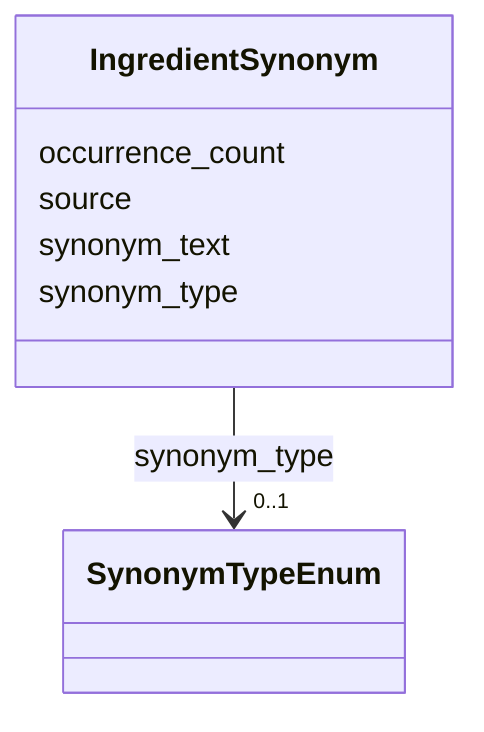

# Class: IngredientSynonym 


_Alternative name or raw text variant for an ingredient_


URI: [mediaingredientmech:IngredientSynonym](https://w3id.org/mediaingredientmech/IngredientSynonym)





<!-- no inheritance hierarchy -->


## Slots

| Name | Cardinality and Range | Description | Inheritance |
| ---  | --- | --- | --- |
| [synonym_text](synonym_text.md) | 1 <br/> [String](String.md) | The synonym text | direct |
| [synonym_type](synonym_type.md) | 0..1 <br/> [SynonymTypeEnum](SynonymTypeEnum.md) | Type of synonym | direct |
| [source](source.md) | 0..1 <br/> [String](String.md) | Where this synonym came from (e | direct |
| [occurrence_count](occurrence_count.md) | 0..1 <br/> [Integer](Integer.md) | Number of times this variant appears | direct |


## Usages

| used by | used in | type | used |
| ---  | --- | --- | --- |
| [IngredientRecord](IngredientRecord.md) | [synonyms](synonyms.md) | range | [IngredientSynonym](IngredientSynonym.md) |


## Identifier and Mapping Information


### Schema Source


* from schema: https://w3id.org/mediaingredientmech


## Mappings

| Mapping Type | Mapped Value |
| ---  | ---  |
| self | mediaingredientmech:IngredientSynonym |
| native | mediaingredientmech:IngredientSynonym |


## LinkML Source

<!-- TODO: investigate https://stackoverflow.com/questions/37606292/how-to-create-tabbed-code-blocks-in-mkdocs-or-sphinx -->

### Direct

<details>
```yaml
name: IngredientSynonym
description: Alternative name or raw text variant for an ingredient
from_schema: https://w3id.org/mediaingredientmech
attributes:
  synonym_text:
    name: synonym_text
    description: The synonym text
    from_schema: https://w3id.org/mediaingredientmech
    rank: 1000
    domain_of:
    - IngredientSynonym
    required: true
  synonym_type:
    name: synonym_type
    description: Type of synonym
    from_schema: https://w3id.org/mediaingredientmech
    rank: 1000
    domain_of:
    - IngredientSynonym
    range: SynonymTypeEnum
  source:
    name: source
    description: Where this synonym came from (e.g., database, curator)
    from_schema: https://w3id.org/mediaingredientmech
    domain_of:
    - MappingEvidence
    - IngredientSynonym
  occurrence_count:
    name: occurrence_count
    description: Number of times this variant appears
    from_schema: https://w3id.org/mediaingredientmech
    rank: 1000
    domain_of:
    - IngredientSynonym
    range: integer

```
</details>

### Induced

<details>
```yaml
name: IngredientSynonym
description: Alternative name or raw text variant for an ingredient
from_schema: https://w3id.org/mediaingredientmech
attributes:
  synonym_text:
    name: synonym_text
    description: The synonym text
    from_schema: https://w3id.org/mediaingredientmech
    rank: 1000
    alias: synonym_text
    owner: IngredientSynonym
    domain_of:
    - IngredientSynonym
    range: string
    required: true
  synonym_type:
    name: synonym_type
    description: Type of synonym
    from_schema: https://w3id.org/mediaingredientmech
    rank: 1000
    alias: synonym_type
    owner: IngredientSynonym
    domain_of:
    - IngredientSynonym
    range: SynonymTypeEnum
  source:
    name: source
    description: Where this synonym came from (e.g., database, curator)
    from_schema: https://w3id.org/mediaingredientmech
    alias: source
    owner: IngredientSynonym
    domain_of:
    - MappingEvidence
    - IngredientSynonym
    range: string
  occurrence_count:
    name: occurrence_count
    description: Number of times this variant appears
    from_schema: https://w3id.org/mediaingredientmech
    rank: 1000
    alias: occurrence_count
    owner: IngredientSynonym
    domain_of:
    - IngredientSynonym
    range: integer

```
</details>