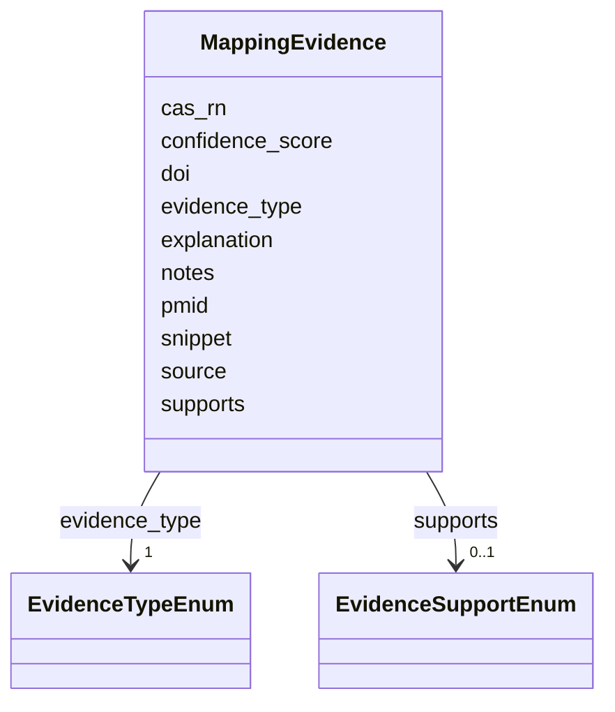

# Class: MappingEvidence 


_Evidence for an ontology mapping_


URI: [mediaingredientmech:MappingEvidence](https://w3id.org/mediaingredientmech/MappingEvidence)





<!-- no inheritance hierarchy -->


## Slots

| Name | Cardinality and Range | Description | Inheritance |
| ---  | --- | --- | --- |
| [evidence_type](evidence_type.md) | 1 <br/> [EvidenceTypeEnum](EvidenceTypeEnum.md) | Type of evidence | direct |
| [source](source.md) | 0..1 <br/> [String](String.md) | Source of evidence (e | direct |
| [confidence_score](confidence_score.md) | 0..1 <br/> [Float](Float.md) | Confidence score (0 | direct |
| [notes](notes.md) | 0..1 <br/> [String](String.md) | Additional context | direct |
| [cas_rn](cas_rn.md) | 0..1 <br/> [String](String.md) | CAS Registry Number that supports this evidence row | direct |
| [pmid](pmid.md) | 0..1 <br/> [String](String.md) | PubMed ID for MEDLINE citations (e | direct |
| [doi](doi.md) | 0..1 <br/> [String](String.md) | Digital Object Identifier (e | direct |
| [snippet](snippet.md) | 0..1 <br/> [String](String.md) | Exact substring quoted from the cited abstract that supports | direct |
| [supports](supports.md) | 0..1 <br/> [EvidenceSupportEnum](EvidenceSupportEnum.md) | How the cited reference relates to the mapping claim | direct |
| [explanation](explanation.md) | 0..1 <br/> [String](String.md) | Curator (or LLM)'s rationale connecting the snippet to the | direct |


## Usages

| used by | used in | type | used |
| ---  | --- | --- | --- |
| [OntologyMapping](OntologyMapping.md) | [evidence](evidence.md) | range | [MappingEvidence](MappingEvidence.md) |


## Identifier and Mapping Information


### Schema Source


* from schema: https://w3id.org/mediaingredientmech


## Mappings

| Mapping Type | Mapped Value |
| ---  | ---  |
| self | mediaingredientmech:MappingEvidence |
| native | mediaingredientmech:MappingEvidence |


## LinkML Source

<!-- TODO: investigate https://stackoverflow.com/questions/37606292/how-to-create-tabbed-code-blocks-in-mkdocs-or-sphinx -->

### Direct

<details>
```yaml
name: MappingEvidence
description: Evidence for an ontology mapping
from_schema: https://w3id.org/mediaingredientmech
attributes:
  evidence_type:
    name: evidence_type
    description: Type of evidence
    from_schema: https://w3id.org/mediaingredientmech
    rank: 1000
    domain_of:
    - MappingEvidence
    range: EvidenceTypeEnum
    required: true
  source:
    name: source
    description: Source of evidence (e.g., database name, curator name)
    from_schema: https://w3id.org/mediaingredientmech
    rank: 1000
    domain_of:
    - MappingEvidence
    - IngredientSynonym
    - StockComponent
  confidence_score:
    name: confidence_score
    description: Confidence score (0.0-1.0)
    from_schema: https://w3id.org/mediaingredientmech
    rank: 1000
    domain_of:
    - MappingEvidence
    range: float
  notes:
    name: notes
    description: Additional context
    from_schema: https://w3id.org/mediaingredientmech
    domain_of:
    - IngredientRecord
    - EnvironmentContext
    - MappingEvidence
    - CurationEvent
    - RoleAssignment
    - CommunityOrganismRoleAssignment
    - NutritionalRoleAssignment
    - PhysicochemicalRoleAssignment
    - CellularMetabolicRoleAssignment
    - SupportingReference
    - Discussion
    - Dataset
  cas_rn:
    name: cas_rn
    description: 'CAS Registry Number that supports this evidence row. Set by the
      CAS-RN cross-reference resolver (`evidence_type: CAS_RN_CROSS_REFERENCE`) when
      an ontology term was matched via its CAS-RN rather than label or synonym. Same
      format as `ChemicalProperties.cas_rn`.'
    from_schema: https://w3id.org/mediaingredientmech
    domain_of:
    - ChemicalProperties
    - MappingEvidence
    pattern: ^\d+-\d+-\d+$
  pmid:
    name: pmid
    description: PubMed ID for MEDLINE citations (e.g., 12345678)
    from_schema: https://w3id.org/mediaingredientmech
    rank: 1000
    domain_of:
    - MappingEvidence
    - RoleCitation
    pattern: ^[0-9]+$
  doi:
    name: doi
    description: Digital Object Identifier (e.g., 10.1128/jb.00123-15)
    from_schema: https://w3id.org/mediaingredientmech
    rank: 1000
    domain_of:
    - MappingEvidence
    - RoleCitation
    pattern: ^10\.\d{4,}/[-._;()/:A-Za-z0-9]+$
  snippet:
    name: snippet
    description: 'Exact substring quoted from the cited abstract that supports

      this mapping. Used by linkml-reference-validator to detect

      AI-hallucinated evidence: every snippet must appear verbatim

      in the cached PubMed abstract for the given pmid/doi.

      '
    from_schema: https://w3id.org/mediaingredientmech
    rank: 1000
    domain_of:
    - MappingEvidence
    - SupportingReference
  supports:
    name: supports
    description: 'How the cited reference relates to the mapping claim.

      SUPPORT = abstract substantiates the mapping; PARTIAL =

      adjacent context only; REFUTE = contradicts; NO_EVIDENCE =

      reference cited but no relevant snippet extractable.

      '
    from_schema: https://w3id.org/mediaingredientmech
    rank: 1000
    domain_of:
    - MappingEvidence
    - SupportingReference
    range: EvidenceSupportEnum
  explanation:
    name: explanation
    description: 'Curator (or LLM)''s rationale connecting the snippet to the

      mapping claim — separate from the verbatim snippet so the

      snippet stays validatable.

      '
    from_schema: https://w3id.org/mediaingredientmech
    rank: 1000
    domain_of:
    - MappingEvidence
    - SupportingReference

```
</details>

### Induced

<details>
```yaml
name: MappingEvidence
description: Evidence for an ontology mapping
from_schema: https://w3id.org/mediaingredientmech
attributes:
  evidence_type:
    name: evidence_type
    description: Type of evidence
    from_schema: https://w3id.org/mediaingredientmech
    rank: 1000
    alias: evidence_type
    owner: MappingEvidence
    domain_of:
    - MappingEvidence
    range: EvidenceTypeEnum
    required: true
  source:
    name: source
    description: Source of evidence (e.g., database name, curator name)
    from_schema: https://w3id.org/mediaingredientmech
    rank: 1000
    alias: source
    owner: MappingEvidence
    domain_of:
    - MappingEvidence
    - IngredientSynonym
    - StockComponent
    range: string
  confidence_score:
    name: confidence_score
    description: Confidence score (0.0-1.0)
    from_schema: https://w3id.org/mediaingredientmech
    rank: 1000
    alias: confidence_score
    owner: MappingEvidence
    domain_of:
    - MappingEvidence
    range: float
  notes:
    name: notes
    description: Additional context
    from_schema: https://w3id.org/mediaingredientmech
    alias: notes
    owner: MappingEvidence
    domain_of:
    - IngredientRecord
    - EnvironmentContext
    - MappingEvidence
    - CurationEvent
    - RoleAssignment
    - CommunityOrganismRoleAssignment
    - NutritionalRoleAssignment
    - PhysicochemicalRoleAssignment
    - CellularMetabolicRoleAssignment
    - SupportingReference
    - Discussion
    - Dataset
    range: string
  cas_rn:
    name: cas_rn
    description: 'CAS Registry Number that supports this evidence row. Set by the
      CAS-RN cross-reference resolver (`evidence_type: CAS_RN_CROSS_REFERENCE`) when
      an ontology term was matched via its CAS-RN rather than label or synonym. Same
      format as `ChemicalProperties.cas_rn`.'
    from_schema: https://w3id.org/mediaingredientmech
    alias: cas_rn
    owner: MappingEvidence
    domain_of:
    - ChemicalProperties
    - MappingEvidence
    range: string
    pattern: ^\d+-\d+-\d+$
  pmid:
    name: pmid
    description: PubMed ID for MEDLINE citations (e.g., 12345678)
    from_schema: https://w3id.org/mediaingredientmech
    rank: 1000
    alias: pmid
    owner: MappingEvidence
    domain_of:
    - MappingEvidence
    - RoleCitation
    range: string
    pattern: ^[0-9]+$
  doi:
    name: doi
    description: Digital Object Identifier (e.g., 10.1128/jb.00123-15)
    from_schema: https://w3id.org/mediaingredientmech
    rank: 1000
    alias: doi
    owner: MappingEvidence
    domain_of:
    - MappingEvidence
    - RoleCitation
    range: string
    pattern: ^10\.\d{4,}/[-._;()/:A-Za-z0-9]+$
  snippet:
    name: snippet
    description: 'Exact substring quoted from the cited abstract that supports

      this mapping. Used by linkml-reference-validator to detect

      AI-hallucinated evidence: every snippet must appear verbatim

      in the cached PubMed abstract for the given pmid/doi.

      '
    from_schema: https://w3id.org/mediaingredientmech
    rank: 1000
    alias: snippet
    owner: MappingEvidence
    domain_of:
    - MappingEvidence
    - SupportingReference
    range: string
  supports:
    name: supports
    description: 'How the cited reference relates to the mapping claim.

      SUPPORT = abstract substantiates the mapping; PARTIAL =

      adjacent context only; REFUTE = contradicts; NO_EVIDENCE =

      reference cited but no relevant snippet extractable.

      '
    from_schema: https://w3id.org/mediaingredientmech
    rank: 1000
    alias: supports
    owner: MappingEvidence
    domain_of:
    - MappingEvidence
    - SupportingReference
    range: EvidenceSupportEnum
  explanation:
    name: explanation
    description: 'Curator (or LLM)''s rationale connecting the snippet to the

      mapping claim — separate from the verbatim snippet so the

      snippet stays validatable.

      '
    from_schema: https://w3id.org/mediaingredientmech
    rank: 1000
    alias: explanation
    owner: MappingEvidence
    domain_of:
    - MappingEvidence
    - SupportingReference
    range: string

```
</details>