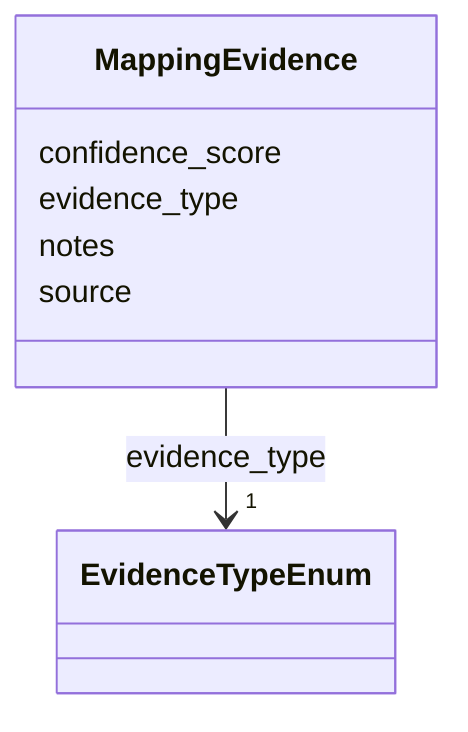

# Class: MappingEvidence 


_Evidence for an ontology mapping_


URI: [mediaingredientmech:MappingEvidence](https://w3id.org/mediaingredientmech/MappingEvidence)





<!-- no inheritance hierarchy -->


## Slots

| Name | Cardinality and Range | Description | Inheritance |
| ---  | --- | --- | --- |
| [evidence_type](evidence_type.md) | 1 <br/> [EvidenceTypeEnum](EvidenceTypeEnum.md) | Type of evidence | direct |
| [source](source.md) | 0..1 <br/> [String](String.md) | Source of evidence (e | direct |
| [confidence_score](confidence_score.md) | 0..1 <br/> [Float](Float.md) | Confidence score (0 | direct |
| [notes](notes.md) | 0..1 <br/> [String](String.md) | Additional context | direct |


## Usages

| used by | used in | type | used |
| ---  | --- | --- | --- |
| [OntologyMapping](OntologyMapping.md) | [evidence](evidence.md) | range | [MappingEvidence](MappingEvidence.md) |


## Identifier and Mapping Information


### Schema Source


* from schema: https://w3id.org/mediaingredientmech


## Mappings

| Mapping Type | Mapped Value |
| ---  | ---  |
| self | mediaingredientmech:MappingEvidence |
| native | mediaingredientmech:MappingEvidence |


## LinkML Source

<!-- TODO: investigate https://stackoverflow.com/questions/37606292/how-to-create-tabbed-code-blocks-in-mkdocs-or-sphinx -->

### Direct

<details>
```yaml
name: MappingEvidence
description: Evidence for an ontology mapping
from_schema: https://w3id.org/mediaingredientmech
attributes:
  evidence_type:
    name: evidence_type
    description: Type of evidence
    from_schema: https://w3id.org/mediaingredientmech
    rank: 1000
    domain_of:
    - MappingEvidence
    range: EvidenceTypeEnum
    required: true
  source:
    name: source
    description: Source of evidence (e.g., database name, curator name)
    from_schema: https://w3id.org/mediaingredientmech
    rank: 1000
    domain_of:
    - MappingEvidence
    - IngredientSynonym
  confidence_score:
    name: confidence_score
    description: Confidence score (0.0-1.0)
    from_schema: https://w3id.org/mediaingredientmech
    rank: 1000
    domain_of:
    - MappingEvidence
    range: float
  notes:
    name: notes
    description: Additional context
    from_schema: https://w3id.org/mediaingredientmech
    domain_of:
    - IngredientRecord
    - MappingEvidence
    - CurationEvent

```
</details>

### Induced

<details>
```yaml
name: MappingEvidence
description: Evidence for an ontology mapping
from_schema: https://w3id.org/mediaingredientmech
attributes:
  evidence_type:
    name: evidence_type
    description: Type of evidence
    from_schema: https://w3id.org/mediaingredientmech
    rank: 1000
    alias: evidence_type
    owner: MappingEvidence
    domain_of:
    - MappingEvidence
    range: EvidenceTypeEnum
    required: true
  source:
    name: source
    description: Source of evidence (e.g., database name, curator name)
    from_schema: https://w3id.org/mediaingredientmech
    rank: 1000
    alias: source
    owner: MappingEvidence
    domain_of:
    - MappingEvidence
    - IngredientSynonym
    range: string
  confidence_score:
    name: confidence_score
    description: Confidence score (0.0-1.0)
    from_schema: https://w3id.org/mediaingredientmech
    rank: 1000
    alias: confidence_score
    owner: MappingEvidence
    domain_of:
    - MappingEvidence
    range: float
  notes:
    name: notes
    description: Additional context
    from_schema: https://w3id.org/mediaingredientmech
    alias: notes
    owner: MappingEvidence
    domain_of:
    - IngredientRecord
    - MappingEvidence
    - CurationEvent
    range: string

```
</details>