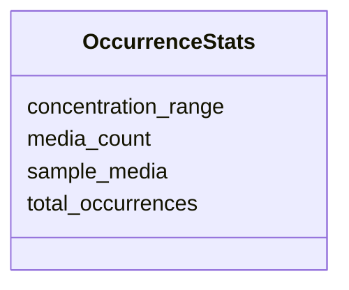

# Class: OccurrenceStats 


_Statistics about ingredient usage across media_


URI: [mediaingredientmech:OccurrenceStats](https://w3id.org/mediaingredientmech/OccurrenceStats)





<!-- no inheritance hierarchy -->


## Slots

| Name | Cardinality and Range | Description | Inheritance |
| ---  | --- | --- | --- |
| [total_occurrences](total_occurrences.md) | 1 <br/> [Integer](Integer.md) | Total number of occurrences across all media | direct |
| [media_count](media_count.md) | 1 <br/> [Integer](Integer.md) | Number of unique media containing this ingredient | direct |
| [sample_media](sample_media.md) | * <br/> [String](String.md) | Sample media names (for reference) | direct |
| [concentration_range](concentration_range.md) | 0..1 <br/> [String](String.md) | Observed concentration range (if available) | direct |


## Usages

| used by | used in | type | used |
| ---  | --- | --- | --- |
| [IngredientRecord](IngredientRecord.md) | [occurrence_statistics](occurrence_statistics.md) | range | [OccurrenceStats](OccurrenceStats.md) |


## Identifier and Mapping Information


### Schema Source


* from schema: https://w3id.org/mediaingredientmech


## Mappings

| Mapping Type | Mapped Value |
| ---  | ---  |
| self | mediaingredientmech:OccurrenceStats |
| native | mediaingredientmech:OccurrenceStats |


## LinkML Source

<!-- TODO: investigate https://stackoverflow.com/questions/37606292/how-to-create-tabbed-code-blocks-in-mkdocs-or-sphinx -->

### Direct

<details>
```yaml
name: OccurrenceStats
description: Statistics about ingredient usage across media
from_schema: https://w3id.org/mediaingredientmech
attributes:
  total_occurrences:
    name: total_occurrences
    description: Total number of occurrences across all media
    from_schema: https://w3id.org/mediaingredientmech
    rank: 1000
    domain_of:
    - OccurrenceStats
    range: integer
    required: true
  media_count:
    name: media_count
    description: Number of unique media containing this ingredient
    from_schema: https://w3id.org/mediaingredientmech
    rank: 1000
    domain_of:
    - OccurrenceStats
    range: integer
    required: true
  sample_media:
    name: sample_media
    description: Sample media names (for reference)
    from_schema: https://w3id.org/mediaingredientmech
    rank: 1000
    domain_of:
    - OccurrenceStats
    multivalued: true
  concentration_range:
    name: concentration_range
    description: Observed concentration range (if available)
    from_schema: https://w3id.org/mediaingredientmech
    rank: 1000
    domain_of:
    - OccurrenceStats

```
</details>

### Induced

<details>
```yaml
name: OccurrenceStats
description: Statistics about ingredient usage across media
from_schema: https://w3id.org/mediaingredientmech
attributes:
  total_occurrences:
    name: total_occurrences
    description: Total number of occurrences across all media
    from_schema: https://w3id.org/mediaingredientmech
    rank: 1000
    alias: total_occurrences
    owner: OccurrenceStats
    domain_of:
    - OccurrenceStats
    range: integer
    required: true
  media_count:
    name: media_count
    description: Number of unique media containing this ingredient
    from_schema: https://w3id.org/mediaingredientmech
    rank: 1000
    alias: media_count
    owner: OccurrenceStats
    domain_of:
    - OccurrenceStats
    range: integer
    required: true
  sample_media:
    name: sample_media
    description: Sample media names (for reference)
    from_schema: https://w3id.org/mediaingredientmech
    rank: 1000
    alias: sample_media
    owner: OccurrenceStats
    domain_of:
    - OccurrenceStats
    range: string
    multivalued: true
  concentration_range:
    name: concentration_range
    description: Observed concentration range (if available)
    from_schema: https://w3id.org/mediaingredientmech
    rank: 1000
    alias: concentration_range
    owner: OccurrenceStats
    domain_of:
    - OccurrenceStats
    range: string

```
</details>