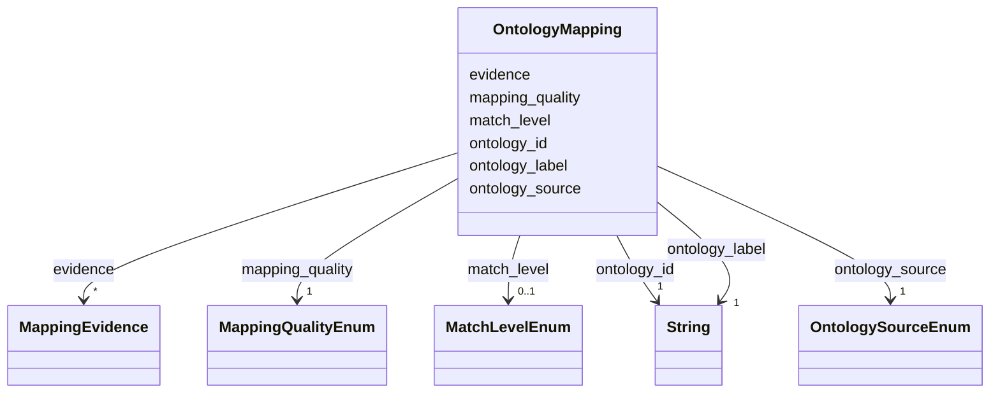

# Class: OntologyMapping 


_Mapping to an ontology term (CHEBI, FOODON, etc.)_


URI: [mediaingredientmech:OntologyMapping](https://w3id.org/mediaingredientmech/OntologyMapping)





<!-- no inheritance hierarchy -->


## Slots

| Name | Cardinality and Range | Description | Inheritance |
| ---  | --- | --- | --- |
| [ontology_id](ontology_id.md) | 1 <br/> [xsd:string](http://www.w3.org/2001/XMLSchema#string) | Ontology term ID in CURIE format (e | direct |
| [ontology_label](ontology_label.md) | 1 <br/> [xsd:string](http://www.w3.org/2001/XMLSchema#string) | Human-readable label for the term | direct |
| [ontology_source](ontology_source.md) | 1 <br/> [OntologySourceEnum](OntologySourceEnum.md) | Source ontology | direct |
| [mapping_quality](mapping_quality.md) | 1 <br/> [MappingQualityEnum](MappingQualityEnum.md) | Quality assessment of this mapping | direct |
| [match_level](match_level.md) | 0..1 <br/> [MatchLevelEnum](MatchLevelEnum.md) | Technical method used to find this mapping | direct |
| [evidence](evidence.md) | * <br/> [MappingEvidence](MappingEvidence.md) | Evidence supporting this mapping | direct |


## Usages

| used by | used in | type | used |
| ---  | --- | --- | --- |
| [IngredientRecord](IngredientRecord.md) | [ontology_mapping](ontology_mapping.md) | range | [OntologyMapping](OntologyMapping.md) |


## Identifier and Mapping Information


### Schema Source


* from schema: https://w3id.org/mediaingredientmech


## Mappings

| Mapping Type | Mapped Value |
| ---  | ---  |
| self | mediaingredientmech:OntologyMapping |
| native | mediaingredientmech:OntologyMapping |


## LinkML Source

<!-- TODO: investigate https://stackoverflow.com/questions/37606292/how-to-create-tabbed-code-blocks-in-mkdocs-or-sphinx -->

### Direct

<details>
```yaml
name: OntologyMapping
description: Mapping to an ontology term (CHEBI, FOODON, etc.)
from_schema: https://w3id.org/mediaingredientmech
attributes:
  ontology_id:
    name: ontology_id
    description: Ontology term ID in CURIE format (e.g., CHEBI:26710)
    from_schema: https://w3id.org/mediaingredientmech
    domain_of:
    - IngredientRecord
    - OntologyMapping
    required: true
    pattern: ^[A-Z]+:[0-9]+$
  ontology_label:
    name: ontology_label
    description: Human-readable label for the term
    from_schema: https://w3id.org/mediaingredientmech
    rank: 1000
    domain_of:
    - OntologyMapping
    required: true
  ontology_source:
    name: ontology_source
    description: Source ontology
    from_schema: https://w3id.org/mediaingredientmech
    rank: 1000
    domain_of:
    - OntologyMapping
    range: OntologySourceEnum
    required: true
  mapping_quality:
    name: mapping_quality
    description: Quality assessment of this mapping
    from_schema: https://w3id.org/mediaingredientmech
    rank: 1000
    domain_of:
    - OntologyMapping
    range: MappingQualityEnum
    required: true
  match_level:
    name: match_level
    description: Technical method used to find this mapping
    from_schema: https://w3id.org/mediaingredientmech
    rank: 1000
    domain_of:
    - OntologyMapping
    range: MatchLevelEnum
  evidence:
    name: evidence
    description: Evidence supporting this mapping
    from_schema: https://w3id.org/mediaingredientmech
    rank: 1000
    domain_of:
    - OntologyMapping
    - RoleAssignment
    - CellularRoleAssignment
    range: MappingEvidence
    multivalued: true
    inlined: true
    inlined_as_list: true

```
</details>

### Induced

<details>
```yaml
name: OntologyMapping
description: Mapping to an ontology term (CHEBI, FOODON, etc.)
from_schema: https://w3id.org/mediaingredientmech
attributes:
  ontology_id:
    name: ontology_id
    description: Ontology term ID in CURIE format (e.g., CHEBI:26710)
    from_schema: https://w3id.org/mediaingredientmech
    alias: ontology_id
    owner: OntologyMapping
    domain_of:
    - IngredientRecord
    - OntologyMapping
    range: string
    required: true
    pattern: ^[A-Z]+:[0-9]+$
  ontology_label:
    name: ontology_label
    description: Human-readable label for the term
    from_schema: https://w3id.org/mediaingredientmech
    rank: 1000
    alias: ontology_label
    owner: OntologyMapping
    domain_of:
    - OntologyMapping
    range: string
    required: true
  ontology_source:
    name: ontology_source
    description: Source ontology
    from_schema: https://w3id.org/mediaingredientmech
    rank: 1000
    alias: ontology_source
    owner: OntologyMapping
    domain_of:
    - OntologyMapping
    range: OntologySourceEnum
    required: true
  mapping_quality:
    name: mapping_quality
    description: Quality assessment of this mapping
    from_schema: https://w3id.org/mediaingredientmech
    rank: 1000
    alias: mapping_quality
    owner: OntologyMapping
    domain_of:
    - OntologyMapping
    range: MappingQualityEnum
    required: true
  match_level:
    name: match_level
    description: Technical method used to find this mapping
    from_schema: https://w3id.org/mediaingredientmech
    rank: 1000
    alias: match_level
    owner: OntologyMapping
    domain_of:
    - OntologyMapping
    range: MatchLevelEnum
  evidence:
    name: evidence
    description: Evidence supporting this mapping
    from_schema: https://w3id.org/mediaingredientmech
    rank: 1000
    alias: evidence
    owner: OntologyMapping
    domain_of:
    - OntologyMapping
    - RoleAssignment
    - CellularRoleAssignment
    range: MappingEvidence
    multivalued: true
    inlined: true
    inlined_as_list: true

```
</details>