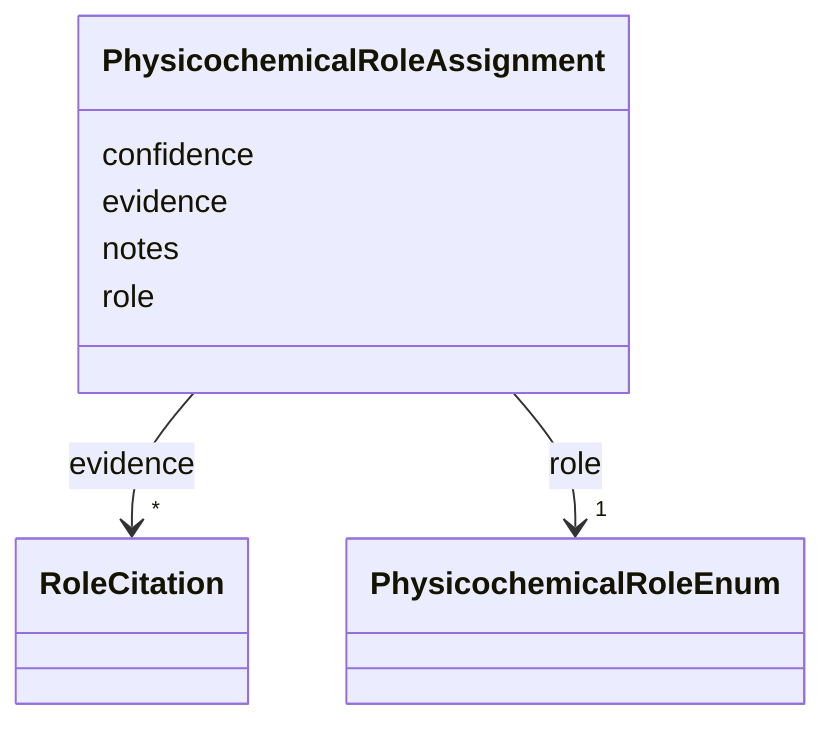

# Class: PhysicochemicalRoleAssignment 


_Assignment of a physicochemical facet role (the chemical or physical function the ingredient performs in the medium) with supporting evidence._


URI: [mediaingredientmech:PhysicochemicalRoleAssignment](https://w3id.org/mediaingredientmech/PhysicochemicalRoleAssignment)





<!-- no inheritance hierarchy -->


## Slots

| Name | Cardinality and Range | Description | Inheritance |
| ---  | --- | --- | --- |
| [role](role.md) | 1 <br/> [PhysicochemicalRoleEnum](PhysicochemicalRoleEnum.md) | The physicochemical role (e | direct |
| [confidence](confidence.md) | 0..1 <br/> [Float](Float.md) | Confidence score for this role assignment (0 | direct |
| [evidence](evidence.md) | * <br/> [RoleCitation](RoleCitation.md) | Citations and references supporting this role | direct |
| [notes](notes.md) | 0..1 <br/> [String](String.md) | Additional context about this role assignment | direct |


## Usages

| used by | used in | type | used |
| ---  | --- | --- | --- |
| [IngredientRecord](IngredientRecord.md) | [physicochemical_roles](physicochemical_roles.md) | range | [PhysicochemicalRoleAssignment](PhysicochemicalRoleAssignment.md) |


## Identifier and Mapping Information


### Schema Source


* from schema: https://w3id.org/mediaingredientmech


## Mappings

| Mapping Type | Mapped Value |
| ---  | ---  |
| self | mediaingredientmech:PhysicochemicalRoleAssignment |
| native | mediaingredientmech:PhysicochemicalRoleAssignment |


## LinkML Source

<!-- TODO: investigate https://stackoverflow.com/questions/37606292/how-to-create-tabbed-code-blocks-in-mkdocs-or-sphinx -->

### Direct

<details>
```yaml
name: PhysicochemicalRoleAssignment
description: Assignment of a physicochemical facet role (the chemical or physical
  function the ingredient performs in the medium) with supporting evidence.
from_schema: https://w3id.org/mediaingredientmech
attributes:
  role:
    name: role
    description: The physicochemical role (e.g., BUFFER, CHELATOR, REDUCING_AGENT).
    from_schema: https://w3id.org/mediaingredientmech
    domain_of:
    - CommunityOrganismRoleAssignment
    - NutritionalRoleAssignment
    - PhysicochemicalRoleAssignment
    - CellularMetabolicRoleAssignment
    range: PhysicochemicalRoleEnum
    required: true
  confidence:
    name: confidence
    description: Confidence score for this role assignment (0.0-1.0)
    from_schema: https://w3id.org/mediaingredientmech
    domain_of:
    - CommunityOrganismRoleAssignment
    - NutritionalRoleAssignment
    - PhysicochemicalRoleAssignment
    - CellularMetabolicRoleAssignment
    range: float
  evidence:
    name: evidence
    description: Citations and references supporting this role
    from_schema: https://w3id.org/mediaingredientmech
    domain_of:
    - OntologyMapping
    - CommunityOrganismRoleAssignment
    - NutritionalRoleAssignment
    - PhysicochemicalRoleAssignment
    - CellularMetabolicRoleAssignment
    - Discussion
    - Dataset
    range: RoleCitation
    multivalued: true
    inlined: true
    inlined_as_list: true
  notes:
    name: notes
    description: Additional context about this role assignment
    from_schema: https://w3id.org/mediaingredientmech
    domain_of:
    - IngredientRecord
    - EnvironmentContext
    - MappingEvidence
    - CurationEvent
    - CommunityOrganismRoleAssignment
    - NutritionalRoleAssignment
    - PhysicochemicalRoleAssignment
    - CellularMetabolicRoleAssignment
    - SupportingReference
    - Discussion
    - Dataset

```
</details>

### Induced

<details>
```yaml
name: PhysicochemicalRoleAssignment
description: Assignment of a physicochemical facet role (the chemical or physical
  function the ingredient performs in the medium) with supporting evidence.
from_schema: https://w3id.org/mediaingredientmech
attributes:
  role:
    name: role
    description: The physicochemical role (e.g., BUFFER, CHELATOR, REDUCING_AGENT).
    from_schema: https://w3id.org/mediaingredientmech
    alias: role
    owner: PhysicochemicalRoleAssignment
    domain_of:
    - CommunityOrganismRoleAssignment
    - NutritionalRoleAssignment
    - PhysicochemicalRoleAssignment
    - CellularMetabolicRoleAssignment
    range: PhysicochemicalRoleEnum
    required: true
  confidence:
    name: confidence
    description: Confidence score for this role assignment (0.0-1.0)
    from_schema: https://w3id.org/mediaingredientmech
    alias: confidence
    owner: PhysicochemicalRoleAssignment
    domain_of:
    - CommunityOrganismRoleAssignment
    - NutritionalRoleAssignment
    - PhysicochemicalRoleAssignment
    - CellularMetabolicRoleAssignment
    range: float
  evidence:
    name: evidence
    description: Citations and references supporting this role
    from_schema: https://w3id.org/mediaingredientmech
    alias: evidence
    owner: PhysicochemicalRoleAssignment
    domain_of:
    - OntologyMapping
    - CommunityOrganismRoleAssignment
    - NutritionalRoleAssignment
    - PhysicochemicalRoleAssignment
    - CellularMetabolicRoleAssignment
    - Discussion
    - Dataset
    range: RoleCitation
    multivalued: true
    inlined: true
    inlined_as_list: true
  notes:
    name: notes
    description: Additional context about this role assignment
    from_schema: https://w3id.org/mediaingredientmech
    alias: notes
    owner: PhysicochemicalRoleAssignment
    domain_of:
    - IngredientRecord
    - EnvironmentContext
    - MappingEvidence
    - CurationEvent
    - CommunityOrganismRoleAssignment
    - NutritionalRoleAssignment
    - PhysicochemicalRoleAssignment
    - CellularMetabolicRoleAssignment
    - SupportingReference
    - Discussion
    - Dataset
    range: string

```
</details>