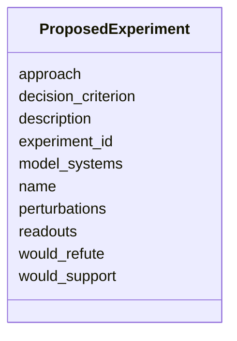

# Class: ProposedExperiment 


_A lightweight, domain-neutral sketch of an experiment or analysis that could resolve a knowledge gap. Records the idea and how its outcome would decide the gap; intentionally simpler than a full study design._


URI: [mediaingredientmech:ProposedExperiment](https://w3id.org/mediaingredientmech/ProposedExperiment)





<!-- no inheritance hierarchy -->


## Slots

| Name | Cardinality and Range | Description | Inheritance |
| ---  | --- | --- | --- |
| [experiment_id](experiment_id.md) | 0..1 <br/> [String](String.md) | Stable local id (optional; for cross-reference) | direct |
| [name](name.md) | 0..1 _recommended_ <br/> [String](String.md) |  | direct |
| [description](description.md) | 0..1 <br/> [String](String.md) |  | direct |
| [approach](approach.md) | 0..1 <br/> [String](String.md) | Method/assay in brief (e | direct |
| [model_systems](model_systems.md) | * <br/> [String](String.md) | Systems to use (e | direct |
| [perturbations](perturbations.md) | * <br/> [String](String.md) | Interventions applied (e | direct |
| [readouts](readouts.md) | * <br/> [String](String.md) | What would be measured | direct |
| [decision_criterion](decision_criterion.md) | 0..1 <br/> [String](String.md) | The observation that would settle the question | direct |
| [would_support](would_support.md) | 0..1 <br/> [String](String.md) | Outcome that would support the hypothesis/assertion | direct |
| [would_refute](would_refute.md) | 0..1 <br/> [String](String.md) | Outcome that would refute it | direct |


## Usages

| used by | used in | type | used |
| ---  | --- | --- | --- |
| [Discussion](Discussion.md) | [proposed_experiments](proposed_experiments.md) | range | [ProposedExperiment](ProposedExperiment.md) |


## Identifier and Mapping Information


### Schema Source


* from schema: https://w3id.org/mediaingredientmech


## Mappings

| Mapping Type | Mapped Value |
| ---  | ---  |
| self | mediaingredientmech:ProposedExperiment |
| native | mediaingredientmech:ProposedExperiment |


## LinkML Source

<!-- TODO: investigate https://stackoverflow.com/questions/37606292/how-to-create-tabbed-code-blocks-in-mkdocs-or-sphinx -->

### Direct

<details>
```yaml
name: ProposedExperiment
description: A lightweight, domain-neutral sketch of an experiment or analysis that
  could resolve a knowledge gap. Records the idea and how its outcome would decide
  the gap; intentionally simpler than a full study design.
from_schema: https://w3id.org/mediaingredientmech
attributes:
  experiment_id:
    name: experiment_id
    description: Stable local id (optional; for cross-reference).
    from_schema: https://w3id.org/kg-microbe/mech-shared
    rank: 1000
    domain_of:
    - ProposedExperiment
  name:
    name: name
    from_schema: https://w3id.org/kg-microbe/mech-shared
    rank: 1000
    domain_of:
    - ProposedExperiment
    recommended: true
  description:
    name: description
    from_schema: https://w3id.org/kg-microbe/mech-shared
    rank: 1000
    domain_of:
    - ProposedExperiment
    - Dataset
  approach:
    name: approach
    description: Method/assay in brief (e.g. "defined-coculture growth assay", "isolate
      WGS").
    from_schema: https://w3id.org/kg-microbe/mech-shared
    rank: 1000
    domain_of:
    - ProposedExperiment
  model_systems:
    name: model_systems
    description: Systems to use (e.g. isolate, enrichment, defined coculture, metagenome).
    from_schema: https://w3id.org/kg-microbe/mech-shared
    rank: 1000
    domain_of:
    - ProposedExperiment
    multivalued: true
  perturbations:
    name: perturbations
    description: Interventions applied (e.g. gene knockout, nutrient removal).
    from_schema: https://w3id.org/kg-microbe/mech-shared
    rank: 1000
    domain_of:
    - ProposedExperiment
    multivalued: true
  readouts:
    name: readouts
    description: What would be measured.
    from_schema: https://w3id.org/kg-microbe/mech-shared
    rank: 1000
    domain_of:
    - ProposedExperiment
    multivalued: true
  decision_criterion:
    name: decision_criterion
    description: The observation that would settle the question.
    from_schema: https://w3id.org/kg-microbe/mech-shared
    rank: 1000
    domain_of:
    - ProposedExperiment
  would_support:
    name: would_support
    description: Outcome that would support the hypothesis/assertion.
    from_schema: https://w3id.org/kg-microbe/mech-shared
    rank: 1000
    domain_of:
    - ProposedExperiment
  would_refute:
    name: would_refute
    description: Outcome that would refute it.
    from_schema: https://w3id.org/kg-microbe/mech-shared
    rank: 1000
    domain_of:
    - ProposedExperiment

```
</details>

### Induced

<details>
```yaml
name: ProposedExperiment
description: A lightweight, domain-neutral sketch of an experiment or analysis that
  could resolve a knowledge gap. Records the idea and how its outcome would decide
  the gap; intentionally simpler than a full study design.
from_schema: https://w3id.org/mediaingredientmech
attributes:
  experiment_id:
    name: experiment_id
    description: Stable local id (optional; for cross-reference).
    from_schema: https://w3id.org/kg-microbe/mech-shared
    rank: 1000
    alias: experiment_id
    owner: ProposedExperiment
    domain_of:
    - ProposedExperiment
    range: string
  name:
    name: name
    from_schema: https://w3id.org/kg-microbe/mech-shared
    rank: 1000
    alias: name
    owner: ProposedExperiment
    domain_of:
    - ProposedExperiment
    range: string
    recommended: true
  description:
    name: description
    from_schema: https://w3id.org/kg-microbe/mech-shared
    rank: 1000
    alias: description
    owner: ProposedExperiment
    domain_of:
    - ProposedExperiment
    - Dataset
    range: string
  approach:
    name: approach
    description: Method/assay in brief (e.g. "defined-coculture growth assay", "isolate
      WGS").
    from_schema: https://w3id.org/kg-microbe/mech-shared
    rank: 1000
    alias: approach
    owner: ProposedExperiment
    domain_of:
    - ProposedExperiment
    range: string
  model_systems:
    name: model_systems
    description: Systems to use (e.g. isolate, enrichment, defined coculture, metagenome).
    from_schema: https://w3id.org/kg-microbe/mech-shared
    rank: 1000
    alias: model_systems
    owner: ProposedExperiment
    domain_of:
    - ProposedExperiment
    range: string
    multivalued: true
  perturbations:
    name: perturbations
    description: Interventions applied (e.g. gene knockout, nutrient removal).
    from_schema: https://w3id.org/kg-microbe/mech-shared
    rank: 1000
    alias: perturbations
    owner: ProposedExperiment
    domain_of:
    - ProposedExperiment
    range: string
    multivalued: true
  readouts:
    name: readouts
    description: What would be measured.
    from_schema: https://w3id.org/kg-microbe/mech-shared
    rank: 1000
    alias: readouts
    owner: ProposedExperiment
    domain_of:
    - ProposedExperiment
    range: string
    multivalued: true
  decision_criterion:
    name: decision_criterion
    description: The observation that would settle the question.
    from_schema: https://w3id.org/kg-microbe/mech-shared
    rank: 1000
    alias: decision_criterion
    owner: ProposedExperiment
    domain_of:
    - ProposedExperiment
    range: string
  would_support:
    name: would_support
    description: Outcome that would support the hypothesis/assertion.
    from_schema: https://w3id.org/kg-microbe/mech-shared
    rank: 1000
    alias: would_support
    owner: ProposedExperiment
    domain_of:
    - ProposedExperiment
    range: string
  would_refute:
    name: would_refute
    description: Outcome that would refute it.
    from_schema: https://w3id.org/kg-microbe/mech-shared
    rank: 1000
    alias: would_refute
    owner: ProposedExperiment
    domain_of:
    - ProposedExperiment
    range: string

```
</details>