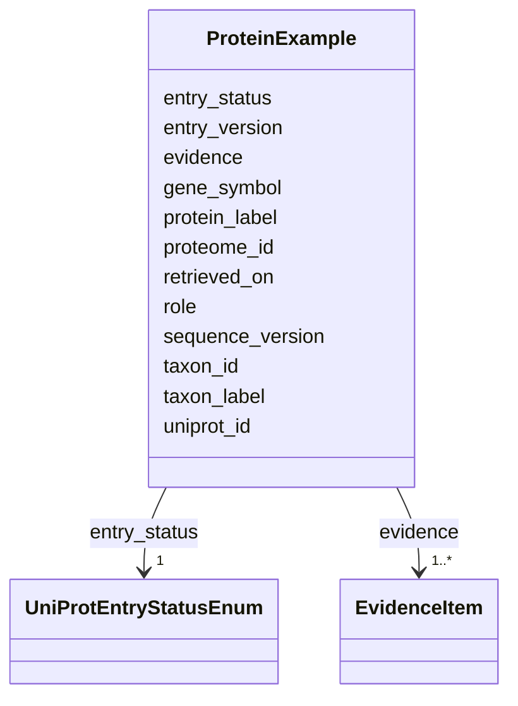

# Class: ProteinExample 


_A source-backed UniProt protein paired with the organism in which its role in this mechanism was established. Reviewed Swiss-Prot entries are preferred. Not exported as a graph node; it is how genome-level information enters MIM._


URI: [mediaingredientmech:ProteinExample](https://w3id.org/mediaingredientmech/ProteinExample)





<!-- no inheritance hierarchy -->


## Slots

| Name | Cardinality and Range | Description | Inheritance |
| ---  | --- | --- | --- |
| [uniprot_id](uniprot_id.md) | 1 <br/> [String](String.md) |  | direct |
| [protein_label](protein_label.md) | 1 <br/> [String](String.md) |  | direct |
| [gene_symbol](gene_symbol.md) | 0..1 <br/> [String](String.md) |  | direct |
| [taxon_id](taxon_id.md) | 1 <br/> [String](String.md) |  | direct |
| [taxon_label](taxon_label.md) | 1 <br/> [String](String.md) |  | direct |
| [entry_status](entry_status.md) | 1 <br/> [UniProtEntryStatusEnum](UniProtEntryStatusEnum.md) |  | direct |
| [proteome_id](proteome_id.md) | 0..1 <br/> [String](String.md) |  | direct |
| [retrieved_on](retrieved_on.md) | 1 <br/> [Date](Date.md) | Date the UniProt metadata was verified (quote it in YAML) | direct |
| [entry_version](entry_version.md) | 0..1 <br/> [Integer](Integer.md) |  | direct |
| [sequence_version](sequence_version.md) | 0..1 <br/> [Integer](Integer.md) |  | direct |
| [role](role.md) | 1 <br/> [String](String.md) |  | direct |
| [evidence](evidence.md) | 1..* <br/> [EvidenceItem](EvidenceItem.md) |  | direct |


## Usages

| used by | used in | type | used |
| ---  | --- | --- | --- |
| [CausalNode](CausalNode.md) | [protein_examples](protein_examples.md) | range | [ProteinExample](ProteinExample.md) |


## Identifier and Mapping Information


### Schema Source


* from schema: https://w3id.org/mediaingredientmech


## Mappings

| Mapping Type | Mapped Value |
| ---  | ---  |
| self | mediaingredientmech:ProteinExample |
| native | mediaingredientmech:ProteinExample |


## LinkML Source

<!-- TODO: investigate https://stackoverflow.com/questions/37606292/how-to-create-tabbed-code-blocks-in-mkdocs-or-sphinx -->

### Direct

<details>
```yaml
name: ProteinExample
description: A source-backed UniProt protein paired with the organism in which its
  role in this mechanism was established. Reviewed Swiss-Prot entries are preferred.
  Not exported as a graph node; it is how genome-level information enters MIM.
from_schema: https://w3id.org/mediaingredientmech
attributes:
  uniprot_id:
    name: uniprot_id
    from_schema: https://w3id.org/mediaingredientmech
    rank: 1000
    domain_of:
    - ProteinExample
    range: string
    required: true
    pattern: ^UniProtKB:(?:[OPQ][0-9][A-Z0-9]{3}[0-9]|[A-NR-Z][0-9](?:[A-Z][A-Z0-9]{2}[0-9]){1,2})$
  protein_label:
    name: protein_label
    from_schema: https://w3id.org/mediaingredientmech
    rank: 1000
    domain_of:
    - ProteinExample
    range: string
    required: true
  gene_symbol:
    name: gene_symbol
    from_schema: https://w3id.org/mediaingredientmech
    rank: 1000
    domain_of:
    - ProteinExample
    range: string
  taxon_id:
    name: taxon_id
    from_schema: https://w3id.org/mediaingredientmech
    rank: 1000
    domain_of:
    - ProteinExample
    range: string
    required: true
    pattern: ^NCBITaxon:[0-9]+$
  taxon_label:
    name: taxon_label
    from_schema: https://w3id.org/mediaingredientmech
    rank: 1000
    domain_of:
    - ProteinExample
    range: string
    required: true
  entry_status:
    name: entry_status
    from_schema: https://w3id.org/mediaingredientmech
    rank: 1000
    domain_of:
    - ProteinExample
    range: UniProtEntryStatusEnum
    required: true
  proteome_id:
    name: proteome_id
    from_schema: https://w3id.org/mediaingredientmech
    rank: 1000
    domain_of:
    - ProteinExample
    range: string
    pattern: ^UP[0-9]{9}$
  retrieved_on:
    name: retrieved_on
    description: Date the UniProt metadata was verified (quote it in YAML).
    from_schema: https://w3id.org/mediaingredientmech
    rank: 1000
    domain_of:
    - ProteinExample
    range: date
    required: true
  entry_version:
    name: entry_version
    from_schema: https://w3id.org/mediaingredientmech
    rank: 1000
    domain_of:
    - ProteinExample
    range: integer
  sequence_version:
    name: sequence_version
    from_schema: https://w3id.org/mediaingredientmech
    rank: 1000
    domain_of:
    - ProteinExample
    range: integer
  role:
    name: role
    from_schema: https://w3id.org/mediaingredientmech
    domain_of:
    - CommunityOrganismRoleAssignment
    - NutritionalRoleAssignment
    - PhysicochemicalRoleAssignment
    - CellularMetabolicRoleAssignment
    - ProteinExample
    range: string
    required: true
  evidence:
    name: evidence
    from_schema: https://w3id.org/mediaingredientmech
    domain_of:
    - OntologyMapping
    - CultureMechReference
    - CommunityOrganismRoleAssignment
    - NutritionalRoleAssignment
    - PhysicochemicalRoleAssignment
    - CellularMetabolicRoleAssignment
    - ComponentAssertion
    - CausalEdge
    - ProteinExample
    - Discussion
    - Dataset
    range: EvidenceItem
    required: true
    multivalued: true
    inlined: true
    inlined_as_list: true
    minimum_cardinality: 1

```
</details>

### Induced

<details>
```yaml
name: ProteinExample
description: A source-backed UniProt protein paired with the organism in which its
  role in this mechanism was established. Reviewed Swiss-Prot entries are preferred.
  Not exported as a graph node; it is how genome-level information enters MIM.
from_schema: https://w3id.org/mediaingredientmech
attributes:
  uniprot_id:
    name: uniprot_id
    from_schema: https://w3id.org/mediaingredientmech
    rank: 1000
    alias: uniprot_id
    owner: ProteinExample
    domain_of:
    - ProteinExample
    range: string
    required: true
    pattern: ^UniProtKB:(?:[OPQ][0-9][A-Z0-9]{3}[0-9]|[A-NR-Z][0-9](?:[A-Z][A-Z0-9]{2}[0-9]){1,2})$
  protein_label:
    name: protein_label
    from_schema: https://w3id.org/mediaingredientmech
    rank: 1000
    alias: protein_label
    owner: ProteinExample
    domain_of:
    - ProteinExample
    range: string
    required: true
  gene_symbol:
    name: gene_symbol
    from_schema: https://w3id.org/mediaingredientmech
    rank: 1000
    alias: gene_symbol
    owner: ProteinExample
    domain_of:
    - ProteinExample
    range: string
  taxon_id:
    name: taxon_id
    from_schema: https://w3id.org/mediaingredientmech
    rank: 1000
    alias: taxon_id
    owner: ProteinExample
    domain_of:
    - ProteinExample
    range: string
    required: true
    pattern: ^NCBITaxon:[0-9]+$
  taxon_label:
    name: taxon_label
    from_schema: https://w3id.org/mediaingredientmech
    rank: 1000
    alias: taxon_label
    owner: ProteinExample
    domain_of:
    - ProteinExample
    range: string
    required: true
  entry_status:
    name: entry_status
    from_schema: https://w3id.org/mediaingredientmech
    rank: 1000
    alias: entry_status
    owner: ProteinExample
    domain_of:
    - ProteinExample
    range: UniProtEntryStatusEnum
    required: true
  proteome_id:
    name: proteome_id
    from_schema: https://w3id.org/mediaingredientmech
    rank: 1000
    alias: proteome_id
    owner: ProteinExample
    domain_of:
    - ProteinExample
    range: string
    pattern: ^UP[0-9]{9}$
  retrieved_on:
    name: retrieved_on
    description: Date the UniProt metadata was verified (quote it in YAML).
    from_schema: https://w3id.org/mediaingredientmech
    rank: 1000
    alias: retrieved_on
    owner: ProteinExample
    domain_of:
    - ProteinExample
    range: date
    required: true
  entry_version:
    name: entry_version
    from_schema: https://w3id.org/mediaingredientmech
    rank: 1000
    alias: entry_version
    owner: ProteinExample
    domain_of:
    - ProteinExample
    range: integer
  sequence_version:
    name: sequence_version
    from_schema: https://w3id.org/mediaingredientmech
    rank: 1000
    alias: sequence_version
    owner: ProteinExample
    domain_of:
    - ProteinExample
    range: integer
  role:
    name: role
    from_schema: https://w3id.org/mediaingredientmech
    alias: role
    owner: ProteinExample
    domain_of:
    - CommunityOrganismRoleAssignment
    - NutritionalRoleAssignment
    - PhysicochemicalRoleAssignment
    - CellularMetabolicRoleAssignment
    - ProteinExample
    range: string
    required: true
  evidence:
    name: evidence
    from_schema: https://w3id.org/mediaingredientmech
    alias: evidence
    owner: ProteinExample
    domain_of:
    - OntologyMapping
    - CultureMechReference
    - CommunityOrganismRoleAssignment
    - NutritionalRoleAssignment
    - PhysicochemicalRoleAssignment
    - CellularMetabolicRoleAssignment
    - ComponentAssertion
    - CausalEdge
    - ProteinExample
    - Discussion
    - Dataset
    range: EvidenceItem
    required: true
    multivalued: true
    inlined: true
    inlined_as_list: true
    minimum_cardinality: 1

```
</details>