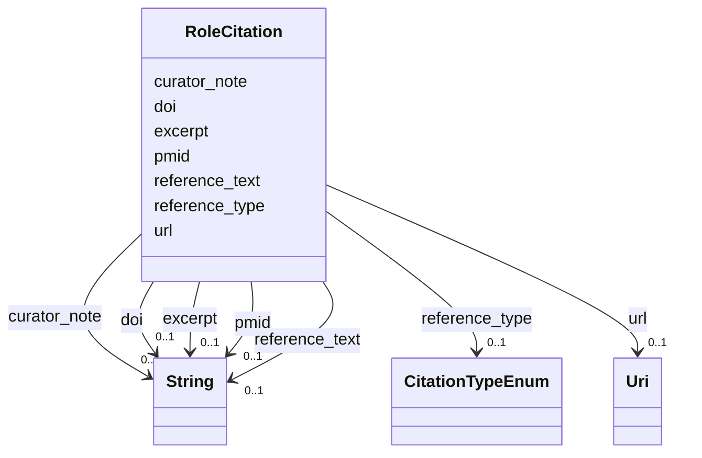

# Class: RoleCitation 


_Citation supporting a role assignment (DOI, publication, database reference)_


URI: [mediaingredientmech:RoleCitation](https://w3id.org/mediaingredientmech/RoleCitation)





<!-- no inheritance hierarchy -->


## Slots

| Name | Cardinality and Range | Description | Inheritance |
| ---  | --- | --- | --- |
| [doi](doi.md) | 0..1 <br/> [xsd:string](http://www.w3.org/2001/XMLSchema#string) | Digital Object Identifier (e | direct |
| [pmid](pmid.md) | 0..1 <br/> [xsd:string](http://www.w3.org/2001/XMLSchema#string) | PubMed ID for MEDLINE citations | direct |
| [reference_text](reference_text.md) | 0..1 <br/> [xsd:string](http://www.w3.org/2001/XMLSchema#string) | Human-readable citation text | direct |
| [reference_type](reference_type.md) | 0..1 <br/> [CitationTypeEnum](CitationTypeEnum.md) | Type of reference (peer-reviewed, database, manual curation, etc | direct |
| [url](url.md) | 0..1 <br/> [xsd:anyURI](http://www.w3.org/2001/XMLSchema#anyURI) | Web URL for the reference | direct |
| [excerpt](excerpt.md) | 0..1 <br/> [xsd:string](http://www.w3.org/2001/XMLSchema#string) | Relevant excerpt or quote from the source | direct |
| [curator_note](curator_note.md) | 0..1 <br/> [xsd:string](http://www.w3.org/2001/XMLSchema#string) | Curator's explanation of why this supports the role assignment | direct |


## Usages

| used by | used in | type | used |
| ---  | --- | --- | --- |
| [RoleAssignment](RoleAssignment.md) | [evidence](evidence.md) | range | [RoleCitation](RoleCitation.md) |
| [CellularRoleAssignment](CellularRoleAssignment.md) | [evidence](evidence.md) | range | [RoleCitation](RoleCitation.md) |


## Identifier and Mapping Information


### Schema Source


* from schema: https://w3id.org/mediaingredientmech


## Mappings

| Mapping Type | Mapped Value |
| ---  | ---  |
| self | mediaingredientmech:RoleCitation |
| native | mediaingredientmech:RoleCitation |


## LinkML Source

<!-- TODO: investigate https://stackoverflow.com/questions/37606292/how-to-create-tabbed-code-blocks-in-mkdocs-or-sphinx -->

### Direct

<details>
```yaml
name: RoleCitation
description: Citation supporting a role assignment (DOI, publication, database reference)
from_schema: https://w3id.org/mediaingredientmech
attributes:
  doi:
    name: doi
    description: Digital Object Identifier (e.g., 10.1128/jb.00123-15)
    from_schema: https://w3id.org/mediaingredientmech
    rank: 1000
    domain_of:
    - RoleCitation
    pattern: ^10\.\d{4,}/[-._;()/:A-Za-z0-9]+$
  pmid:
    name: pmid
    description: PubMed ID for MEDLINE citations
    from_schema: https://w3id.org/mediaingredientmech
    rank: 1000
    domain_of:
    - RoleCitation
  reference_text:
    name: reference_text
    description: Human-readable citation text
    from_schema: https://w3id.org/mediaingredientmech
    rank: 1000
    domain_of:
    - RoleCitation
  reference_type:
    name: reference_type
    description: Type of reference (peer-reviewed, database, manual curation, etc.)
    from_schema: https://w3id.org/mediaingredientmech
    rank: 1000
    domain_of:
    - RoleCitation
    range: CitationTypeEnum
  url:
    name: url
    description: Web URL for the reference
    from_schema: https://w3id.org/mediaingredientmech
    rank: 1000
    domain_of:
    - RoleCitation
    range: uri
  excerpt:
    name: excerpt
    description: Relevant excerpt or quote from the source
    from_schema: https://w3id.org/mediaingredientmech
    rank: 1000
    domain_of:
    - RoleCitation
  curator_note:
    name: curator_note
    description: Curator's explanation of why this supports the role assignment
    from_schema: https://w3id.org/mediaingredientmech
    rank: 1000
    domain_of:
    - RoleCitation

```
</details>

### Induced

<details>
```yaml
name: RoleCitation
description: Citation supporting a role assignment (DOI, publication, database reference)
from_schema: https://w3id.org/mediaingredientmech
attributes:
  doi:
    name: doi
    description: Digital Object Identifier (e.g., 10.1128/jb.00123-15)
    from_schema: https://w3id.org/mediaingredientmech
    rank: 1000
    alias: doi
    owner: RoleCitation
    domain_of:
    - RoleCitation
    range: string
    pattern: ^10\.\d{4,}/[-._;()/:A-Za-z0-9]+$
  pmid:
    name: pmid
    description: PubMed ID for MEDLINE citations
    from_schema: https://w3id.org/mediaingredientmech
    rank: 1000
    alias: pmid
    owner: RoleCitation
    domain_of:
    - RoleCitation
    range: string
  reference_text:
    name: reference_text
    description: Human-readable citation text
    from_schema: https://w3id.org/mediaingredientmech
    rank: 1000
    alias: reference_text
    owner: RoleCitation
    domain_of:
    - RoleCitation
    range: string
  reference_type:
    name: reference_type
    description: Type of reference (peer-reviewed, database, manual curation, etc.)
    from_schema: https://w3id.org/mediaingredientmech
    rank: 1000
    alias: reference_type
    owner: RoleCitation
    domain_of:
    - RoleCitation
    range: CitationTypeEnum
  url:
    name: url
    description: Web URL for the reference
    from_schema: https://w3id.org/mediaingredientmech
    rank: 1000
    alias: url
    owner: RoleCitation
    domain_of:
    - RoleCitation
    range: uri
  excerpt:
    name: excerpt
    description: Relevant excerpt or quote from the source
    from_schema: https://w3id.org/mediaingredientmech
    rank: 1000
    alias: excerpt
    owner: RoleCitation
    domain_of:
    - RoleCitation
    range: string
  curator_note:
    name: curator_note
    description: Curator's explanation of why this supports the role assignment
    from_schema: https://w3id.org/mediaingredientmech
    rank: 1000
    alias: curator_note
    owner: RoleCitation
    domain_of:
    - RoleCitation
    range: string

```
</details>