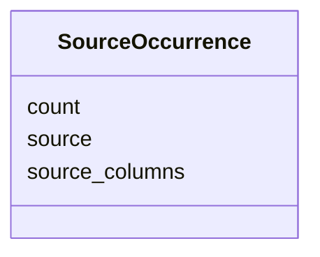

# Class: SourceOccurrence


_An occurrence count attributed to a specific upstream source, with the source's own provenance detail._


URI: [mediaingredientmech:SourceOccurrence](https://w3id.org/mediaingredientmech/SourceOccurrence)





<!-- no inheritance hierarchy -->


## Slots

| Name | Cardinality and Range | Description | Inheritance |
| ---  | --- | --- | --- |
| [source](source.md) | 1 <br/> [String](String.md) | Upstream dataset the count comes from (e | direct |
| [count](count.md) | 1 <br/> [Integer](Integer.md) | Number of occurrences that source reports | direct |
| [source_columns](source_columns.md) | 0..1 <br/> [String](String.md) | The upstream columns the count was aggregated over, verbatim (e | direct |


## Usages

| used by | used in | type | used |
| ---  | --- | --- | --- |
| [OccurrenceStats](OccurrenceStats.md) | [source_occurrences](source_occurrences.md) | range | [SourceOccurrence](SourceOccurrence.md) |


## Identifier and Mapping Information


### Schema Source


* from schema: https://w3id.org/mediaingredientmech


## Mappings

| Mapping Type | Mapped Value |
| ---  | ---  |
| self | mediaingredientmech:SourceOccurrence |
| native | mediaingredientmech:SourceOccurrence |


## LinkML Source

<!-- TODO: investigate https://stackoverflow.com/questions/37606292/how-to-create-tabbed-code-blocks-in-mkdocs-or-sphinx -->

### Direct

<details>
```yaml
name: SourceOccurrence
description: An occurrence count attributed to a specific upstream source, with the
  source's own provenance detail.
from_schema: https://w3id.org/mediaingredientmech
attributes:
  source:
    name: source
    description: Upstream dataset the count comes from (e.g. microbedecoder)
    from_schema: https://w3id.org/mediaingredientmech
    domain_of:
    - MappingEvidence
    - IngredientSynonym
    - SourceOccurrence
    - ComponentEvidence
    - StockComponent
    required: true
  count:
    name: count
    description: Number of occurrences that source reports
    from_schema: https://w3id.org/mediaingredientmech
    domain_of:
    - IngredientCollection
    - SourceOccurrence
    range: integer
    required: true
  source_columns:
    name: source_columns
    description: The upstream columns the count was aggregated over, verbatim (e.g.
      `BacDive_Metabolite_utilization|Bergey_substrate`), so the number stays interpretable
      without the original extract.
    from_schema: https://w3id.org/mediaingredientmech
    rank: 1000
    domain_of:
    - SourceOccurrence

```
</details>

### Induced

<details>
```yaml
name: SourceOccurrence
description: An occurrence count attributed to a specific upstream source, with the
  source's own provenance detail.
from_schema: https://w3id.org/mediaingredientmech
attributes:
  source:
    name: source
    description: Upstream dataset the count comes from (e.g. microbedecoder)
    from_schema: https://w3id.org/mediaingredientmech
    alias: source
    owner: SourceOccurrence
    domain_of:
    - MappingEvidence
    - IngredientSynonym
    - SourceOccurrence
    - ComponentEvidence
    - StockComponent
    range: string
    required: true
  count:
    name: count
    description: Number of occurrences that source reports
    from_schema: https://w3id.org/mediaingredientmech
    alias: count
    owner: SourceOccurrence
    domain_of:
    - IngredientCollection
    - SourceOccurrence
    range: integer
    required: true
  source_columns:
    name: source_columns
    description: The upstream columns the count was aggregated over, verbatim (e.g.
      `BacDive_Metabolite_utilization|Bergey_substrate`), so the number stays interpretable
      without the original extract.
    from_schema: https://w3id.org/mediaingredientmech
    rank: 1000
    alias: source_columns
    owner: SourceOccurrence
    domain_of:
    - SourceOccurrence
    range: string

```
</details>