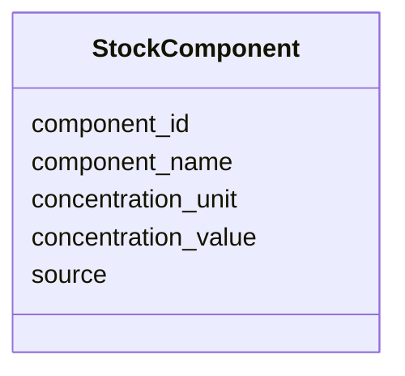

# Class: StockComponent 


_One constituent of a stock solution or defined medium recipe — a component ingredient with its concentration. Used in IngredientRecord.components to decompose a named mixture (e.g. a trace-element or vitamin solution) into its parts. Populate only from a verifiable recipe source._


URI: [mediaingredientmech:StockComponent](https://w3id.org/mediaingredientmech/StockComponent)





<!-- no inheritance hierarchy -->


## Slots

| Name | Cardinality and Range | Description | Inheritance |
| ---  | --- | --- | --- |
| [component_name](component_name.md) | 1 <br/> [String](String.md) | Component ingredient name as listed in the recipe (e | direct |
| [component_id](component_id.md) | 0..1 <br/> [String](String.md) | Identifier of the component when mapped to an ontology/registry term (e | direct |
| [concentration_value](concentration_value.md) | 0..1 <br/> [String](String.md) | Amount/concentration of the component, kept as a string to preserve the sourc... | direct |
| [concentration_unit](concentration_unit.md) | 0..1 <br/> [String](String.md) | Unit for concentration_value (e | direct |
| [source](source.md) | 0..1 <br/> [String](String.md) | Provenance of this component entry (e | direct |


## Usages

| used by | used in | type | used |
| ---  | --- | --- | --- |
| [IngredientRecord](IngredientRecord.md) | [components](components.md) | range | [StockComponent](StockComponent.md) |


## Identifier and Mapping Information


### Schema Source


* from schema: https://w3id.org/mediaingredientmech


## Mappings

| Mapping Type | Mapped Value |
| ---  | ---  |
| self | mediaingredientmech:StockComponent |
| native | mediaingredientmech:StockComponent |


## LinkML Source

<!-- TODO: investigate https://stackoverflow.com/questions/37606292/how-to-create-tabbed-code-blocks-in-mkdocs-or-sphinx -->

### Direct

<details>
```yaml
name: StockComponent
description: One constituent of a stock solution or defined medium recipe — a component
  ingredient with its concentration. Used in IngredientRecord.components to decompose
  a named mixture (e.g. a trace-element or vitamin solution) into its parts. Populate
  only from a verifiable recipe source.
from_schema: https://w3id.org/mediaingredientmech
attributes:
  component_name:
    name: component_name
    description: Component ingredient name as listed in the recipe (e.g. "FeCl3 x
      6 H2O").
    from_schema: https://w3id.org/mediaingredientmech
    rank: 1000
    domain_of:
    - StockComponent
    required: true
  component_id:
    name: component_id
    description: 'Identifier of the component when mapped to an ontology/registry
      term (e.g. CHEBI:..., or a registry CURIE). Omit when the component is unmapped.
      (No pattern constraint: components may be unmapped.)'
    from_schema: https://w3id.org/mediaingredientmech
    rank: 1000
    domain_of:
    - StockComponent
  concentration_value:
    name: concentration_value
    description: Amount/concentration of the component, kept as a string to preserve
      the source's formatting (e.g. "1.5", "0.1-0.5").
    from_schema: https://w3id.org/mediaingredientmech
    rank: 1000
    domain_of:
    - StockComponent
  concentration_unit:
    name: concentration_unit
    description: Unit for concentration_value (e.g. G_PER_L, MG_PER_L, M, MM, PERCENT).
    from_schema: https://w3id.org/mediaingredientmech
    rank: 1000
    domain_of:
    - StockComponent
  source:
    name: source
    description: Provenance of this component entry (e.g. a CultureMech medium ID,
      a MediaDive solution ID, or a publication / DOI). Recording it keeps the recipe
      verifiable rather than fabricated.
    from_schema: https://w3id.org/mediaingredientmech
    domain_of:
    - MappingEvidence
    - IngredientSynonym
    - StockComponent

```
</details>

### Induced

<details>
```yaml
name: StockComponent
description: One constituent of a stock solution or defined medium recipe — a component
  ingredient with its concentration. Used in IngredientRecord.components to decompose
  a named mixture (e.g. a trace-element or vitamin solution) into its parts. Populate
  only from a verifiable recipe source.
from_schema: https://w3id.org/mediaingredientmech
attributes:
  component_name:
    name: component_name
    description: Component ingredient name as listed in the recipe (e.g. "FeCl3 x
      6 H2O").
    from_schema: https://w3id.org/mediaingredientmech
    rank: 1000
    alias: component_name
    owner: StockComponent
    domain_of:
    - StockComponent
    range: string
    required: true
  component_id:
    name: component_id
    description: 'Identifier of the component when mapped to an ontology/registry
      term (e.g. CHEBI:..., or a registry CURIE). Omit when the component is unmapped.
      (No pattern constraint: components may be unmapped.)'
    from_schema: https://w3id.org/mediaingredientmech
    rank: 1000
    alias: component_id
    owner: StockComponent
    domain_of:
    - StockComponent
    range: string
  concentration_value:
    name: concentration_value
    description: Amount/concentration of the component, kept as a string to preserve
      the source's formatting (e.g. "1.5", "0.1-0.5").
    from_schema: https://w3id.org/mediaingredientmech
    rank: 1000
    alias: concentration_value
    owner: StockComponent
    domain_of:
    - StockComponent
    range: string
  concentration_unit:
    name: concentration_unit
    description: Unit for concentration_value (e.g. G_PER_L, MG_PER_L, M, MM, PERCENT).
    from_schema: https://w3id.org/mediaingredientmech
    rank: 1000
    alias: concentration_unit
    owner: StockComponent
    domain_of:
    - StockComponent
    range: string
  source:
    name: source
    description: Provenance of this component entry (e.g. a CultureMech medium ID,
      a MediaDive solution ID, or a publication / DOI). Recording it keeps the recipe
      verifiable rather than fabricated.
    from_schema: https://w3id.org/mediaingredientmech
    alias: source
    owner: StockComponent
    domain_of:
    - MappingEvidence
    - IngredientSynonym
    - StockComponent
    range: string

```
</details>