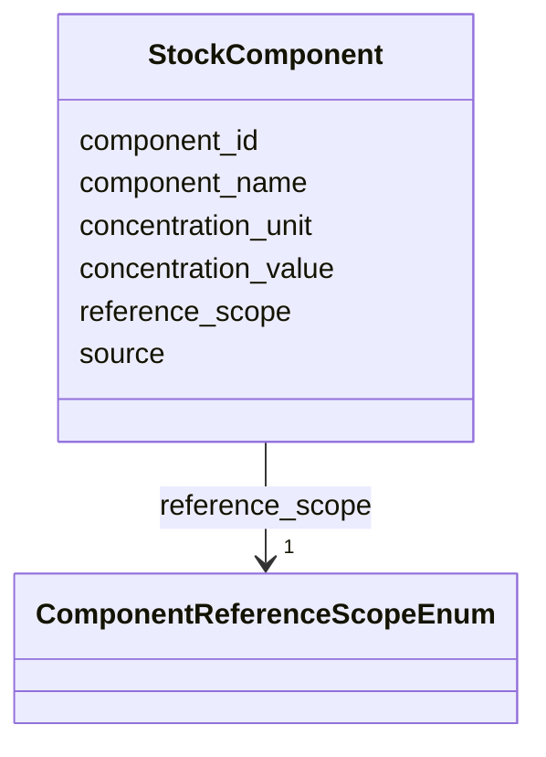

# Class: StockComponent


_One constituent in an IngredientRecord.components has-part assertion. The component may resolve to the current MIM catalog, deliberately name an external ontology/registry term, or remain unmapped; reference_scope makes those cases explicit. This class does not represent an identity mapping or variant hierarchy._


URI: [mediaingredientmech:StockComponent](https://w3id.org/mediaingredientmech/StockComponent)



```mermaid
 classDiagram
    class StockComponent
    click StockComponent href "../StockComponent/"
      StockComponent : component_id

      StockComponent : component_name

      StockComponent : concentration_unit

      StockComponent : concentration_value

      StockComponent : reference_scope


        StockComponent --> "1" ComponentReferenceScopeEnum : reference_scope
        click ComponentReferenceScopeEnum href "../ComponentReferenceScopeEnum/"


      StockComponent : source


```


<!-- no inheritance hierarchy -->


## Slots

| Name | Cardinality and Range | Description | Inheritance |
| ---  | --- | --- | --- |
| [component_name](component_name.md) | 1 <br/> [String](String.md) | Component ingredient name as listed in the supporting source (e | direct |
| [component_id](component_id.md) | 0..1 <br/> [String](String.md) | Semantic CURIE for the component (e | direct |
| [reference_scope](reference_scope.md) | 1 <br/> [ComponentReferenceScopeEnum](ComponentReferenceScopeEnum.md) | Resolution status and intended scope of component_id | direct |
| [concentration_value](concentration_value.md) | 0..1 <br/> [String](String.md) | Amount/concentration of the component, kept as a string to preserve the sourc... | direct |
| [concentration_unit](concentration_unit.md) | 0..1 <br/> [String](String.md) | Unit for concentration_value (e | direct |
| [source](source.md) | 0..1 <br/> [String](String.md) | Legacy free-text component provenance retained for compatibility; it may dupl... | direct |


## Usages

| used by | used in | type | used |
| ---  | --- | --- | --- |
| [IngredientRecord](IngredientRecord.md) | [components](components.md) | range | [StockComponent](StockComponent.md) |


## Rules


###

| Rule Applied | Preconditions | Postconditions | Elseconditions |
|--------------|---------------|----------------|----------------|
| slot_conditions |```{'reference_scope': {'equals_string_in': ['MIM_CATALOG', 'EXTERNAL_TERM']}}``` |```{'component_id': {'value_presence': 'PRESENT'}}``` | |


###

| Rule Applied | Preconditions | Postconditions | Elseconditions |
|--------------|---------------|----------------|----------------|
| slot_conditions |```{'reference_scope': {'equals_string_in': ['UNMAPPED']}}``` |```{'component_id': {'value_presence': 'ABSENT'}}``` | |


###

| Rule Applied | Preconditions | Postconditions | Elseconditions |
|--------------|---------------|----------------|----------------|
| slot_conditions |```{'concentration_value': {'value_presence': 'PRESENT'}}``` |```{'concentration_unit': {'value_presence': 'PRESENT'}}``` | |


## Identifier and Mapping Information


### Schema Source


* from schema: https://w3id.org/mediaingredientmech


## Mappings

| Mapping Type | Mapped Value |
| ---  | ---  |
| self | mediaingredientmech:StockComponent |
| native | mediaingredientmech:StockComponent |


## LinkML Source

<!-- TODO: investigate https://stackoverflow.com/questions/37606292/how-to-create-tabbed-code-blocks-in-mkdocs-or-sphinx -->

### Direct

<details>
```yaml
name: StockComponent
description: One constituent in an IngredientRecord.components has-part assertion.
  The component may resolve to the current MIM catalog, deliberately name an external
  ontology/registry term, or remain unmapped; reference_scope makes those cases explicit.
  This class does not represent an identity mapping or variant hierarchy.
from_schema: https://w3id.org/mediaingredientmech
attributes:
  component_name:
    name: component_name
    description: Component ingredient name as listed in the supporting source (e.g.
      "FeCl3 x 6 H2O").
    from_schema: https://w3id.org/mediaingredientmech
    rank: 1000
    domain_of:
    - StockComponent
    required: true
  component_id:
    name: component_id
    description: 'Semantic CURIE for the component (e.g. CHEBI:..., MICRO:..., or
      cas:...). It is not unconditionally a foreign key to one MIM row: reference_scope
      states whether the CURIE is represented in MIM or deliberately external. Omit
      only when reference_scope is UNMAPPED.'
    from_schema: https://w3id.org/mediaingredientmech
    rank: 1000
    domain_of:
    - StockComponent
    pattern: ^[A-Za-z][A-Za-z0-9.]*:[A-Za-z0-9][A-Za-z0-9._~-]*$
  reference_scope:
    name: reference_scope
    description: Resolution status and intended scope of component_id.
    from_schema: https://w3id.org/mediaingredientmech
    rank: 1000
    domain_of:
    - StockComponent
    range: ComponentReferenceScopeEnum
    required: true
  concentration_value:
    name: concentration_value
    description: Amount/concentration of the component, kept as a string to preserve
      the source's formatting (e.g. "1.5", "0.1-0.5").
    from_schema: https://w3id.org/mediaingredientmech
    rank: 1000
    domain_of:
    - StockComponent
  concentration_unit:
    name: concentration_unit
    description: Unit for concentration_value (e.g. G_PER_L, MG_PER_L, M, MM, PERCENT).
    from_schema: https://w3id.org/mediaingredientmech
    rank: 1000
    domain_of:
    - StockComponent
  source:
    name: source
    description: Legacy free-text component provenance retained for compatibility;
      it may duplicate component_assertion.evidence. New curation should put record-level
      decomposition method and structured evidence in component_assertion, using this
      slot only when a part has additional component-specific provenance.
    from_schema: https://w3id.org/mediaingredientmech
    domain_of:
    - MappingEvidence
    - IngredientSynonym
    - SourceOccurrence
    - ComponentEvidence
    - StockComponent
rules:
- preconditions:
    slot_conditions:
      reference_scope:
        name: reference_scope
        equals_string_in:
        - MIM_CATALOG
        - EXTERNAL_TERM
  postconditions:
    slot_conditions:
      component_id:
        name: component_id
        value_presence: PRESENT
- preconditions:
    slot_conditions:
      reference_scope:
        name: reference_scope
        equals_string_in:
        - UNMAPPED
  postconditions:
    slot_conditions:
      component_id:
        name: component_id
        value_presence: ABSENT
- preconditions:
    slot_conditions:
      concentration_value:
        name: concentration_value
        value_presence: PRESENT
  postconditions:
    slot_conditions:
      concentration_unit:
        name: concentration_unit
        value_presence: PRESENT
  bidirectional: true

```
</details>

### Induced

<details>
```yaml
name: StockComponent
description: One constituent in an IngredientRecord.components has-part assertion.
  The component may resolve to the current MIM catalog, deliberately name an external
  ontology/registry term, or remain unmapped; reference_scope makes those cases explicit.
  This class does not represent an identity mapping or variant hierarchy.
from_schema: https://w3id.org/mediaingredientmech
attributes:
  component_name:
    name: component_name
    description: Component ingredient name as listed in the supporting source (e.g.
      "FeCl3 x 6 H2O").
    from_schema: https://w3id.org/mediaingredientmech
    rank: 1000
    alias: component_name
    owner: StockComponent
    domain_of:
    - StockComponent
    range: string
    required: true
  component_id:
    name: component_id
    description: 'Semantic CURIE for the component (e.g. CHEBI:..., MICRO:..., or
      cas:...). It is not unconditionally a foreign key to one MIM row: reference_scope
      states whether the CURIE is represented in MIM or deliberately external. Omit
      only when reference_scope is UNMAPPED.'
    from_schema: https://w3id.org/mediaingredientmech
    rank: 1000
    alias: component_id
    owner: StockComponent
    domain_of:
    - StockComponent
    range: string
    pattern: ^[A-Za-z][A-Za-z0-9.]*:[A-Za-z0-9][A-Za-z0-9._~-]*$
  reference_scope:
    name: reference_scope
    description: Resolution status and intended scope of component_id.
    from_schema: https://w3id.org/mediaingredientmech
    rank: 1000
    alias: reference_scope
    owner: StockComponent
    domain_of:
    - StockComponent
    range: ComponentReferenceScopeEnum
    required: true
  concentration_value:
    name: concentration_value
    description: Amount/concentration of the component, kept as a string to preserve
      the source's formatting (e.g. "1.5", "0.1-0.5").
    from_schema: https://w3id.org/mediaingredientmech
    rank: 1000
    alias: concentration_value
    owner: StockComponent
    domain_of:
    - StockComponent
    range: string
  concentration_unit:
    name: concentration_unit
    description: Unit for concentration_value (e.g. G_PER_L, MG_PER_L, M, MM, PERCENT).
    from_schema: https://w3id.org/mediaingredientmech
    rank: 1000
    alias: concentration_unit
    owner: StockComponent
    domain_of:
    - StockComponent
    range: string
  source:
    name: source
    description: Legacy free-text component provenance retained for compatibility;
      it may duplicate component_assertion.evidence. New curation should put record-level
      decomposition method and structured evidence in component_assertion, using this
      slot only when a part has additional component-specific provenance.
    from_schema: https://w3id.org/mediaingredientmech
    alias: source
    owner: StockComponent
    domain_of:
    - MappingEvidence
    - IngredientSynonym
    - SourceOccurrence
    - ComponentEvidence
    - StockComponent
    range: string
rules:
- preconditions:
    slot_conditions:
      reference_scope:
        name: reference_scope
        equals_string_in:
        - MIM_CATALOG
        - EXTERNAL_TERM
  postconditions:
    slot_conditions:
      component_id:
        name: component_id
        value_presence: PRESENT
- preconditions:
    slot_conditions:
      reference_scope:
        name: reference_scope
        equals_string_in:
        - UNMAPPED
  postconditions:
    slot_conditions:
      component_id:
        name: component_id
        value_presence: ABSENT
- preconditions:
    slot_conditions:
      concentration_value:
        name: concentration_value
        value_presence: PRESENT
  postconditions:
    slot_conditions:
      concentration_unit:
        name: concentration_unit
        value_presence: PRESENT
  bidirectional: true

```
</details>