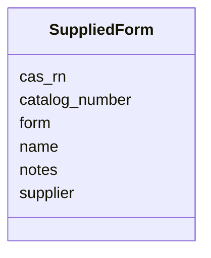

# Class: SuppliedForm


_A purchasable form of an ingredient: what a lab would physically order and receive. Separate from `ChemicalProperties`, which describes the substance the record denotes — the two differ whenever a recipe names a substance generically but only one form is sold, or several are._


URI: [mediaingredientmech:SuppliedForm](https://w3id.org/mediaingredientmech/SuppliedForm)





<!-- no inheritance hierarchy -->


## Slots

| Name | Cardinality and Range | Description | Inheritance |
| ---  | --- | --- | --- |
| [name](name.md) | 0..1 <br/> [String](String.md) | The product name as a catalogue would write it, e | direct |
| [cas_rn](cas_rn.md) | 0..1 <br/> [String](String.md) | The CAS-RN you would order by | direct |
| [form](form.md) | 0..1 <br/> [String](String.md) | The physical/chemical form supplied, e | direct |
| [supplier](supplier.md) | 0..1 <br/> [String](String.md) | Vendor, where a specific one is recorded (e | direct |
| [catalog_number](catalog_number.md) | 0..1 <br/> [String](String.md) | Vendor catalogue number, e | direct |
| [notes](notes.md) | 0..1 <br/> [String](String.md) | Why this form, or what the source said | direct |


## Usages

| used by | used in | type | used |
| ---  | --- | --- | --- |
| [IngredientRecord](IngredientRecord.md) | [supplied_form](supplied_form.md) | range | [SuppliedForm](SuppliedForm.md) |


## Identifier and Mapping Information


### Schema Source


* from schema: https://w3id.org/mediaingredientmech


## Mappings

| Mapping Type | Mapped Value |
| ---  | ---  |
| self | mediaingredientmech:SuppliedForm |
| native | mediaingredientmech:SuppliedForm |


## LinkML Source

<!-- TODO: investigate https://stackoverflow.com/questions/37606292/how-to-create-tabbed-code-blocks-in-mkdocs-or-sphinx -->

### Direct

<details>
```yaml
name: SuppliedForm
description: 'A purchasable form of an ingredient: what a lab would physically order
  and receive. Separate from `ChemicalProperties`, which describes the substance the
  record denotes — the two differ whenever a recipe names a substance generically
  but only one form is sold, or several are.'
from_schema: https://w3id.org/mediaingredientmech
attributes:
  name:
    name: name
    description: The product name as a catalogue would write it, e.g. `Carboxymethylcellulose
      sodium`. Not necessarily the record's preferred_term, which optimises for readability
      in the graph.
    from_schema: https://w3id.org/mediaingredientmech
    rank: 1000
    domain_of:
    - SuppliedForm
    - ProposedExperiment
  cas_rn:
    name: cas_rn
    description: The CAS-RN you would order by. This is the operative identifier for
      procurement and may differ from `chemical_properties.cas_rn`, which describes
      the substance — the free acid and its sodium salt have different CAS-RNs and
      are different purchases.
    from_schema: https://w3id.org/mediaingredientmech
    domain_of:
    - ChemicalProperties
    - MappingEvidence
    - SuppliedForm
    pattern: ^\d{2,7}-\d{2}-\d$
  form:
    name: form
    description: The physical/chemical form supplied, e.g. `sodium salt`, `heptahydrate`,
      `anhydrous powder`, `50% w/v solution`.
    from_schema: https://w3id.org/mediaingredientmech
    rank: 1000
    domain_of:
    - SuppliedForm
  supplier:
    name: supplier
    description: Vendor, where a specific one is recorded (e.g. `Sigma-Aldrich`).
    from_schema: https://w3id.org/mediaingredientmech
    rank: 1000
    domain_of:
    - SuppliedForm
  catalog_number:
    name: catalog_number
    description: Vendor catalogue number, e.g. `C-5013`.
    from_schema: https://w3id.org/mediaingredientmech
    rank: 1000
    domain_of:
    - SuppliedForm
  notes:
    name: notes
    description: Why this form, or what the source said. Use it when a medium's preparation
      note names a form its ingredient string does not — DSMZ 1111 lists `Carboxymethyl
      cellulose` but its note specifies the sodium salt.
    from_schema: https://w3id.org/mediaingredientmech
    domain_of:
    - IngredientRecord
    - EnvironmentContext
    - MappingEvidence
    - SuppliedForm
    - CurationEvent
    - CommunityOrganismRoleAssignment
    - NutritionalRoleAssignment
    - PhysicochemicalRoleAssignment
    - CellularMetabolicRoleAssignment
    - ComponentAssertion
    - ComponentEvidence
    - SupportingReference
    - Discussion
    - Dataset

```
</details>

### Induced

<details>
```yaml
name: SuppliedForm
description: 'A purchasable form of an ingredient: what a lab would physically order
  and receive. Separate from `ChemicalProperties`, which describes the substance the
  record denotes — the two differ whenever a recipe names a substance generically
  but only one form is sold, or several are.'
from_schema: https://w3id.org/mediaingredientmech
attributes:
  name:
    name: name
    description: The product name as a catalogue would write it, e.g. `Carboxymethylcellulose
      sodium`. Not necessarily the record's preferred_term, which optimises for readability
      in the graph.
    from_schema: https://w3id.org/mediaingredientmech
    rank: 1000
    alias: name
    owner: SuppliedForm
    domain_of:
    - SuppliedForm
    - ProposedExperiment
    range: string
  cas_rn:
    name: cas_rn
    description: The CAS-RN you would order by. This is the operative identifier for
      procurement and may differ from `chemical_properties.cas_rn`, which describes
      the substance — the free acid and its sodium salt have different CAS-RNs and
      are different purchases.
    from_schema: https://w3id.org/mediaingredientmech
    alias: cas_rn
    owner: SuppliedForm
    domain_of:
    - ChemicalProperties
    - MappingEvidence
    - SuppliedForm
    range: string
    pattern: ^\d{2,7}-\d{2}-\d$
  form:
    name: form
    description: The physical/chemical form supplied, e.g. `sodium salt`, `heptahydrate`,
      `anhydrous powder`, `50% w/v solution`.
    from_schema: https://w3id.org/mediaingredientmech
    rank: 1000
    alias: form
    owner: SuppliedForm
    domain_of:
    - SuppliedForm
    range: string
  supplier:
    name: supplier
    description: Vendor, where a specific one is recorded (e.g. `Sigma-Aldrich`).
    from_schema: https://w3id.org/mediaingredientmech
    rank: 1000
    alias: supplier
    owner: SuppliedForm
    domain_of:
    - SuppliedForm
    range: string
  catalog_number:
    name: catalog_number
    description: Vendor catalogue number, e.g. `C-5013`.
    from_schema: https://w3id.org/mediaingredientmech
    rank: 1000
    alias: catalog_number
    owner: SuppliedForm
    domain_of:
    - SuppliedForm
    range: string
  notes:
    name: notes
    description: Why this form, or what the source said. Use it when a medium's preparation
      note names a form its ingredient string does not — DSMZ 1111 lists `Carboxymethyl
      cellulose` but its note specifies the sodium salt.
    from_schema: https://w3id.org/mediaingredientmech
    alias: notes
    owner: SuppliedForm
    domain_of:
    - IngredientRecord
    - EnvironmentContext
    - MappingEvidence
    - SuppliedForm
    - CurationEvent
    - CommunityOrganismRoleAssignment
    - NutritionalRoleAssignment
    - PhysicochemicalRoleAssignment
    - CellularMetabolicRoleAssignment
    - ComponentAssertion
    - ComponentEvidence
    - SupportingReference
    - Discussion
    - Dataset
    range: string

```
</details>