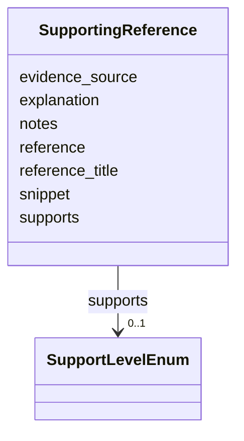

# Class: SupportingReference 


_A lightweight literature/database citation supporting a Discussion or Dataset. Self-contained (so this module has no dependency on each repo's EvidenceItem); carries a verbatim `snippet` so the same anti-hallucination snippet-vs-cached-abstract check the Mechs already run can validate it._


URI: [mediaingredientmech:SupportingReference](https://w3id.org/mediaingredientmech/SupportingReference)





<!-- no inheritance hierarchy -->


## Slots

| Name | Cardinality and Range | Description | Inheritance |
| ---  | --- | --- | --- |
| [reference](reference.md) | 1 <br/> [String](String.md) | PMID: | direct |
| [reference_title](reference_title.md) | 0..1 <br/> [String](String.md) | Title of the cited source (optional; populated by tooling) | direct |
| [supports](supports.md) | 0..1 <br/> [SupportLevelEnum](SupportLevelEnum.md) |  | direct |
| [evidence_source](evidence_source.md) | 0..1 <br/> [String](String.md) | How the snippet was obtained (e | direct |
| [snippet](snippet.md) | 0..1 <br/> [String](String.md) | Verbatim quote from the source supporting the attached claim | direct |
| [explanation](explanation.md) | 0..1 <br/> [String](String.md) | Why this source bears on the claim | direct |
| [notes](notes.md) | 0..1 <br/> [String](String.md) |  | direct |


## Usages

| used by | used in | type | used |
| ---  | --- | --- | --- |
| [Discussion](Discussion.md) | [evidence](evidence.md) | range | [SupportingReference](SupportingReference.md) |
| [Dataset](Dataset.md) | [evidence](evidence.md) | range | [SupportingReference](SupportingReference.md) |


## Identifier and Mapping Information


### Schema Source


* from schema: https://w3id.org/mediaingredientmech


## Mappings

| Mapping Type | Mapped Value |
| ---  | ---  |
| self | mediaingredientmech:SupportingReference |
| native | mediaingredientmech:SupportingReference |


## LinkML Source

<!-- TODO: investigate https://stackoverflow.com/questions/37606292/how-to-create-tabbed-code-blocks-in-mkdocs-or-sphinx -->

### Direct

<details>
```yaml
name: SupportingReference
description: A lightweight literature/database citation supporting a Discussion or
  Dataset. Self-contained (so this module has no dependency on each repo's EvidenceItem);
  carries a verbatim `snippet` so the same anti-hallucination snippet-vs-cached-abstract
  check the Mechs already run can validate it.
from_schema: https://w3id.org/mediaingredientmech
attributes:
  reference:
    name: reference
    description: PMID:..., DOI:..., a repository accession/CURIE, or an opaque URL.
    from_schema: https://w3id.org/kg-microbe/mech-shared
    rank: 1000
    domain_of:
    - SupportingReference
    required: true
  reference_title:
    name: reference_title
    description: Title of the cited source (optional; populated by tooling).
    from_schema: https://w3id.org/kg-microbe/mech-shared
    rank: 1000
    domain_of:
    - SupportingReference
  supports:
    name: supports
    from_schema: https://w3id.org/kg-microbe/mech-shared
    domain_of:
    - MappingEvidence
    - SupportingReference
    range: SupportLevelEnum
  evidence_source:
    name: evidence_source
    description: How the snippet was obtained (e.g. abstract, full_text, figure, supplement,
      database). Free-form to stay self-contained.
    from_schema: https://w3id.org/kg-microbe/mech-shared
    rank: 1000
    domain_of:
    - SupportingReference
  snippet:
    name: snippet
    description: Verbatim quote from the source supporting the attached claim.
    from_schema: https://w3id.org/kg-microbe/mech-shared
    domain_of:
    - MappingEvidence
    - SupportingReference
  explanation:
    name: explanation
    description: Why this source bears on the claim.
    from_schema: https://w3id.org/kg-microbe/mech-shared
    domain_of:
    - MappingEvidence
    - SupportingReference
  notes:
    name: notes
    from_schema: https://w3id.org/kg-microbe/mech-shared
    domain_of:
    - IngredientRecord
    - EnvironmentContext
    - MappingEvidence
    - CurationEvent
    - CommunityOrganismRoleAssignment
    - NutritionalRoleAssignment
    - PhysicochemicalRoleAssignment
    - CellularMetabolicRoleAssignment
    - SupportingReference
    - Discussion
    - Dataset

```
</details>

### Induced

<details>
```yaml
name: SupportingReference
description: A lightweight literature/database citation supporting a Discussion or
  Dataset. Self-contained (so this module has no dependency on each repo's EvidenceItem);
  carries a verbatim `snippet` so the same anti-hallucination snippet-vs-cached-abstract
  check the Mechs already run can validate it.
from_schema: https://w3id.org/mediaingredientmech
attributes:
  reference:
    name: reference
    description: PMID:..., DOI:..., a repository accession/CURIE, or an opaque URL.
    from_schema: https://w3id.org/kg-microbe/mech-shared
    rank: 1000
    alias: reference
    owner: SupportingReference
    domain_of:
    - SupportingReference
    range: string
    required: true
  reference_title:
    name: reference_title
    description: Title of the cited source (optional; populated by tooling).
    from_schema: https://w3id.org/kg-microbe/mech-shared
    rank: 1000
    alias: reference_title
    owner: SupportingReference
    domain_of:
    - SupportingReference
    range: string
  supports:
    name: supports
    from_schema: https://w3id.org/kg-microbe/mech-shared
    alias: supports
    owner: SupportingReference
    domain_of:
    - MappingEvidence
    - SupportingReference
    range: SupportLevelEnum
  evidence_source:
    name: evidence_source
    description: How the snippet was obtained (e.g. abstract, full_text, figure, supplement,
      database). Free-form to stay self-contained.
    from_schema: https://w3id.org/kg-microbe/mech-shared
    rank: 1000
    alias: evidence_source
    owner: SupportingReference
    domain_of:
    - SupportingReference
    range: string
  snippet:
    name: snippet
    description: Verbatim quote from the source supporting the attached claim.
    from_schema: https://w3id.org/kg-microbe/mech-shared
    alias: snippet
    owner: SupportingReference
    domain_of:
    - MappingEvidence
    - SupportingReference
    range: string
  explanation:
    name: explanation
    description: Why this source bears on the claim.
    from_schema: https://w3id.org/kg-microbe/mech-shared
    alias: explanation
    owner: SupportingReference
    domain_of:
    - MappingEvidence
    - SupportingReference
    range: string
  notes:
    name: notes
    from_schema: https://w3id.org/kg-microbe/mech-shared
    alias: notes
    owner: SupportingReference
    domain_of:
    - IngredientRecord
    - EnvironmentContext
    - MappingEvidence
    - CurationEvent
    - CommunityOrganismRoleAssignment
    - NutritionalRoleAssignment
    - PhysicochemicalRoleAssignment
    - CellularMetabolicRoleAssignment
    - SupportingReference
    - Discussion
    - Dataset
    range: string

```
</details>